# 
 Universidad Peruana de Ciencias Aplicadas 

  

### 
 Informe de Trabajo Final 

 

  
 Carrera: Ingeniería de Software 

   
  
 Ciclo: 2025-20 

   
  
 Curso: Fundamentos de Arquitectura de Software 

   
  
 NRC: 6336 

   
  
 Profesor: Delgado Vite, Jorge Luis 

   
  
 Nombre del Startup: PeaceApp 

   
  
 Nombre del Producto: PeaceApp 

   
  
 Relación de Integrantes: 

  
  - Pilares Pocohuanca, Maria (u202215528) 

  
  - Ramirez Cabrera, Kenyi Efrain (u202220138) 

  
  - Noriega Suschenko, Anatoly Andrey (u202211813) 

  
  - Gordillo Ramos, Santiago Alonso (u202215160) 

  
  - Espejo Gamarra, Bryan Ronald (u202213278) 

   
  
 Mes y Año: Septiembre del 2025 

---

# Registro de Versiones del Informe

<table>
  <tr>
    <th style="text-align:center;">Versión</th>
    <th style="text-align:center;">Fecha</th>
    <th style="text-align:center;">Autor</th>
    <th style="text-align:center;">Descripción de la modificación</th>
  </tr>
  <tr>
    <td align="center">TB1</td>
    <td>12/09/2025</td>
    <td> Maria Pilares   Kenyi Ramirez   Anatoly Noriega   Santiago Gordillo   Bryan Espejo </td>
    <td> Realizamos los capítulos 1, 2 y 3 según la rúbrica de manera conjunta y eficiente.  </td>
  </tr>
  <tr>
    <td align="center">TB2</td>
    <td>28/09/2025</td>
    <td> Maria Pilares   Kenyi Ramirez   Anatoly Noriega   Santiago Gordillo   Bryan Espejo </td>
    <td> Avanzamos el capítulo 4, desarrollando la arquitectura del sistema, diagramas, drivers y aplicación del método ADD. </td>
  </tr>
</table>

---

# Tabla de contenidos

- [ Universidad Peruana de Ciencias Aplicadas ](#-universidad-peruana-de-ciencias-aplicadas-)
    - [ Informe de Trabajo Final ](#-informe-de-trabajo-final-)
- [Registro de Versiones del Informe](#registro-de-versiones-del-informe)
- [Tabla de contenidos](#tabla-de-contenidos)
- [Student Outcome](#student-outcome)
- [Capítulo I: Introducción](#capítulo-i-introducción)
    - [1.1 Startup Profile](#11-startup-profile)
        - [1.1.1 Descripción de la Startup](#111-descripción-de-la-startup)
        - [1.1.2. Perfiles de integrantes del equipo](#112-perfiles-de-integrantes-del-equipo)
    - [1.2. Solution Profile](#12-solution-profile)
        - [1.2.1. Nombre del Producto](#121-nombre-del-producto)
        - [1.2.2. Antecedentes y problemática](#122-antecedentes-y-problemática)
        - [1.2.3. Lean UX Process](#123-lean-ux-process)
            - [1.2.3.1. Lean UX Problem Statements](#1231-lean-ux-problem-statements)
            - [1.2.3.2. Lean UX Assumptions](#1232-lean-ux-assumptions)
            - [1.2.3.3. Lean UX Hypothesis Statements](#1233-lean-ux-hypothesis-statements)
            - [1.2.3.4. Lean UX Canvas](#1234-lean-ux-canvas)
    - [1.3. Segmentos Objetivo](#13-segmentos-objetivo)
- [Capítulo II: Requirements & Analysis](#capítulo-ii-requirements--analysis)
    - [2.1. Competidores](#21-competidores)
        - [2.1.1. Análisis Competitivo](#211-análisis-competitivo)
        - [2.1.2. Estrategias y tácticas frente a competidores](#212-estrategias-y-tácticas-frente-a-competidores)
    - [2.2. Entrevistas](#22-entrevistas)
        - [2.2.1.  entrevistas](#221-diseño-de-entrevistas)
        - [2.2.2. Registro de entrevistas](#222-registro-de-entrevistas)
        - [2.2.3. Análisis de entrevistas](#223-análisis-de-entrevistas)
    - [2.3. Needfinding](#23-needfinding)
        - [2.3.1. User Personas](#231-user-personas)
        - [2.3.2. User Task Matrix](#232-user-task-matrix)
        - [2.3.3. Empathy Mapping](#233-empathy-mapping)
        - [2.3.4. As-is Scenario Mapping](#234-as-is-scenario-mapping)
- [Capítulo III: Requirements Specification](#capítulo-iii-requirements-specification)
    - [3.1. To-be Scenario Mapping](#31-to-be-scenario-mapping)
    - [3.2. User Stories](#32-user-stories)
    - [3.3. Impact Mapping](#33-impact-mapping)
    - [3.4. Product Backlog](#34-product-backlog)
- [Capítulo IV: Product Architecture Design](#capítulo-iv-product-architecture-design)
    - [4.1. Design Concepts, ViewPoints & ER Diagrams](#41-design-concepts-viewpoints--er-diagrams)
        - [4.1.1. Principles Statements](#411-principles-statements)
        - [4.1.2. Approaches Statements Architectural Styles & Patterns](#412-approaches-statements-architectural-styles--patterns)
        - [4.1.3. Context Diagram](#413-context-diagram)
        - [4.1.4. Approach driven ViewPoints Diagrams](#414-approach-driven-viewpoints-diagrams)
            - [4.1.4.1. Diagrama de Actividad](#4141-diagrama-de-actividad)
            - [4.1.4.2. Diagrama de Estado](#4142-diagrama-de-estado)
            - [4.1.4.3. Diagrama de Clase](#4143-diagrama-de-clase)
            - [4.1.4.4. Diagrama de Contenedores](#4144-diagrama-de-contenedores)
        - [4.1.5. Relational/Non Relational Database Diagram](#415-relationalnon-relational-database-diagram)
        - [4.1.6. Design Patterns](#416-design-patterns)
        - [4.1.7. Tactics](#417-tactics)
    - [4.2. Architectural Drivers](#42-architectural-drivers)
        - [4.2.1. Design Purpose](#421-design-purpose)
        - [4.2.2. Primary Functionality (Primary User Stories)](#422-primary-functionality-primary-user-stories)
        - [4.2.3. Quality Attribute Scenarios](#423-quality-attribute-scenarios)
        - [4.2.4. Constraints](#424-constraints)
        - [4.2.5. Architectural Concerns](#425-architectural-concerns)
    - [4.3. ADD Iterations](#43-add-iterations)
        - [4.3.1 Iteration 1: Optimización de Procesos Clave para la Seguridad Ciudadana](#431-iteration-1-optimización-de-procesos-clave-para-la-seguridad-ciudadana)
            - [4.3.1.1 Architectural Design Backlog 1](#4311-architectural-design-backlog-1)
            - [4.3.1.2 Establish Iteration Goal by Selecting Drivers](#4312-establish-iteration-goal-by-selecting-drivers)
            - [4.3.1.3 Choose One or More Elements of the System to Refine](#4313-choose-one-or-more-elements-of-the-system-to-refine)
            - [4.3.1.4 Choose One or More Design Concepts That Satisfy the Selected Drivers](#4314-choose-one-or-more-design-concepts-that-satisfy-the-selected-drivers)
            - [4.3.1.5 Instantiate Architectural Elements, Allocate Responsibilities, and Define Interfaces](#4315-instantiate-architectural-elements-allocate-responsibilities-and-define-interfaces)
            - [4.3.1.6 Sketch Views (C4 & UML) and Record Design Decisions](#4316-sketch-views-c4--uml-and-record-design-decisions)
            - [4.3.1.7 Analysis of Current Design and Review Iteration Goal (Kanban Board)](#4317-analysis-of-current-design-and-review-iteration-goal-kanban-board)
- [Conclusiones](#conclusiones)
- [Bibliografia](#bibliografia)
- [Anexos](#anexos)

# Student Outcome

**Criterio:** La capacidad de adquirir y aplicar nuevos conocimientos según sea necesario, utilizando estrategias de
aprendizaje apropiadas.

ABET -- EAC - Student Outcome 7

<table>
<colgroup>
<col style="width: 30%" />
<col style="width: 40%" />
<col style="width: 30%" />
</colgroup>
<thead>
<tr class="header">
<th><strong>Criterio específico</strong></th>
<th><strong>Acciones Realizadas</strong></th>
<th><strong>Conclusiones</strong></th>
</tr>
</thead>
<tbody>
<tr class="odd">
<td>Actualiza conceptos y
conocimientos necesarios para su
desarrollo profesional y en especial
para su proyecto en soluciones de
software.</td>
<td>
            <strong>Pilares Pocohuanca, Maria</strong>  
            TB1   Me comprometí a tomar decisiones éticas y profesionales, entendiendo la relevancia de seguir buenas prácticas en todas las etapas del proyecto, desde las entrevistas hasta las revisiones, para asegurar la calidad y la transparencia del software creado. 
            TB2   Reforcé mis conocimientos en principios de diseño (SOLID, modularidad, seguridad) y enfoques como DDD, UCD y microservicios. También profundicé en la definición del propósito de diseño y user stories, lo que me ayudó a conectar los principios arquitectónicos con las necesidades del sistema. 
            <strong>Ramirez Cabrera, Kenyi Efrain</strong>  
            TB1  En mi rol, me enfoqué en aplicar y actualizar mis conocimientos para asegurar la alineación estratégica del proyecto. Evalué y perfeccioné las User Stories y el Impact Mapping, asegurándome de que cada elemento encajara con la visión de la aplicación. Además, participé activamente en la elaboración del Product Backlog, priorizando las funcionalidades para crear una hoja de ruta clara y eficiente. Estas responsabilidades me permitieron fortalecer mis habilidades en la planificación ágil y la gestión de requisitos de software, demostrando mi capacidad para convertir la visión del producto en pasos de desarrollo concretos y estratégicos. 
            TB2   Actualicé mis conocimientos en patrones de diseño y tácticas arquitectónicas orientadas a seguridad, escalabilidad y usabilidad. Además, comprendí cómo los escenarios de atributos de calidad permiten vincular decisiones técnicas con las necesidades críticas del sistema. 
            <strong>Noriega Suschenko, Anatoly Andrey</strong>  
            TB1  Durante el desarrollo del proyecto, actualicé mis conocimientos aplicados al diseño de preguntas para las entrevistas, así como en el uso de herramientas de análisis como empathy mapping, as is scenario mapping y to be scenario mapping. Esta actualización me permitió comprender mejor las necesidades del segmento objetivo y orientar el proyecto hacia soluciones de software alineadas con la realidad de los usuarios. 
            TB2  Actualicé mis conocimientos en la elaboración de diagramas arquitectónicos (contexto, actividad, estado, clases, contenedores) y en el modelado de bases de datos, reforzando además el uso de C4 y UML para representar la arquitectura de forma clara y alineada a los principios de escalabilidad y seguridad. 
            <strong>Gordillo Ramos, Santiago Alonso</strong>  
            TB1   Me aseguré de tomar decisiones éticas, responsables y profesionales, reconociendo la importancia de aplicar buenas técnicas al momento de completar la información para garantizar la calidad del software.  
            TB2  Fortalecí mis conocimientos en el método ADD, aprendiendo a elaborar backlog arquitectónico, seleccionar drivers, refinar elementos y definir interfaces. Esto me permitió comprender mejor cómo alinear las decisiones de diseño con atributos de calidad como usabilidad, seguridad y rendimiento. 
            <strong>Espejo Gamarra, Bryan Ronald</strong>  
            TB1  Me aseguré de tomar decisiones profesionales responsables, aplicando enfoques éticos a lo largo de todo el proceso, desde la recopilación de datos hasta la entrega final, para garantizar que el software desarrollado fuera íntegro y de alta calidad. 
            TB2  Amplié mis conocimientos en restricciones y preocupaciones arquitectónicas (normativas, presupuesto, experiencia de usuario) y en el análisis de diseño con tableros Kanban. Esto me permitió entender cómo factores externos e internos influyen en la sostenibilidad de la arquitectura. 
</td>
<td>
<em><strong>TB1</strong></em>
 En conjunto, los estudiantes demostraron haber actualizado y aplicado sus conocimientos de manera estratégica durante el desarrollo del proyecto. Desde la planificación ágil con user stories e impact mapping, hasta el diseño y validación mediante entrevistas, empathy mapping y escenarios as is / to be, cada integrante reforzó sus competencias técnicas y éticas. Esto permitió orientar las soluciones de software hacia la calidad, la transparencia y la alineación con las necesidades reales de los usuarios, consolidando su capacidad para transformar la visión del producto en acciones concretas y efectivas.
 

<em><strong>TB2</strong></em>
 En esta segunda etapa, los estudiantes consolidaron y ampliaron sus conocimientos en el ámbito del diseño arquitectónico de software. A través de la elaboración de diagramas (contexto, actividades, estados, clases, contenedores y bases de datos), la aplicación del método ADD y la incorporación de patrones y tácticas, lograron comprender de manera integral cómo se estructuran y evolucionan los sistemas. Asimismo, al analizar restricciones, preocupaciones y atributos de calidad, reforzaron su capacidad crítica para tomar decisiones técnicas fundamentadas y sostenibles. Esta actualización de competencias permitió orientar el proyecto hacia una arquitectura robusta, escalable y alineada con las necesidades del usuario, demostrando una evolución significativa respecto a la fase inicial.
 
</td>
</tr>
<tr class="even">
<td>Reconoce la necesidad del
aprendizaje permanente para el
desempeño profesional y el
desarrollo de proyectos en
soluciones de software.</td>
<td>
            <strong>Pilares Pocohuanca, Maria</strong>  
            TB1   Al llevar a cabo entrevistas y revisiones, siempre consideré los efectos a nivel global, económico y social de las soluciones planteadas, buscando opciones sostenibles que pudieran tener un impacto positivo en el entorno donde se aplicarían. 
            TB2   Reafirmé la necesidad de mantenerme en aprendizaje permanente en principios y enfoques arquitectónicos, pues estos evolucionan y son clave para diseñar soluciones vigentes y efectivas. 
            <strong>Ramirez Cabrera, Kenyi Efrain</strong>  
            TB1  Demostrando mi compromiso con el aprendizaje continuo, investigué el contexto de mercado de nuestra aplicación para validar su viabilidad y proyección a futuro. Apliqué buenas prácticas de desarrollo al colaborar activamente en la creación y ejecución de entrevistas, lo que nos permitió obtener información valiosa de los usuarios. También participé en la elaboración de las user stories y el product backlog, contribuyendo a una planificación sólida y a una gestión eficiente de los requisitos del proyecto. Este proceso me permitió reforzar la importancia de la actualización constante de conocimientos para el éxito en el desarrollo de soluciones de software. 
            TB2  Reconocí que el aprendizaje constante en patrones, tácticas y atributos de calidad es fundamental para aplicar soluciones robustas y adaptadas a las exigencias del entorno tecnológico. 
            <strong>Noriega Suschenko, Anatoly Andrey</strong>  
            TB1  Reconozco la importancia del aprendizaje continuo para mi crecimiento profesional, lo cual apliqué al conducir entrevistas con el segmento objetivo y al analizar sus resultados mediante herramientas de diseño centrado en el usuario. Estas experiencias reforzaron la necesidad de mantenerme en constante actualización para desarrollar proyectos de software que respondan a contextos dinámicos y necesidades reales. 
            TB2  Reconocí la importancia de seguir aprendiendo en el uso de diagramas arquitectónicos y modelos de bases de datos, así como en el manejo de C4 y UML, lo que refuerza mi desarrollo profesional en diseño de software. 
            <strong>Gordillo Ramos, Santiago Alonso</strong>  
            TB1   Con el desarrollo del software y el proyecto investigué nuevas tecnologías y buenas prácticas de programación que me permitieron ampliar mi conocimiento y mi profesionalismo al momento de realizar el trabajo  
            TB2   Comprendí la necesidad de actualizarme en el método ADD y su aplicación práctica, lo que evidencia que el aprendizaje continuo es esencial para enfrentar proyectos complejos de software.  
            <strong>Espejo Gamarra, Bryan Ronald</strong>  
            TB1  Durante las entrevistas y evaluaciones, tuve en cuenta las consecuencias a nivel global, económico y social de las soluciones propuestas, buscando alternativas que fueran viables a largo plazo y que generaran beneficios tangibles para la comunidad en la que se implementaran.  
            TB2  Valoré la importancia del aprendizaje permanente para abordar restricciones y preocupaciones arquitectónicas, así como para analizar diseños con nuevas herramientas y metodologías. 
</td>
<td>
<em><strong>TB1</strong></em>
 Los testimonios reflejan un compromiso común con el aprendizaje continuo como eje de crecimiento profesional. Al investigar nuevos contextos de mercado, incorporar buenas prácticas, conducir entrevistas y aplicar metodologías de diseño centrado en el usuario, los estudiantes reconocieron que la actualización constante es indispensable para responder a entornos dinámicos. Este enfoque no solo favoreció la planificación y viabilidad del proyecto, sino que también reafirmó la importancia de integrar sostenibilidad, impacto social y accesibilidad en el desarrollo de soluciones tecnológicas. 
 
<em><strong>TB2</strong></em>
 El desarrollo de esta etapa reafirmó la importancia del aprendizaje permanente en la formación profesional, ya que permitió actualizar conocimientos en arquitectura, patrones, tácticas y metodologías ágiles. El trabajo colaborativo y la aplicación de buenas prácticas facilitaron la construcción de una solución más sólida, sostenible y alineada a las necesidades reales de los usuarios. 
 
</td>

</tr>
</tbody>
</table>

# Capítulo I: Introducción

## 1.1 Startup Profile

### 1.1.1 Descripción de la Startup

En respuesta a la creciente inseguridad ciudadana en Perú, PeaceApp nace como una solución innovadora para mejorar la seguridad en las calles. En Lima Metropolitana, el 89,9% de la población percibe su entorno como inseguro (INEI, 2024), una cifra alarmante que no podemos ignorar.

**Misión:** Nuestra misión es garantizar la seguridad de nuestros usuarios, para que puedan transitar sin miedo alguno por las distintas calles del Perú.

**Visión:** Vemos el mundo en constante cambio y buscamos ser parte de ello. Creemos que todas las personas deben poder sentirse seguras de vivir y transitar en su propio país, y que los gobiernos deben encargarse de ello. Por eso, aspiramos a ser reconocidos como líderes en el mercado de seguridad, gracias a nuestra labor en beneficio de todos nuestros usuarios.

*¿Cómo lo logramos?* PeaceApp se presenta como una herramienta esencial para cualquier ciudadano preocupado por su seguridad. Con nuestra aplicación, los usuarios pueden acceder a un mapa interactivo que muestra los niveles de seguridad en diferentes zonas, permitiendo tomar decisiones más informadas. Además, ofrecemos la posibilidad de denunciar crímenes de forma rápida y sencilla, adjuntando fotos, audios o videos, ya sea de manera pública o anónima.

Sin embargo, PeaceApp va más allá: permite a los usuarios compartir su ubicación en tiempo real con sus contactos de confianza para que puedan monitorear su trayecto, brindando tranquilidad en sus desplazamientos.

Con PeaceApp, construimos un Perú más seguro, paso a paso.

### 1.1.2. Perfiles de integrantes del equipo

<table>
<colgroup>
<col style="width: 65%" />
<col style="width: 34%" />
</colgroup>
<thead>
<tr class="even">
<td>
<strong>Nombre:</strong> Maria Pilares Pocohuanca (U202215528)

<strong> Mi nombre es Maria Pilares tengo 22 años y estudio la carrera de ingeniería de software en la UPC. Desde niña tuve mucho interés por las matemáticas y la tecnología, motivo por el cual estudio una ingeniería enfocada más a la programación. Me considero una persona perseverante aunque algo impaciente. Sin embargo, como miembro del equipo me comprometo a colaborar con mis compañeros y realizar todas las indicaciones que se dicten, todo con el fin de presentar un buen proyecto. </strong>
</td>
<td></td>
</tr>
<tr class="even">
<td>
<strong>Nombre:</strong> Kenyi Efrain Ramirez Cabrera (U202220138)

<strong>Soy Kenyi Ramirez, estudio la carrera de Ingeniería de Software en la Universidad Peruana de Ciencias Aplicadas. Soy una persona comprometida y trabajadora. Poseo un nivel intermedio en los lenguajes C++, C#, Python, Java y HTML, además de algunos frameworks como Angular, Node.js y Vue, los cuales aplico para garantizar resultados efectivos en mis proyectos. </strong>
</td>
<td></td>
</tr>
<tr class="even">
<td>
<strong>Nombre:</strong> Anatoly Andrey Noriega Suschenko
(U202211813)

<strong>Mi nombre es Anatoly Andrey Noriega Suschenko y soy muy apasionado a los videojuegos y a la programación en general. Actualmente tengo 21 años y estoy cursando el séptimo ciclo de mi carrera. Tengo cierto conocimiento y habilidad con los frameworks de Angular, Kotlin y Vue. Domino lenguajes como C++, Python, Java, C#, HTML, CSS, GML, Javascript, entre otros.
</td>
<td></td>
</tr>
<tr class="even">
<td>
<strong>Nombre:</strong> Santiago Alonso Gordillo Ramos (U202215160)

<strong> Mi nombre es Santiago Gordillo, me gusta la programación, en específico el lado frontend y me gustaría especializarme en ciberseguridad. tengo 21 años, domino frameworks como vue, angular,etc y lenguajes como C++ , Python, Javascript.</strong>
</td>
<td></td>
</tr>
<tr class="even">
  <td>
    
<strong>Nombre:</strong> Bryan Ronald Espejo Gamarra (U202213278)

    
Mi nombre es Bryan Espejo, tengo 22 años. Soy una persona que aprende rápido y me apasiona el desarrollo de software. Domino lenguajes como C++, Python, Java, C#, HTML, CSS y Javascript, además de frameworks como Vue y Angular. Lo último que aprendí fue Flutter y Kotlin, reforzando mis habilidades tanto en desarrollo móvil como en frontend.

  </td>
  <td></td>
</tr>

</table>

## 1.2. Solution Profile

### 1.2.1. Nombre del Producto

El producto desarrollado lleva por nombre PeaceApp, una aplicación móvil orientada a la seguridad ciudadana. Su propósito es brindar a los usuarios información en tiempo real sobre incidentes y zonas de riesgo en Lima Metropolitana, permitiendo tomar decisiones más seguras en sus desplazamientos y fomentando la colaboración entre ciudadanos y autoridades.

### 1.2.2. Antecedentes y problemática

**What (Qué):** PeaceApp es una aplicación diseñada para empoderar a los usuarios en su vida diaria, ayudándolos a navegar de manera más segura por las calles de Lima Metropolitana. Al crear una comunidad entre ciudadanos y autoridades, PeaceApp garantiza el acceso a información detallada y confiable sobre la seguridad en tiempo real, fomentando una red de colaboración que beneficia a todos.

**When (Cuándo):** PeaceApp estará disponible las 24 horas del día, los 7 días de la semana, ofreciendo asistencia continua y actualizada en cualquier momento que los usuarios lo necesiten.

**Where (Dónde):** PeaceApp puede ser utilizada en cualquier lugar y momento, siempre que el usuario cuente con una conexión a internet. La aplicación se adapta automáticamente a la ubicación del usuario, actualizando la información de seguridad local en tiempo real para brindar datos precisos y relevantes.

**Who (Quién):** PeaceApp está dirigida a los ciudadanos que transitan por las calles de Lima Metropolitana. Los usuarios no solo podrán beneficiarse de la información proporcionada, sino que también tendrán la capacidad de contribuir al bienestar de la comunidad al reportar incidentes y situaciones de riesgo, ayudando a mantener la plataforma actualizada y confiable para todos.

**Why (Por qué):** PeaceApp surge como respuesta al preocupante aumento de la delincuencia en Lima y en todo el país. Nuestro objetivo es proporcionar a los ciudadanos una herramienta que les permita estar informados sobre los sucesos más recientes en su entorno, incrementando su seguridad personal y ayudando a otros transeúntes a evitar situaciones peligrosas.

**How (Cómo):** PeaceApp se mantiene actualizada gracias al constante aporte de los usuarios, quienes reportan incidentes y colaboran con la comunidad. Además, la aplicación utiliza tecnología avanzada de geolocalización y análisis de datos para ofrecer información precisa en tiempo real.

**How Much (Cuánto):** PeaceApp estará disponible de forma gratuita para todos los usuarios. Sin embargo, para sostener el desarrollo y mantenimiento de la plataforma, la aplicación incluirá anuncios integrados.

### 1.2.3. Lean UX Process

#### 1.2.3.1. Lean UX Problem Statements

El propósito de nuestro servicio es empoderar a los ciudadanos ayudándolos a moverse de manera segura por su entorno. Con nuestra aplicación, los usuarios acceden a un mapa de calor que muestra la peligrosidad de las diferentes zonas de Lima Metropolitana, actualizado en tiempo real según los reportes enviados por otros usuarios. Hemos identificado una creciente insatisfacción en la población respecto a la seguridad en las calles, ya que los hurtos y delitos son una preocupación constante. Según el último resultado de la ENAPRES para el semestre móvil Ene-Jun 2024, publicado por el INEI, el 27.7% de la población mayor de 15 años en Perú ha sido víctima de algún hecho delictivo.

Ante ello, ¿cómo podemos transformar la percepción de inseguridad en Lima y ofrecer a los ciudadanos una herramienta que realmente impacte en su día a día?

#### 1.2.3.2. Lean UX Assumptions

hora que hemos analizado la problemática y contamos con una visión clara de cómo abordar la solución, es crucial identificar qué empresas comparten características similares a las nuestras y cómo han evolucionado con el tiempo. Esto nos permitirá aprender de su experiencia y adaptarnos mejor al mercado.

**Assumptions:**

1.  **Los ciudadanos de Lima necesitan una aplicación que les ofrezca rutas seguras para moverse por la ciudad.** Con el aumento de la delincuencia, es esencial que los usuarios puedan planificar sus trayectos de manera informada y evitar zonas peligrosas.

2.  **Los ciudadanos valoran sentirse parte de una comunidad que les permita reportar incidentes y ver esos reportes reflejados en un mapa interactivo.** La posibilidad de contribuir a la seguridad de su entorno genera un sentido de pertenencia y confianza en la plicación.

3.  **Actualmente, no existe una competencia relevante en el mercado que ofrezca una solución integral como la nuestra.** Esto nos posiciona como pioneros y líderes potenciales en el sector de la seguridad ciudadana en Lima.

4.  **Las entidades que utilicen nuestra aplicación obtendrán datos valiosos que les ayudarán a combatir la criminalidad de manera más efectiva.** Al tener acceso a información en tiempo real sobre las zonas más conflictivas, podrán tomar decisiones informadas.

5.  **Los ciudadanos comunes estarán interesados en nuestra aplicación, ya que les proporciona una herramienta práctica para mejorar su seguridad diaria.** La simplicidad y utilidad de la aplicación atraerán a un público amplio.

6.  **Las entidades públicas de Perú necesitan este tipo de soluciones tecnológicas para mejorar su capacidad de respuesta ante la criminalidad.** Nuestra aplicación les permitirá actuar de manera más proactiva y estratégica.

**Business Outcomes:**

- Generar ingresos sostenibles a través de la venta de la aplicación a entidades públicas y privadas.

- Mejorar la calidad de vida de los ciudadanos del Perú al reducir su exposición a riesgos en las calles.

- Contribuir a la disminución de la delincuencia en el país al facilitar la detección de zonas peligrosas y la respuesta oportuna.

**User Outcomes:**

1.  **¿Quién es el usuario?** Cualquier ciudadano que viva o trabaje en zonas donde las entidades están asociadas con nuestra plataforma.

2.  **¿Dónde encaja nuestro producto en su vida diaria?** Nuestra aplicación se convierte en una herramienta indispensable para planificar trayectos seguros y reportar incidentes, brindando tranquilidad en su rutina diaria.

3.  **¿Qué desafíos enfrenta nuestro producto?** Un desafío importante es que nuestra generación de ingresos depende de la capacidad de atraer y mantener asociaciones con entidades públicas y privadas.

4.  **¿Cuándo y cómo es usado nuestro producto?** Los usuarios utilizan la aplicación al desplazarse por áreas desconocidas o al desear reportar incidentes para proteger a otros. La aplicación se convierte en una herramienta diaria para asegurar trayectos más seguros.

5.  **¿Qué características son importantes?** La aplicación debe ser intuitiva y fácil de usar, con acceso rápido a la información relevante y una navegación clara. La actualización en tiempo real es fundamental para su efectividad.

6.  **¿Cómo debe verse y comportarse nuestro producto?** La aplicación debe ser visualmente atractiva, con una paleta de colores que sea agradable y fácil de leer. El proceso de registro debe ser simple y accesible para todos los usuarios, maximizando la usabilidad.

**User Benefits:**

1.  Evitar robos y otros incidentes peligrosos al moverse por la ciudad, gracias a la información proporcionada en tiempo real.

2.  Acceso a un mapa de calor que muestra zonas peligrosas y rutas seguras, ayudando a los usuarios a tomar decisiones informadas.

3.  Sentirse parte de una comunidad que contribuye a la seguridad colectiva, fortaleciendo el sentido de pertenencia y confianza.

#### 1.2.3.3. Lean UX Hypothesis Statements

- **Hypothesis Statement 01:**

**Creemos que** la aplicación logrará formar una comunidad activa y comprometida con la seguridad ciudadana.

**Sabremos que** hemos tenido éxito cuando se observe un aumento constante en la cantidad de usuarios registrados diariamente y estos participen en la aplicación realizando reportes.

- **Hypothesis Statement 02:**

**Creemos que** los ciudadanos valorarán la posibilidad de reportar incidentes y recibir información en tiempo real sobre la seguridad de su entorno.

**Sabremos que** hemos tenido éxito cuando veamos un alto porcentaje de usuarios activos que reporten incidentes con regularidad y utilicen la aplicación para consultar el mapa de calor antes de desplazarse.

- **Hypothesis Statement 03:**

**Creemos que** nuestra aplicación será capaz de reducir la percepción de inseguridad en las zonas donde se implemente.

**Sabremos que** hemos tenido éxito cuando encuestas de percepción de seguridad reflejen una disminución del miedo al crimen en las áreas donde los usuarios utilizan PeaceApp activamente.

- **Hypothesis Statement 04:**

**Creemos que** la implementación de anuncios en la versión gratuita de la aplicación no afectará negativamente la experiencia del usuario.

**Sabremos que** hemos tenido éxito cuando mantengamos un alto índice de retención de usuarios en la versión gratuita y obtengamos ingresos sostenibles a través de la publicidad.

- **Hypothesis Statement 05:**

**Creemos que** la aplicación será intuitiva y fácil de usar para personas de todas las edades y niveles de experiencia tecnológica.

**Sabremos que** hemos tenido éxito cuando las pruebas de usabilidad muestren que la mayoría de los usuarios completan tareas clave en la aplicación sin dificultad.

- **Hypothesis Statement 06:**

**Creemos que** el uso de geolocalización en tiempo real mejorará la precisión y relevancia de los datos de seguridad proporcionados a los usuarios.

**Sabremos que** hemos tenido éxito cuando los usuarios confíen en la información del mapa de calor y se apoyen en ella para tomar decisiones
sobre sus rutas diarias.

- **Hypothesis Statement 07:**

**Creemos que** la posibilidad de compartir la ubicación en tiempo real con contactos de confianza aumentará la sensación de seguridad entre los
usuarios.

**Sabremos que** hemos tenido éxito cuando una cantidad significativa de usuarios utilicen esta función regularmente.

#### 1.2.3.4. Lean UX Canvas

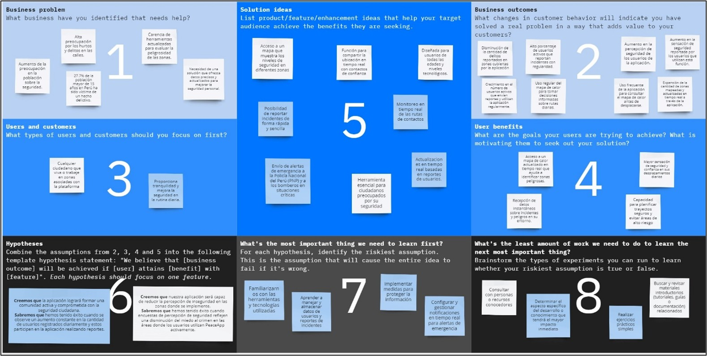

Enlace al esquema hecho en Miro: <https://tinyurl.com/ymmmjj7t>

## 1.3. Segmentos Objetivo

<table>
<colgroup>
<col style="width: 22%" />
<col style="width: 77%" />
</colgroup>
<thead>
<tr class="header">
<th rowspan="2"><strong>Variables</strong></th>
<th><strong>Segmento</strong></th>
</tr>
<tr class="odd">
<th>Ciudadanos preocupados por su seguridad en espacios públicos</th>
</tr>
</thead>
<tbody>
<tr class="odd">
<td><strong>Geográfica</strong></td>
<td><ul>
<li>
Ubicación: Lima Metropolitana, con especial enfoque en zonas con
altos índices de delincuencia y tráfico peatonal.
</li>
<li>
Alcance: Barrios y distritos urbanos dentro de Lima
Metropolitana.
</li>
</ul></td>
</tr>
<tr class="even">
<td><strong>Demográfica</strong></td>
<td><ul>
<li>
Edad: Adultos jóvenes y mayores (18-65 años).
</li>
<li>
Género: Hombres y mujeres.
</li>
<li>
Nivel socioeconómico: C1, C2 y C3, quienes suelen transitar por
las calles de Lima para trabajo, estudio o actividades
personales.
</li>
<li>
Ocupación: Estudiantes, profesionales, trabajadores informales, y
amas de casa.
</li>
</ul></td>
</tr>
<tr class="odd">
<td><strong>Psicológica</strong></td>
<td><ul>
<li>
Actitudes y valores: Personas preocupadas por su seguridad
personal y la de sus seres queridos, con alta sensibilidad a temas de
delincuencia y seguridad.
</li>
<li>
Motivaciones: Buscan tranquilidad al transitar por la ciudad,
desean estar informados sobre situaciones de riesgo y prefieren tomar
decisiones basadas en información confiable.
</li>
<li>
Estilo de vida: Ciudadanos activos que suelen desplazarse
frecuentemente por la ciudad.
</li>
</ul></td>
</tr>
<tr class="even">
<td><strong>Función de comportamiento</strong></td>
<td><ul>
<li>
Necesidades: Acceso a información en tiempo real sobre la
seguridad en su entorno inmediato.
</li>
<li>
Comportamiento de compra/uso: Uso frecuente de aplicaciones
móviles para obtener información y comunicación, propensos a adoptar
nuevas tecnologías que mejoren su seguridad.
</li>
<li>
Lealtad: Usuarios que buscan plataformas confiables y
colaborativas que les permitan contribuir a la seguridad
comunitaria.
</li>
</ul></td>
</tr>
</tbody>
</table>

# Capítulo II: Requirements & Analysis

## 2.1. Competidores

<!--EDITANDO -->

| **Principales Competidores** | **Características** | **Diferencias** | **Limitaciones** |
|-----------------------------|---------------------|-----------------|------------------|
| **SafeCity** | - **Reportes Confidenciales**: Los usuarios pueden reportar incidentes sin revelar su identidad.   - **Mapas de Seguridad**: Los reportes se utilizan para crear mapas interactivos que muestran las zonas con más incidentes.   - **Colaboración con ONGs**: Trabaja junto con organizaciones para utilizar los datos en campañas de sensibilización y políticas públicas. | - **Especialización en Acoso**: SafeCity se enfoca específicamente en el acoso, mientras que PeaceApp cubre una variedad de incidentes.   - **Análisis de Datos Avanzado**: Ofrece un análisis detallado de los datos con fines educativos y de políticas públicas. | - **Enfoque Limitado**: Su enfoque exclusivo en el acoso puede no ser útil para quienes buscan una herramienta más general de seguridad.   - **Cobertura Restringida**: SafeCity no está disponible en todas las ciudades, a diferencia de PeaceApp, que se enfoca en Lima Metropolitana. |
| **Nextdoor** | - **Foros Vecinales**: Los usuarios pueden discutir temas de seguridad, reportar incidentes y organizar eventos comunitarios.   - **Alertas de Seguridad**: Notificaciones sobre incidentes de seguridad en áreas cercanas.   - **Redes Locales**: Posibilidad de crear grupos privados según la ubicación del usuario. | - **Enfoque Comunitario**: A diferencia de PeaceApp, que se centra en la seguridad ciudadana, Nextdoor es una red social de uso general.   - **Mayor Cobertura Geográfica**: Disponible en múltiples ciudades a nivel mundial, no solo en Lima. | - **No Exclusivo en Seguridad**: Aunque incluye funciones de seguridad, es una plataforma multifuncional.   - **Privacidad**: La naturaleza social de la plataforma puede generar preocupaciones sobre la privacidad, especialmente en temas de seguridad. |
| **Waze** | - **Alcance Amplio**: Aunque es una app de navegación, permite reportar incidentes en la vía pública, como accidentes y peligros.   - **Interactividad**: Los usuarios pueden reportar incidentes visibles para otros conductores en tiempo real.   - **Popularidad**: Cuenta con una gran base de usuarios, lo que aumenta la cantidad de reportes en tiempo real. | - **Enfoque en Navegación**: Aunque permite reportar incidentes, Waze no está diseñado para la seguridad personal o la prevención de delitos.   - **Comunidad de Conductores**: Su comunidad está más centrada en conductores, no en peatones o transeúntes. | - **No Está Focalizado en Seguridad Ciudadana**: Su objetivo principal es la navegación, no la seguridad personal.   - **Información Limitada**: Los reportes de incidentes pueden no ser tan detallados o útiles para la prevención de delitos. |

<!--EDITANDO -->

### 2.1.1. Análisis Competitivo

<!--EDITANDO -->

<table>
<colgroup>
<col style="width: 9%" />
<col style="width: 11%" />
<col style="width: 21%" />
<col style="width: 19%" />
<col style="width: 19%" />
<col style="width: 17%" />
</colgroup>
<thead>
<tr class="header">
<th colspan="6"><strong>Competitive Analysis Landscape</strong></th>
</tr>
</thead>
<tbody>
<tr class="odd">
<td colspan="6"><em>¿Por qué llevar al cabo este análisis</em>? Para conocer a nuestros competidores, conocer sus estrategias y poder aprender de estos.</td>
</tr>
<tr class="even">
<td colspan="2">Empresas (Aplicación)</td>
<td>
SafeCity

</td>
<td>
Nextdoor

</td>
<td>
Waze

</td>
<td>PeaceApp</td>
</tr>
<tr class="odd">
<td rowspan="2"><strong>Perfil</strong></td>
<td>Overview</td>
<td>SafeCity es una aplicación que permite a los usuarios reportar
incidentes de acoso y violencia en tiempo real, principalmente enfocada en la seguridad de las mujeres. La plataforma utiliza estos reportes para crear mapas de calor que visualizan las áreas más peligrosas, ayudando a otros usuarios a evitar esas zonas.</td>
<td>Nextdoor es una red social privada para vecindarios, que conecta a los residentes de una misma comunidad para discutir temas locales, compartir recomendaciones, organizar eventos y mantenerse informados sobre lo que ocurre en su entorno.</td>
<td>Waze es una aplicación de navegación que utiliza la información proporcionada por los usuarios para ofrecer rutas en tiempo real, evitando tráfico, accidentes y otros obstáculos en la carretera.</td>
<td>PeaceApp es una aplicación móvil enfocada en mejorar la seguridad ciudadana en Lima Metropolitana, proporcionando información en tiempo real sobre incidentes y riesgos en las calles.</td>
</tr>
<tr class="even">
<td>¿Qué valor ofrece los clientes?</td>
<td>
Seguridad y prevención: Proporciona a los usuarios una herramienta para identificar y evitar áreas peligrosas basadas en reportes en tiempo real.

Empoderamiento: Empodera a las mujeres y a otras víctimas al darles una plataforma para denunciar incidentes de acoso.

Comunicación anónima: Permite reportes anónimos, lo que ayuda a aumentar la cantidad de reportes sin temor a represalias.
</td>
<td>
Conexión comunitaria: Facilita la interacción entre vecinos, fortaleciendo la sensación de comunidad.

Seguridad y vigilancia vecinal: Permite a los usuarios reportar y discutir incidentes de seguridad, fomentando una red de vigilancia vecinal.

Recursos locales: Ofrece una plataforma para que los usuarios compartan recomendaciones de servicios y negocios locales, creando un entorno de apoyo mutuo.
</td>
<td>
Eficiencia en desplazamientos: Proporciona rutas optimizadas en tiempo real, ahorrando tiempo y evitando atascos.

Seguridad en la conducción: Informa sobre peligros en la carretera, como accidentes y obstáculos, ayudando a los conductores a tomar decisiones informadas.

Comunidad activa: Los usuarios contribuyen activamente con información sobre el tráfico, lo que enriquece la precisión y utilidad de la aplicación.
</td>
<td>
Seguridad en tiempo real: Los usuarios reciben alertas sobre situaciones de riesgo en su entorno.

Colaboración ciudadana: Facilita la comunicación entre ciudadanos y autoridades para reportar incidentes.

Empoderamiento: Permite a los usuarios contribuir activamente a la seguridad de su comunidad.

Accesibilidad: Interfaz fácil de usar para personas de todas las edades.

Prevención de riesgos: Ayuda a los usuarios a evitar áreas peligrosas y mejorar su seguridad personal.
</td>
</tr>
<tr class="odd">
<td rowspan="2"><strong>Perfil de Marketing</strong></td>
<td>Mercado objetivo</td>
<td>
Demográfico: Principalmente mujeres de todas las edades, especialmente en áreas urbanas donde el acoso y la violencia de género son más prevalentes.

Geográfico: Focalizado en ciudades con altos índices de violencia y acoso, especialmente en India y otros países donde la inseguridad para las mujeres es una preocupación significativa.

Psicológico: Individuos conscientes de la seguridad y que buscan activamente herramientas para protegerse y empoderarse frente a situaciones de acoso.

Comportamiento: Usuarios que valoran la seguridad personal y están dispuestos a contribuir a una comunidad compartiendo incidentes para prevenir futuros ataques.
</td>
<td>
Demográfico: Adultos de todas las edades, propietarios de viviendas y residentes de vecindarios interesados en conectarse con sus vecinos.

Geográfico: Vecindarios en áreas urbanas y suburbanas en Estados Unidos, Reino Unido, y otros países donde la vida comunitaria es fuerte.

Psicológico: Personas que valoran la interacción comunitaria, la seguridad en el vecindario y el acceso a recursos locales.

Comportamiento: Usuarios que buscan construir relaciones más estrechas con sus vecinos y mantenerse informados sobre lo que ocurre en su comunidad.
</td>
<td>
Demográfico: Conductores de todas las edades, especialmente aquellos que conducen diariamente en áreas urbanas congestionadas.

Geográfico: Principalmente en ciudades grandes con problemas de tráfico significativos a nivel mundial.

Psicológico: Conductores que valoran la eficiencia en sus desplazamientos y están dispuestos a utilizar la tecnología para evitar el tráfico.

Comportamiento: Usuarios que buscan optimizar sus rutas y minimizar el tiempo de viaje mediante la navegación en tiempo real.
</td>
<td>
Demográfico: Ciudadanos de todas las edades, en su mayoría residentes urbanos, que están preocupados por la seguridad personal y buscan soluciones para prevenir situaciones de riesgo.

Geográfico: Enfocado en Lima Metropolitana, una ciudad con desafíos de seguridad que requiere atención y recursos adicionales para mejorar la seguridad ciudadana.

Psicológico: Individuos que valoran su seguridad y buscan herramientas efectivas para mantenerse informados y protegidos en su entorno. Personas proactivas que quieren colaborar con la comunidad para mejorar la seguridad.

Comportamiento: Usuarios que frecuentemente se enfrentan a situaciones de inseguridad y están dispuestos a participar activamente reportando incidentes y compartiendo información para mantener la comunidad segura.
</td>
</tr>
<tr class="even">
<td>Estrategias de Marketing</td>
<td>
Campañas de concienciación: Colaboraciones con ONG y movimientos feministas para sensibilizar sobre la seguridad de las mujeres y promover el uso de la aplicación.

Publicidad digital: Anuncios segmentados en redes sociales y plataformas digitales que lleguen a mujeres en áreas urbanas.

Marketing comunitario: Promoción de la aplicación en comunidades locales y eventos relacionados con la seguridad de las mujeres.

Relaciones públicas: Historias de éxito de la aplicación difundidas en medios de comunicación para destacar su impacto positivo.
</td>
<td>
Publicidad en redes sociales: Campañas dirigidas a residentes de vecindarios específicos para fomentar la conexión entre vecinos.

Marketing de boca en boca: Incentivar a los usuarios actuales para que inviten a sus vecinos a unirse a la plataforma.

Colaboraciones con asociaciones vecinales: Trabajar con asociaciones de vecinos para promover el uso de la aplicación como herramienta de comunicación comunitaria.

Email marketing: Enviar correos electrónicos personalizados con contenido relevante para diferentes vecindarios.
</td>
<td>
Marketing de alianzas: Colaboraciones con empresas automotrices y servicios de transporte para integrar Waze en sus sistemas.

Publicidad geolocalizada: Anuncios dirigidos a conductores en áreas específicas durante sus desplazamientos.

Eventos en carretera: Patrocinio de eventos relacionados con el transporte y la seguridad vial para aumentar la visibilidad de la aplicación.

Programas de incentivos: Ofrecer recompensas o beneficios a los usuarios que contribuyen activamente con información sobre el tráfico y peligros en la carretera.
</td>
<td>
Campañas de concienciación: Colaborar con entidades locales y organizaciones comunitarias para sensibilizar sobre la importancia de la seguridad personal y promover PeaceApp como una herramienta esencial.

Publicidad digital: Implementar campañas en redes sociales y plataformas digitales dirigidas a residentes de Lima Metropolitana, destacando las funcionalidades de la app y cómo contribuye a la seguridad.

Marketing comunitario: Promover la aplicación en eventos locales relacionados con la seguridad y fomentar el uso entre grupos comunitarios que se preocupan por la seguridad pública.

Relaciones públicas: Publicar historias de éxito y casos de uso en medios locales para demostrar el impacto positivo de PeaceApp en la mejora de la seguridad y la colaboración ciudadana.
</td>
</tr>
<tr class="odd">
<td rowspan="3"><strong>Perfil del producto</strong></td>
<td>Producto &amp; Servicios</td>
<td>
Aplicación móvil: SafeCity permite a los usuarios reportar incidentes de acoso y violencia en tiempo real, creando un mapa de puntos críticos de seguridad en ciudades. También ofrece alertas de seguridad basadas en la ubicación y consejos preventivos.

Plataforma de datos: Ofrece un acceso a datos agregados para ONGs, gobiernos y organizaciones comunitarias para analizar y abordar problemas de seguridad.

Comunidad: Fomenta la creación de una comunidad de apoyo y concienciación, donde los usuarios pueden compartir experiencias y obtener apoyo.
</td>
<td>
Red social vecinal: Nextdoor conecta a los vecinos para discutir temas locales, compartir recomendaciones, organizar eventos, y vender o comprar artículos.

Servicios de anuncios locales: Ofrece a las pequeñas empresas y servicios locales la posibilidad de anunciarse directamente en su comunidad.

Alerta de seguridad: Funcionalidad para alertar a los vecinos sobre situaciones de seguridad y eventos importantes en el vecindario.
</td>
<td>
Aplicación de navegación: Waze ofrece navegación GPS en tiempo real con información sobre el tráfico, accidentes, y rutas alternativas, basada en la colaboración de los usuarios.

Alertas de tráfico: Los usuarios pueden reportar incidentes, cámaras de velocidad, y otros peligros en la carretera.

Integración con otros servicios: Waze se integra con servicios de música, mapas y otras aplicaciones, ofreciendo una experiencia de conducción más rica.
</td>
<td>
Aplicación móvil: PeaceApp permite a los usuarios acceder a información en tiempo real sobre la seguridad en las calles de Lima Metropolitana. Los usuarios pueden reportar incidentes y situaciones de riesgo, contribuyendo a un mapa colaborativo que muestra las áreas más peligrosas. También proporciona alertas basadas en la ubicación y recomendaciones de seguridad personal.

Plataforma de datos: Ofrece datos agregados para autoridades locales y organizaciones de seguridad que les permiten analizar patrones de criminalidad y planificar intervenciones más efectivas.

Comunidad: Fomenta la colaboración entre ciudadanos y autoridades, creando una comunidad comprometida con la mejora de la seguridad pública. Los usuarios pueden compartir experiencias y obtener consejos útiles sobre cómo evitar situaciones peligrosas.
</td>
</tr>
<tr class="even">
<td>Precios &amp; Costos</td>
<td>
Modelo freemium: La aplicación es gratuita para usuarios individuales, mientras que las organizaciones pueden acceder a servicios premium, como análisis de datos detallados y reportes personalizados, mediante suscripciones.

Costos: Incluyen desarrollo y mantenimiento de la aplicación, hosting de la plataforma de datos, y costos operativos asociados con campañas de concienciación y relaciones comunitarias.
</td>
<td>
Gratuito para usuarios: No hay costo para los usuarios que se inscriben y utilizan la plataforma.

Publicidad pagada: Las empresas locales y los proveedores de servicios pueden pagar por anuncios dirigidos en su vecindario, lo que constituye la principal fuente de ingresos.

Costos: Desarrollo y mantenimiento de la plataforma, moderación de contenido, soporte al cliente y costos de marketing.
</td>
<td>
Gratuito: La aplicación es gratuita para todos los usuarios. Los ingresos se generan principalmente a través de publicidad geolocalizada.

Publicidad geolocalizada: Waze ofrece a las empresas la posibilidad de mostrar anuncios en la aplicación basados en la ubicación del usuario.

Costos: Incluyen el desarrollo y mantenimiento de la aplicación, costos de servidores para manejar grandes volúmenes de datos, y la gestión de asociaciones con empresas de publicidad y automotrices.
</td>
<td>
Modelo freemium: La aplicación es gratuita para los usuarios individuales. Sin embargo, se ofrece un servicio premium para empresas y organizaciones, que incluye acceso a análisis avanzados de datos, reportes personalizados y funciones adicionales de seguridad, disponibles a través de suscripciones mensuales o anuales.

Costos: Los costos principales incluyen el desarrollo y mantenimiento de la aplicación móvil, el hosting de la plataforma de datos, gastos en campañas de marketing, y costos operativos para la colaboración con autoridades locales y la gestión de la comunidad de usuarios.
</td>
</tr>
<tr class="odd">
<td>Canales de distribución (Web &amp;/o Móvil)</td>
<td>
Móvil: Disponible como aplicación móvil en Android y iOS.

Web: Una plataforma web complementaria permite el acceso a mapas de seguridad y la participación en foros comunitarios.
</td>
<td>
Móvil: Disponible como aplicación móvil en Android y iOS.

Web: La plataforma también está accesible vía navegador web, permitiendo una experiencia completa en escritorio.
</td>
<td>
Móvil: Disponible como aplicación móvil en Android y iOS.

Web: Aunque la experiencia principal es móvil, Waze también ofrece una plataforma web para la planificación de rutas.
</td>
<td>
Móvil: PeaceApp está disponible como una aplicación móvil tanto en Android como en iOS, ofreciendo a los usuarios acceso en cualquier momento y lugar.

Web: Una plataforma web complementaria permite a los usuarios acceder a mapas interactivos de seguridad, reportar incidentes desde sus computadoras, y participar en foros comunitarios para compartir información y consejos de seguridad.
</td>
</tr>
<tr class="even">
<td rowspan="4"><strong>Análisis SWOT</strong></td>
<td>Fortalezas</td>
<td>
Enfoque en la seguridad personal: SafeCity se especializa en la seguridad de los usuarios, permitiéndoles reportar incidentes de manera anónima y acceder a mapas de seguridad en tiempo real.

Impacto social positivo: Fomenta la conciencia y la acción comunitaria sobre temas de seguridad, lo que puede aumentar la confianza y lealtad de los usuarios.

Colaboraciones con ONGs y gobiernos: La plataforma ofrece datos valiosos que pueden ser utilizados por organizaciones para tomar decisiones informadas en temas de seguridad.
</td>
<td>
Red social hiperlocal: Nextdoor se enfoca en conectar a los vecinos, lo que crea una comunidad cercana y de apoyo mutuo.

Diversidad de funcionalidades: Ofrece una amplia gama de servicios, desde discusiones locales hasta venta de artículos, lo que aumenta la retención de usuarios.

Gran base de usuarios: Al estar presente en muchos países, cuenta con una amplia comunidad y reconocimiento de marca.
</td>
<td>
Navegación en tiempo real: Ofrece actualizaciones en vivo sobre tráfico y rutas alternativas, lo que es altamente valorado por los usuarios.

Colaboración de la comunidad: Los usuarios pueden reportar incidentes en tiempo real, mejorando la precisión y utilidad de la información.

Integración con otros servicios: Waze se integra con aplicaciones de música y otros servicios, ofreciendo una experiencia de conducción completa.
</td>
<td>
Enfoque en la seguridad urbana: PeaceApp está diseñada específicamente para mejorar la seguridad en las calles de Lima Metropolitana, ofreciendo a los usuarios la capacidad de reportar incidentes y acceder a información de seguridad en tiempo real.

Colaboración ciudadana: La aplicación promueve la colaboración entre los ciudadanos y las autoridades, lo que refuerza la confianza en la comunidad y aumenta la eficacia en la prevención del crimen.
</td>
</tr>
<tr class="odd">
<td>Debilidades</td>
<td>
Alcance limitado: Aunque es fuerte en áreas urbanas, su impacto puede ser limitado en zonas rurales o en regiones con baja penetración de smartphones.

Dependencia del usuario: La eficacia de la aplicación depende de la cantidad y calidad de los reportes generados por los usuarios.

Modelo freemium restringido: Las opciones premium pueden no ser atractivas para todas las organizaciones, limitando su base de ingresos.
</td>
<td>
Problemas de privacidad: Ha enfrentado críticas sobre la privacidad y la gestión de datos personales, lo que puede afectar la confianza de los usuarios.

Moderación de contenido: Mantener la calidad del contenido y evitar el mal uso de la plataforma puede ser un desafío constante.

Alto nivel de competencia: Compite con otras plataformas sociales y aplicaciones de comunicación local, lo que puede diluir su propuesta de valor.
</td>
<td>
Dependencia de la comunidad: La calidad de la información depende de la participación activa de los usuarios.

Consumo de datos y batería: La aplicación puede consumir mucha batería y datos móviles, lo que puede ser una limitación para algunos usuarios.

Monetización limitada: Aunque tiene publicidad, el modelo de ingresos puede no ser suficiente a largo plazo sin diversificación.
</td>
<td>
Penetración limitada fuera de Lima: La efectividad de PeaceApp está inicialmente limitada a Lima Metropolitana, lo que podría restringir su impacto en otras ciudades o áreas rurales.

Dependencia de la participación del usuario: La calidad y utilidad de la información en la aplicación dependen en gran medida de la cantidad y precisión de los reportes generados por los usuarios.

Costos operativos: Mantener la plataforma actualizada y funcional requiere una inversión constante en tecnología y operaciones, lo que podría ser un desafío a largo plazo.
</td>
</tr>
<tr class="even">
<td>Oportunidades</td>
<td>
Expansión geográfica: Ampliar su presencia a más ciudades y países puede aumentar su impacto y base de usuarios.

Integración con otras plataformas: Colaboraciones con aplicaciones de transporte o redes sociales pueden mejorar la visibilidad y funcionalidad de SafeCity.

Aumento en la demanda de seguridad: Con el incremento de preocupaciones de seguridad, hay una creciente necesidad de soluciones tecnológicas como SafeCity.
</td>
<td>
Expansión de servicios: Puede integrar nuevas funcionalidades, como marketplaces locales más robustos o herramientas para la organización de eventos comunitarios.

Alianzas con negocios locales: Colaborar con pequeños negocios para ofrecer promociones exclusivas podría fortalecer su propuesta de valor.

Creciente demanda de comunidades: La necesidad de conexión a nivel local está en aumento, lo que puede aumentar la adopción de la plataforma.
</td>
<td>
Expansión a nuevas funciones: Integración con servicios de emergencia o mayor personalización de rutas puede atraer a más usuarios.

Colaboración con gobiernos locales: Waze podría colaborar con gobiernos para mejorar la gestión del tráfico en tiempo real.

Crecimiento en el uso de automóviles: A medida que más personas optan por conducir en lugar de utilizar transporte público, la base de usuarios puede crecer.
</td>
<td>
Expansión a otras ciudades: Existe una gran oportunidad de expandir PeaceApp a otras ciudades peruanas y latinoamericanas que también enfrentan problemas de inseguridad.

Alianzas estratégicas: Colaborar con gobiernos locales, ONGs y empresas de tecnología podría mejorar la visibilidad y efectividad de PeaceApp.

Creciente preocupación por la seguridad: Con el aumento de la delincuencia, existe una demanda creciente por aplicaciones como PeaceApp que ofrezcan soluciones tecnológicas para mejorar la seguridad.
</td>
</tr>
<tr class="odd">
<td>Amenazas</td>
<td>
Competencia creciente: Nuevas aplicaciones de seguridad y herramientas similares pueden reducir la cuota de mercado de SafeCity.

Regulaciones sobre datos: Cambios en la legislación sobre privacidad y seguridad de datos pueden impactar la operación de la aplicación.

Dependencia tecnológica: Problemas técnicos o de conectividad pueden afectar la confiabilidad de los datos y la confianza de los usuarios.
</td>
<td>
Cambios en la privacidad de datos: Las nuevas regulaciones podrían afectar su modelo de negocio basado en publicidad.

Competencia de grandes plataformas: Redes sociales más grandes pueden replicar sus características y capturar su mercado.

Saturación del mercado: La aparición de nuevas aplicaciones hiperlocales podría fragmentar la audiencia.
</td>
<td>
Competencia de servicios de mapas: Competidores como Google Maps (que pertenece a la misma empresa matriz) y Apple Maps están mejorando sus capacidades, lo que podría reducir la relevancia de Waze.

Problemas de privacidad: El manejo de datos de localización puede ser un tema sensible y puede generar desconfianza si no se gestiona adecuadamente.

Cambio en hábitos de movilidad: Un cambio hacia transporte público o movilidad compartida podría disminuir el uso de la aplicación.
</td>
<td>
Competencia en el mercado: La presencia de otras aplicaciones de seguridad podría limitar el crecimiento de PeaceApp, especialmente si estas ofrecen funcionalidades similares o más avanzadas.

Cambios regulatorios: La evolución de las normativas sobre privacidad de datos podría afectar la forma en que PeaceApp maneja y utiliza la información de los usuarios.

Riesgos tecnológicos: Fallos en la plataforma o problemas de conectividad podrían comprometer la confianza de los usuarios en la aplicación y su capacidad para proporcionar información precisa.
</td>
</tr>
</tbody>
</table>

<!--EDITANDO -->

### 2.1.2. Estrategias y tácticas frente a competidores

<!--EDITANDO -->

**1. Diferenciación por Especialización Local:**

> Estrategia: Focalizar a PeaceApp en Lima Metropolitana, destacándose por su
> comprensión detallada de los retos de seguridad específicos de la ciudad y
> estableciendo relaciones sólidas con autoridades locales y comunidades.
>
> Táctica: Desarrollar campañas de comunicación que resalten la experiencia de
> PeaceApp y su dedicación exclusiva a la seguridad de Lima, diferenciándola de
> otras aplicaciones más generales como Waze y Nextdoor.

**2. Fomento de la Participación Ciudadana:**

> Estrategia: Fomentar la interacción activa de los usuarios en la plataforma,
> incentivando que reporten incidentes y colaboren en la seguridad de su entorno.
>
> Táctica: Crear un sistema de recompensas que premie a los usuarios más
> comprometidos, ofreciendo incentivos o beneficios dentro de la aplicación a
> quienes participen con mayor frecuencia.

**3. Alianzas Estratégicas:**

> Estrategia: Construir relaciones con organizaciones locales, ONGs y autoridades
> del orden público para reforzar la autoridad y efectividad de PeaceApp.
>
> Táctica: Establecer acuerdos con estas instituciones para integrar PeaceApp en
> sus iniciativas de seguridad ciudadana, asegurando un flujo continuo de datos y
> colaboración mutua.

**4. Expansión Geográfica Controlada:**

> Estrategia: Después de lograr consolidarse en Lima, expandir gradualmente la
> presencia de PeaceApp a otras ciudades peruanas con altos índices de
> criminalidad, replicando el modelo de seguridad implementado en la capital.
>
> Táctica: Realizar análisis de mercado para seleccionar las ciudades más adecuadas
> para la expansión, adaptando las estrategias de comunicación y marketing a las
> características particulares de cada región.

**5. Innovación en Funcionalidades:**

> Estrategia: Introducir características innovadoras que no estén disponibles en las
> aplicaciones competidoras, mejorando la propuesta de valor que PeaceApp
> ofrece a sus usuarios.
>
> Táctica: Desarrollar herramientas como alertas personalizadas, integración con
> sistemas de transporte y un botón de emergencia que permita a los usuarios
> contactar directamente con las autoridades locales.

## 2.2. Entrevistas

El objetivo realizar las entrevistas es para poder comprender las preocupaciones, necesidades y expectativas de nuestro segmento objetivo, en este caso los ciudadanos preocupados por su seguridad en espacios públicos, en relación con su seguridad en espacios públicos. La información recolectada guiará el desarrollo de funcionalidades clave en la aplicación móvil, buscando mejorar la seguridad y tranquilidad de los usuarios en su entorno.

### 2.2.1. Diseño de entrevistas

Para la primera parte necesitaremos algunos de sus datos personales:
Nombres y Apellidos, edad, pasatiempos y ocupación

**Segmento Objetivo: Ciudadanos preocupados por su seguridad en espacios
públicos**

1.  ¿Puede describir alguna situación reciente en un espacio público donde se haya sentido inseguro o preocupado por su seguridad?

Objetivo: Captar experiencias personales y contextos específicos que
generan inseguridad.

2.  ¿Qué medidas toma actualmente para sentirse más seguro cuando se encuentra en espacios públicos?

Objetivo: Conocer las prácticas o herramientas que ya utilizan para protegerse.

3.  ¿Qué aspectos de los espacios públicos (iluminación, vigilancia, presencia policial, etc.) le generan mayor preocupación en términos de seguridad?

Objetivo: Identificar factores específicos que afectan la percepción de seguridad.

4.  ¿Cómo reaccionaría si fuera testigo o víctima de una situación peligrosa en un espacio público?

Objetivo: Comprender las respuestas típicas de los ciudadanos ante situaciones de inseguridad.

5.  ¿Qué tipo de información o alertas le gustaría recibir a través de una aplicación móvil para mejorar su seguridad en espacios públicos?

Objetivo: Definir las funcionalidades más valiosas para los usuarios.

6.  ¿Qué tan cómodo se siente utilizando aplicaciones móviles para reportar incidentes de seguridad o recibir alertas?

Objetivo: Evaluar el nivel de comodidad y experiencia con tecnologías de seguridad.

7.  ¿Ha utilizado alguna vez una aplicación móvil enfocada en la seguridad ciudadana? Si es así, ¿qué le gustó o no le gustó de esa experiencia?

Objetivo: Identificar experiencias previas y posibles mejoras.

8.  ¿Considera útil la posibilidad de compartir su ubicación en tiempo real con familiares o amigos cuando se encuentra en un espacio público?

Objetivo: Evaluar el interés en funciones de seguridad basadas en la ubicación.

9.  ¿Qué otras características o herramientas le gustarían que una aplicación móvil incluyera para ayudarle a sentirse más seguro en espacios públicos?

Objetivo: Recopilar ideas adicionales para funcionalidades en la aplicación.

10. ¿Qué aspectos de una aplicación móvil de seguridad le harían sentir más confiado en su uso regular? (Ej.: facilidad de uso, protección de datos, confiabilidad, etc.)

Objetivo: Identificar los requisitos esenciales para que la aplicación sea adoptada ampliamente.

### 2.2.2. Registro de entrevistas

**URL de todas las entrevistas:** <https://youtu.be/q6cGVX8_OZo>

**Entrevista N°1:**

**Timing:**  00:00

**Nombre:** Mauricio Rojas

**Edad:** 22 años

**Pasatiempos:** Salir con amigos y con mascotas.

**Ocupación:** Estudiante Universitario (Ingeniería de Software)

Mauricio se siente inseguro en zonas congestionadas cerca de su universidad, especialmente después de presenciar un robo que generó tensión entre los transeúntes. Para protegerse, se mantiene cauteloso y evita zonas peligrosas cuando es posible, prestando atención a su
entorno. La falta de iluminación y vigilancia en las calles aumenta su sensación de inseguridad. Ante un incidente, su reacción sería grabarlo y difundirlo para garantizar que se realice una denuncia. Aunque no ha usado aplicaciones de seguridad ciudadana, le ustaría recibir alertas sobre zonas peligrosas y se siente cómodo usando tecnología para mantenerse informado. Considera útil compartir su ubicación en zonas desconocidas y valora la inclusión de foros en una app donde los usuarios puedan compartir experiencias. También le interesa que la aplicación sea confiable, especialmente en la protección de  datos y en la actualización de información basada en los reportes de los usuarios.

**Entrevista N° 2:**

**Timing:** 09:49

Nombre: Edson Sanchez

Edad: 20 años

Pasatiempos: Salir con amigos y jugar fútbol.

Ocupación: Estudiante Universitario (Psicología)

El entrevistado se siente inseguro en espacios públicos, especialmente cerca de su casa a altas horas de la noche, que a pesar de que no le haya ocurrido nada siente algo de miedo. Le preocupa la falta de vigilancia y la iluminación deficiente en estos lugares. Ante situaciones peligrosas, prefiere evitar problemas para salvaguardar su seguridad. Valora recibir alertas sobre robos o zonas peligrosas a través de una aplicación móvil, aunque no ha usado una app de seguridad antes, conoce su potencial y está interesado en funciones como alarmas y mapas de riesgo. Además, considera útil compartir su ubicación en tiempo real en caso de riesgo o llamar a las autoridades.

**Entrevista N°3:**

**Timing:** 19:27

**Nombre**: Marcia Mascco  

**Edad:** 21 años

**Pasatiempos:** Jugar videojuegos con su enamorado o amigos

**Ocupación:** Estudiante de la carrera de Administración y Marketing

La entrevistada no se siente segura en lugares donde no hay mucha iluminación ya que, como menciona, habia una zona por su residencia que estaba totalmente oscura y era zona donde robaban mucho. Afortunadamente, no ha sido victima de algún robo o alguna situación peligrosa, pero ante situaciones peligrosas ella indica que auxiliaria al afectado, dando su celular para llamar o bloquear dependiendo de lo que le hayan robado. Ella se siente cómoda y segura recibiendo alertas en su celuar, argumenta que revisa cada tanto algunas situaciones con alertas como, por ejemplo, google maps que manda alertas de tráfico o accidentes en alguna carretera. No ha usado apps de seguridad antes pero esta abierta a recibir una que le permita sentirse más segura en la vía pública y valora mucho las funcionalidades de alertas y de compartir ubicación en tiempo real.

**Entrevista N° 4:**

**Timing:** 27:27

**Nombre**: Fernanda Peña

**Edad:** 21 años

**Pasatiempos:** Salir a pasear con su mascota

**Ocupación:** Estudiante universitaria

La entrevistada expresa que no se siente completamente tranquila en áreas mal iluminadas, ya que, según comenta, cerca de su hogar había una zona oscura que solía ser un foco de robos. A pesar de no haber sido víctima de ningún incidente hasta el momento, en caso de enfrentar una situación peligrosa, señala que ayudaría a la persona afectada, ofreciéndole su teléfono para hacer una llamada de emergencia o para bloquear su dispositivo si es que le roban algo. Se siente cómoda recibiendo alertas en su celular y menciona que, con frecuencia, revisa notificaciones de situaciones como las alertas de tráfico o accidentes de Google Maps. Aunque nunca ha utilizado aplicaciones de seguridad previamente, está dispuesta a probar una que le brinde mayor sensación de protección mientras se desplaza por la ciudad. Valora especialmente las características de alertas y la posibilidad de compartir su ubicación en tiempo real con sus padres.

**Entrevista N° 5:**

**Timing:** 33:27

**Nombre:** Jefferson Castro

**Edad:** 22

**Pasatiempos:** Leer

**Ocupación:** Estudiante (Ingeniería de Software) y trabajador

El entrevistado se muestra muy consciente de la inseguridad ciudadana en su comunidad, una situación que le afecta especialmente por no tener movilidad propia. Para evitar riesgos, ha adoptado medidas como no usar sus dispositivos en la calle y transitar por zonas concurridas. En caso de presenciar un delito, su reacción sería pedir ayuda; sin embargo, si él fuera la víctima, optaría por entregar sus pertenencias, pues su salud es más importante que cualquier objeto material. Él considera que la inseguridad es un problema cada vez más grave y ve la necesidad de contar con herramientas que ayuden a combatirla. Aunque no ha usado ninguna aplicación con este fin, está muy interesado en probar una que sea intuitiva y que pueda alertar a los usuarios sobre posibles riesgos.

### 2.2.3. Análisis de entrevistas

Los entrevistados manifiestan una preocupación constante por la inseguridad en sus entornos cotidianos, particularmente en espacios con deficiente iluminación, zonas congestionadas o áreas cercanas a sus residencias y universidades. Aunque algunos no han sido víctimas directas de delitos, la experiencia de haber presenciado robos o conocer la peligrosidad de ciertos lugares genera en ellos una percepción de vulnerabilidad. La falta de vigilancia y la poca confianza en el entorno refuerzan la necesidad de contar con herramientas tecnológicas que aumenten su sensación de seguridad y les brinden respaldo ante posibles incidentes.

**Intereses y Requerimientos Principales:**

**1. Alertas de Seguridad y Zonas de Riesgo:** Los entrevistados valoran altamente recibir notificaciones sobre incidentes, robos o zonas peligrosas. Este tipo de alertas es visto como un mecanismo preventivo que permite anticiparse a situaciones de riesgo, tal como sucede con las notificaciones de tráfico o accidentes en aplicaciones ya conocidas.

**2. Compartir Ubicación en Tiempo Real:** Existe un interés marcado en poder compartir la ubicación en tiempo real, especialmente con familiares cercanos. Esta función es percibida como una medida de protección adicional en contextos de riesgo, aunque se resalta la importancia de que la aplicación garantice la seguridad de los datos personales y brinde confianza en su uso.

**3. Reportes en Tiempo Real:** Se destaca la necesidad de contar con la posibilidad de reportar situaciones de riesgo o incidentes de manera inmediata. Esta función es vista como un recurso clave para alertar a otros usuarios, generar información colaborativa y facilitar la intervención de las autoridades en el menor tiempo posible.

**4. Confianza y Protección de Datos:** Más allá de las funciones, los usuarios valoran que la aplicación sea confiable en el manejo de información. La privacidad, la actualización constante de reportes y la veracidad de los datos compartidos son factores determinantes para que la perciban como una herramienta útil y segura.

## 2.3. Needfinding

### 2.3.1. User Personas

En esta sección se presenta el User Persona que representa el segmento del proyecto. Este perfil permite comprender en profundidad las necesidades, motivaciones, frustraciones y comportamientos del usuario potencial del sistema, el cual busca mejorar la seguridad en la vía pública del país.

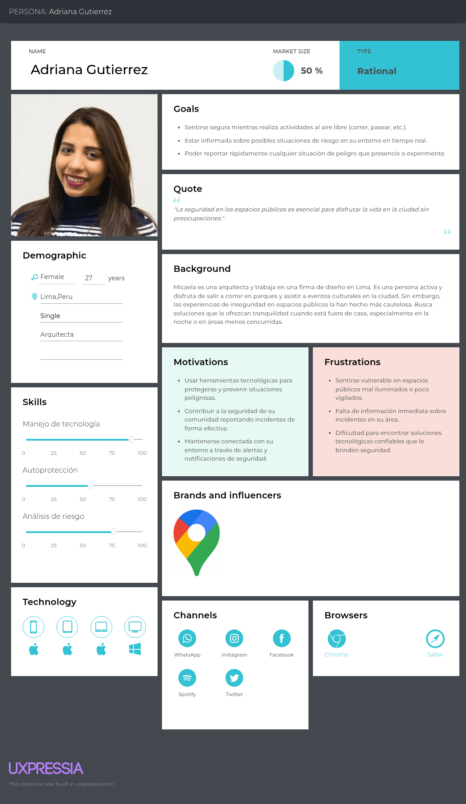

### 2.3.2. User Task Matrix

**Ciudadanos preocupados por su seguridad en espacios públicos**  

| **Tarea** | **Frecuencia / Importancia** |
|-----------|-------------------------------|
| Consultar a familiares o amigos sobre la seguridad de una zona antes de visitarla | Siempre / Alta |
| Buscar en Internet o en redes sociales noticias sobre incidentes en su área | A veces / Media |
| Evitar salir en horarios o lugares que son conocidos como peligrosos | Siempre / Alta |
| Llamar a la policía o a servicios de emergencia en caso de sentirse en peligro | Casi nunca / Alta |
| Organizarse con vecinos para mejorar la seguridad en la comunidad | Nunca / Media |
| Usar aplicaciones de mapas para evitar zonas peligrosas conocidas | Nunca / Media |
| Llevar consigo objetos de autodefensa personal | Nunca / Media |

---

## Análisis  

Adriana centra sus actividades en **mantenerse informada y protegida en espacios públicos**.  
La consulta constante con familiares, redes sociales e Internet, así como la decisión de evitar salir en horarios peligrosos, son sus **acciones prioritarias**, ya que le permiten anticipar riesgos y tomar decisiones seguras.  

Aunque **llamar a la policía o servicios de emergencia** es una acción poco frecuente, tiene una **alta importancia** por su carácter crítico en situaciones de peligro real.  
 
En resumen, la experiencia de Adriana está fuertemente orientada hacia la **prevención informada y la anticipación de riesgos**, lo que evidencia la necesidad de soluciones que le brinden **alertas confiables, comunicación ágil y herramientas tecnológicas de protección personal**.

### 2.3.3. Empathy Mapping

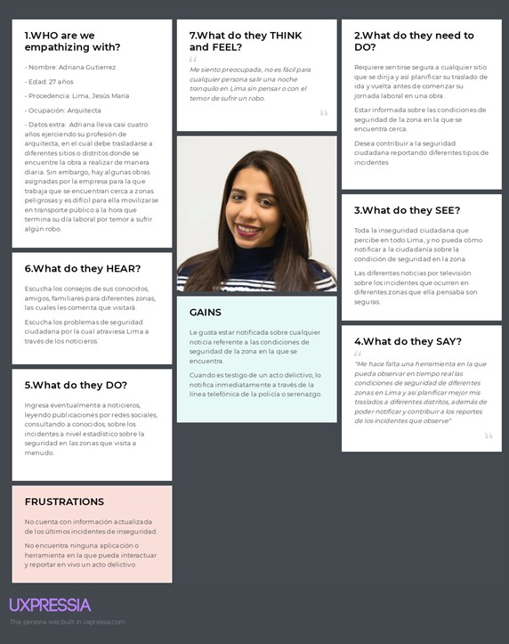

#### 2.3.4. As-is Scenario Mapping

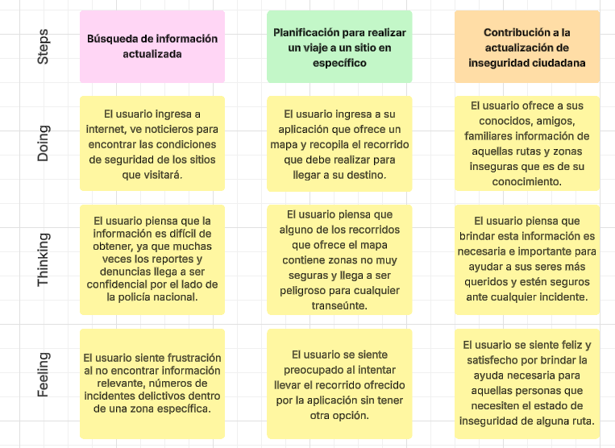

Enlace del As-Is Scenario Mapping: https://lucid.app/lucidchart/c1cb9ad8-c701-42db-9a14-30617f7dbc29/edit?viewport_loc=-495%2C43%2C2351%2C1078%2C0_0&invitationId=inv_26bc4b6e-dc17-4979-8706-54483829b3f9

# Capítulo III: Requirements Specification
## 3.1. To-be Scenario Mapping

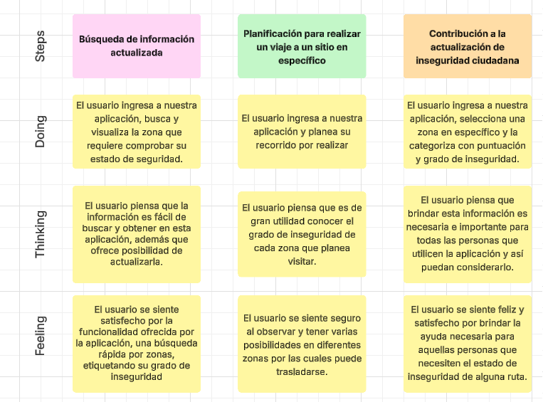

Enlace del To-Be Scenario Mapping: https://lucid.app/lucidchart/9c2329c4-fd90-4760-9ce3-d2e30cbe1b86/edit?viewport_loc=-433%2C56%2C1791%2C836%2C0_0&invitationId=inv_3a88d771-9c52-4f43-8aef-2c234eea78d6

## 3.2. User Stories

| User/Technical Story ID | Título                                                        | Descripción                                                                                                                                                                                                              | Criterios de Aceptación                                                                                                                                                                                                                                                                                                                                                                                                                                                                                                                                                                                                                                                                                                                                                                                                                                                                                       | Relacionado con (Epic ID) |
|-------------------------|---------------------------------------------------------------|--------------------------------------------------------------------------------------------------------------------------------------------------------------------------------------------------------------------------|---------------------------------------------------------------------------------------------------------------------------------------------------------------------------------------------------------------------------------------------------------------------------------------------------------------------------------------------------------------------------------------------------------------------------------------------------------------------------------------------------------------------------------------------------------------------------------------------------------------------------------------------------------------------------------------------------------------------------------------------------------------------------------------------------------------------------------------------------------------------------------------------------------------|---------------------------|
| EP01                    | Interfaz de Usuario y Navegación                              | Como usuario, quiero interactuar con una interfaz clara y fácil de navegar, para acceder a las funciones de la aplicación sin complicaciones.                                                                            | No corresponde.                                                                                                                                                                                                                                                                                                                                                                                                                                                                                                                                                                                                                                                                                                                                                                                                                                                                                               | No corresponde.           |
| EP02                    | Registro, Inicio de Sesión y Perfil                           | Como usuario, quiero poder registrarme, iniciar sesión y personalizar mi perfil, para gestionar mi cuenta y preferencias dentro de la aplicación.                                                                        | No corresponde.                                                                                                                                                                                                                                                                                                                                                                                                                                                                                                                                                                                                                                                                                                                                                                                                                                                                                               | No corresponde.           |
| EP03                    | Mapa Interactivo y Reportes                                   | Como usuario, quiero acceder a un mapa interactivo que muestre rutas seguras y zonas peligrosas, y poder enviar reportes de incidentes, para contribuir a la seguridad de mi comunidad.                                  | No corresponde.                                                                                                                                                                                                                                                                                                                                                                                                                                                                                                                                                                                                                                                                                                                                                                                                                                                                                               | No corresponde.           |
| EP04                    | Diseño y Accesibilidad de la Landing Page                     | Como visitante de la landing page, quiero acceder a una página bien diseñada y fácil de navegar, para obtener rápidamente información sobre PeaceApp y cómo descargarla.                                                 | No corresponde.                                                                                                                                                                                                                                                                                                                                                                                                                                                                                                                                                                                                                                                                                                                                                                                                                                                                                               | No corresponde.           |
| EP05                    | Información y Contacto                                        | Como visitante de la landing page, quiero encontrar información clara sobre los servicios y beneficios de la aplicación y tener la opción de contactar al equipo, para resolver cualquier duda o preocupación que tenga. | No corresponde.                                                                                                                                                                                                                                                                                                                                                                                                                                                                                                                                                                                                                                                                                                                                                                                                                                                                                               | No corresponde.           |
| US01                    | Contactar con la Startup                                      | Como visitante de la Landing Page, quiero encontrar un formulario de contacto funcional y accesible, para poder comunicarme con el startup.                                                                              | Escenario 1: Enviar un mensaje a los desarrolladores Dado que el visitante tiene una consulta o comentario relacionado con la aplicación, Cuando redacte un mensaje para contactar a los desarrolladores, Entonces el sistema enviará el mensaje a la dirección de correo electrónico del startup.                                                                                                                                                                                                                                                                                                                                                                                                                                                                                                                                                                                                   | EP05                      |
| US02                    | Navegar en la Landing Page                                    | Como visitante de la Landing Page, quiero encontrar las secciones bien definidas para comprender fácilmente la información mostrada.                                                                                     | Escenario 1: Visualizar información Dado que el visitante está recorriendo la landing page, Cuando acceda a una sección de la landing page, Entonces podrá comprender la información, ya que, cada sección estará organizada.  Escenario 2: Navegación a través del menú principal Dado que el visitante está en la landing page, Cuando hace clic en una opción del menú principal (como "About Us", "Services", entre otros), Entonces es redirigido a la sección correspondiente y la información se muestra claramente.                                                                                                                                                                                                                                                                                                                                                           | EP04                      |
| US03                    | Diseño Responsivo                                             | Como usuario, quiero que la aplicación se adapte bien a diferentes tamaños de pantalla, para poder usarla cómodamente en cualquier dispositivo, ya sea móvil, tablet o escritorio.                                       | Escenario 1: Adaptación a dispositivos móviles Dado que el usuario accede a la aplicación desde un smartphone, Cuando la aplicación se carga en el dispositivo, Entonces la interfaz se ajusta automáticamente para proporcionar una experiencia de uso óptima en una pantalla pequeña.  Escenario 2: Adaptación a tablets Dado que el usuario accede a la aplicación desde una tablet, Cuando la aplicación se carga en el dispositivo, Entonces la interfaz muestra un diseño responsivo adecuado para la pantalla más grande, utilizando el espacio de manera eficiente.                                                                                                                                                                                                                                                                                                           | EP01                      |
| US04                    | Registro de Usuarios                                          | Como usuario, quiero poder registrarme en la aplicación, para acceder a las funcionalidades de PeaceApp.                                                                                                                 | Escenario 1: Registro exitoso Dado que el usuario ha completado todos los campos del formulario de registro, Cuando hace clic en "Crear cuenta", Entonces la cuenta se crea y el usuario accede a la aplicación.  Escenario 2: Registro incompleto Dado que el usuario intenta registrarse sin completar todos los campos obligatorios, Cuando hace clic en "Crear cuenta", Entonces el sistema muestra un mensaje de error indicando qué campos faltan por completar.  Escenario 3: Registro con credenciales ya utilizadas Dado que el usuario intenta registrarse utilizando un correo electrónico ya registrado en la base de datos, Cuando hace clic en "Crear cuenta", Entonces el sistema muestra un mensaje de error indicando que el correo electrónico ya está en uso y sugiere recuperar la contraseña.                                                     | EP02                      |
| US05                    | Iniciar Sesión                                                | Como usuario registrado, quiero poder iniciar sesión con mi correo y contraseña, para acceder a mi cuenta.                                                                                                               | Escenario 1: Inicio de sesión exitoso Dado que el usuario ha ingresado su correo y contraseña correctamente, Cuando hace clic en "Iniciar sesión", Entonces accede a su cuenta en la aplicación.  Escenario 2: Inicio de sesión con credenciales incorrectas Dado que el usuario ingresa un correo electrónico o contraseña incorrectos, Cuando hace clic en "Iniciar sesión", Entonces el sistema muestra un mensaje de error indicando que las credenciales son incorrectas.                                                                                                                                                                                                                                                                                                                                                                                                        | EP02                      |
| US06                    | Generar Reporte de Incidentes                                 | Como usuario, quiero poder generar reportes de incidentes de seguridad, para contribuir a la actualización del mapa de calor.                                                                                            | Escenario 1: Reporte exitoso Dado que el usuario ha presenciado un incidente, Cuando completa el formulario de reporte en la aplicación, Entonces el incidente se registra y el mapa de calor se actualiza.  Escenario 2: Reporte con datos incompletos Dado que el usuario intenta enviar un reporte sin completar toda la información requerida, Cuando hace clic en "Enviar reporte", Entonces el sistema muestra un mensaje de error indicando los campos faltantes.  Escenario 3: Cancelación del reporte Dado que el usuario ha comenzado a llenar un reporte de incidente, Cuando decide cancelar el envío antes de completar el formulario, Entonces el sistema le pregunta si está seguro de que desea cancelar y descartar los datos ingresados.                                                                                                             | EP03                      |
| US07                    | Adjuntar Evidencia al Reporte                                 | Como usuario, quiero poder adjuntar fotos o videos al reporte, para dar mayor credibilidad y detalle al incidente reportado.                                                                                             | Escenario 1: Adjuntar evidencia Dado que el usuario está completando un reporte, Cuando adjunta una foto o video desde su dispositivo, Entonces el reporte se envía con la evidencia adjunta.  Escenario 2: Error al subir evidencia Dado que el usuario intenta subir una imagen o video de gran tamaño que excede el límite permitido, Cuando hace clic en "Subir evidencia", Entonces el sistema muestra un mensaje de error indicando que el archivo es demasiado grande.                                                                                                                                                                                                                                                                                                                                                                                                         | EP03                      |
| US08                    | Visualización de Reportes                                     | Como ciudadano, quiero poder ver los reportes de otros usuarios sobre incidentes ocurridos en la zona, para estar al tanto de los eventos de seguridad.                                                                  | Escenario 1: Visualización de reportes recientes Dado que el ciudadano está navegando por la aplicación, Cuando accede a la opción de "ver reportes", Entonces la aplicación muestra los reportes más recientes en la zona del ciudadano.  Escenario 2: Visualización de reportes en el mapa Dado que el ciudadano está utilizando el mapa interactivo en la aplicación, Cuando activa la opción de mostrar reportes en el mapa, Entonces la aplicación superpone los reportes relevantes en el mapa, mostrando la ubicación exacta de cada incidente.                                                                                                                                                                                                                                                                                                                                | EP03                      |
| US09                    | Recibir Alertas de Zonas de Riesgo                            | Como ciudadano, quiero recibir alertas si me acerco a una zona de alto riesgo, para tomar las precauciones necesarias.                                                                                                   | Escenario 1: Alerta de riesgo mientras está en una zona peligrosa Dado que el ciudadano está caminando en una zona peligrosa según la aplicación, Cuando la aplicación detecta que el ciudadano está en esa zona, Entonces la aplicación envía una alerta al ciudadano.                                                                                                                                                                                                                                                                                                                                                                                                                                                                                                                                                                                                                              | EP03                      |
| US10                    | Compartir Ubicación con Contactos en la Aplicación Móvil      | Como usuario de la aplicación móvil, quiero poder compartir mi ubicación con mis contactos cercanos, para que puedan monitorear mi trayecto y estar alertas ante cualquier peligro.                                      | Escenario 1: Compartir ubicación con éxito Dado que un usuario desea compartir su ubicación desde la aplicación móvil, Cuando activa la opción de compartir ubicación, Entonces los contactos seleccionados reciben la ubicación en tiempo real.  Escenario 2: Error al compartir ubicación Dado que un usuario intenta compartir su ubicación con sus contactos cercanos desde la aplicación móvil, Cuando la misma no puede acceder a la ubicación del usuario, Entonces se muestra un mensaje de error indicando que no se puede compartir la ubicación.                                                                                                                                                                                                                                                                                                                           | EP03                      |
| US11                    | Editar Información de Perfil                                  | Como usuario, quiero poder editar mi información de perfil, para corregir o actualizar mis datos personales.                                                                                                             | Escenario 1: Editar información de perfil exitosa Dado que el usuario está en la pantalla de edición de su perfil, Cuando el usuario actualiza su información personal y hace clic en el botón "Guardar cambios", Entonces la información actualizada debe guardarse correctamente y mostrarse en el perfil del usuario, con un mensaje de confirmación indicando que los cambios se realizaron con éxito.  Escenario 2: Error al guardar información de perfil Dado que el usuario está en la pantalla de edición de su perfil, Cuando el usuario intenta guardar los cambios con un campo obligatorio vacío o con un formato incorrecto, Entonces el sistema debe mostrar un mensaje de error indicando que la información no es válida, resaltando los campos que necesitan corrección, y no debe guardar los cambios hasta que toda la información esté correctamente completada. | EP02                      |
| US12                    | Recuperar Contraseña                                          | Como usuario, quiero poder recuperar mi contraseña si la olvido, para poder acceder nuevamente a mi cuenta.                                                                                                              | Escenario 1: Edición exitosa Dado que el usuario accede a la configuración de su perfil, Cuando cambia la información deseada, Entonces la información se actualiza correctamente.  Escenario 2: Fallo en la edición de perfil Dado que el usuario intenta guardar los cambios en su perfil, Cuando hay un problema de conectividad o error del servidor, Entonces el sistema muestra un mensaje de error indicando que los cambios no se han podido guardar.                                                                                                                                                                                                                                                                                                                                                                                                                         | EP02                      |
| US13                    | Acceder a Mapa con Reportes                                   | Como usuario, quiero poder ver un mapa interactivo con los reportes de incidentes en mi área, para tomar decisiones informadas sobre mi seguridad.                                                                       | Escenario 1: Acceso al mapa con reportes Dado que el usuario está en la página principal de la aplicación, Cuando selecciona el mapa, Entonces se muestra un mapa interactivo con marcadores que representan los reportes de incidentes según su ubicación.  Escenario 2: Mapa sin reportes disponibles Dado que el usuario está en una zona sin reportes registrados, Cuando accede al mapa desde la aplicación, Entonces el sistema muestra el mapa sin marcadores y con un mensaje indicando que no hay reportes disponibles en la zona seleccionada.                                                                                                                                                                                                                                                                                                                              | EP03                      |
| US14                    | Acceder al Perfil de Usuario                                  | Como usuario, quiero acceder a mi perfil desde el menú principal, para visualizar mi información personal y configuraciones.                                                                                             | Escenario 1: Usuario sin imagen de perfil Dado que el usuario ha iniciado sesión y accede a la sección "Perfil", Cuando no tiene una imagen de perfil configurada, Entonces el sistema muestra una imagen por defecto y la opción de subir una. Y puede visualizar su información ingresada en el sistema.  Escenario 2: Usuario con imagen de perfil Dado que el usuario ha iniciado sesión y accede a la sección "Perfil", Cuando ya tiene una imagen de perfil configurada, Entonces el sistema muestra la foto de perfil subida con la opción de cambiarla, Y puede visualizar su información ingresada en el sistema.                                                                                                                                                                                                                                                      | EP02                      |
| US15                    | Filtrar Reportes                                              | Como usuario, quiero poder filtrar los reportes para ver todos los reportes o solo los que yo he creado, para gestionar mejor la información relevante según mis intereses.                                              | Escenario 1: Ver solo mis reportes Dado que el usuario está en la sección de reportes, Cuando selecciona la opción “Mis reportes”, Entonces el sistema muestra únicamente los reportes generados por ese usuario.  Escenario 2: Ver todos los reportes Dado que el usuario está en la sección de reportes, Cuando selecciona la opción “Todos los reportes”, Entonces el sistema muestra la lista completa de reportes disponibles en la base de datos.                                                                                                                                                                                                                                                                                                                                                                                                                               | EP03                      |
| US16                    | Buscar Ubicación en el Mapa                                   | Como usuario, quiero poder explorar reportes de seguridad en diferentes zonas del mapa, para tomar decisiones informadas sobre mis desplazamientos.                                                                      | Escenario 1: Buscar ubicación por dirección Dado que el usuario está en la sección de mapa, Cuando ingresa una dirección en el buscador, Entonces el mapa se centra en esa ubicación y muestra los reportes disponibles en esa zona.  Escenario 2: Mover el mapa manualmente Dado que el usuario está navegando el mapa, Cuando arrastra o aleja el mapa hacia otra zona, Entonces los reportes visibles se actualizan automáticamente según la nueva área mostrada.                                                                                                                                                                                                                                                                                                                                                                                                                  | EP03                      |
| TS01                    | Autenticación JWT mediante RESTful API                        | Como desarrollador, quiero autenticar a los usuarios a través de un token JWT para que puedan acceder a la plataforma de manera segura.                                                                                  | Escenario 1: Inicio de sesión exitoso Dado que el endpoint /api/v1/login está disponible Cuando se envía un POST request con nombre de usuario y contraseña correctos Entonces se recibe un response con un status 200 Y un token JWT es generado y enviado en el body del response.  Escenario 2: Fallo en inicio de sesión Dado que el endpoint /api/v1/login está disponible Cuando se envía un POST request con credenciales incorrectas Entonces se recibe un response con un status 401 Y un mensaje en el body dice "Credenciales incorrectas."                                                                                                                                                                                                                                                                                                                          | No corresponde            |
| TS02                    | Crear nuevo usuario mediante RESTful API                      | Como desarrollador, quiero permitir la creación de nuevos usuarios para que puedan acceder al sistema.                                                                                                                   | Escenario 1: Crear usuario con datos válidos Dado que el endpoint /api/v1/users está disponible Cuando se envía un POST request con nombre, correo y contraseña Entonces se recibe un response con un status 201 Y el usuario es creado, y se devuelve un body con el ID del usuario y los datos ingresados.  Escenario 2: Crear usuario con correo duplicado Dado que el endpoint /api/v1/users está disponible Cuando se envía un POST request con un correo que ya existe Entonces se recibe un response con un status 400 Y un mensaje en el body del response dice "El correo ya está en uso."                                                                                                                                                                                                                                                                             | No corresponde            |
| TS03                    | Editar perfil de usuario mediante RESTful API                 | Como desarrollador, quiero que los usuarios puedan actualizar su información personal para mantener sus perfiles al día.                                                                                                 | Escenario 1: Actualizar nombre y correo del perfil Dado que el endpoint /api/v1/users/{id} está disponible Cuando se envía un PUT request con datos actualizados Entonces se recibe un response con un status 200 Y la información del perfil es actualizada en el sistema.                                                                                                                                                                                                                                                                                                                                                                                                                                                                                                                                                                                                                       | No corresponde            |
| TS04                    | Crear reporte de incidente mediante RESTful API               | Como desarrollador, quiero que los usuarios puedan crear reportes de incidentes para compartir información sobre zonas peligrosas.                                                                                       | Escenario 1: Crear reporte de incidente válido Dado que el endpoint /api/v1/reports está disponible Cuando se envía un POST request con los detalles del incidente (ubicación, descripción, tipo) Entonces se recibe un response con un status 201 Y el reporte es creado y registrado en el sistema.  Escenario 2: Intentar crear reporte con datos faltantes Dado que el endpoint /api/v1/reports está disponible Cuando se envía un POST request sin todos los detalles necesarios (como la ubicación) Entonces se recibe un response con un status 400 Y un mensaje en el body dice "Datos insuficientes para crear el reporte."                                                                                                                                                                                                                                            | No corresponde            |
| TS05                    | Obtener lista de reportes mediante RESTful API                | Como desarrollador, quiero que los usuarios puedan obtener una lista de reportes para ver incidentes recientes en su área.                                                                                               | Escenario 1: Obtener reportes existentes Dado que el endpoint /api/v1/reports está disponible Cuando se envía un GET request Entonces se recibe un response con un status 200 Y una lista de reportes es devuelta en el body del response.  Escenario 2: No hay reportes disponibles Dado que el endpoint /api/v1/reports está disponible Cuando se envía un GET request Entonces se recibe un response con un status 200 Y un mensaje en el body dice "No hay reportes disponibles."                                                                                                                                                                                                                                                                                                                                                                                           | No corresponde            |
| TS06                    | Obtener reporte por ID mediante RESTful API                   | Como desarrollador, quiero que los usuarios puedan obtener los detalles de un solo reporte para consultar información específica sobre un incidente.                                                                     | Escenario 1: Obtener reporte existente por ID Dado que el endpoint /api/v1/reports/{id} está disponible Cuando se envía un GET request con un ID válido Entonces se recibe un response con un status 200 Y los detalles del reporte son devueltos en el body del response.  Escenario 2: Intentar obtener reporte con un ID inexistente Dado que el endpoint /api/v1/reports/{id} está disponible Cuando se envía un GET request con un ID inexistente Entonces se recibe un response con un status 404 Y un mensaje en el body del response dice "Reporte no encontrado."                                                                                                                                                                                                                                                                                                      | No corresponde            |
| TS07                    | Crear coordenadas de ubicación al generar un reporte          | Como desarrollador, quiero registrar las coordenadas de una ubicación mediante un POST, para asociarlas al reporte de un incidente.                                                                                      | Escenario 1: Creación exitosa    Dado que el endpoint `/api/v1/locations/` está disponible, Cuando se envía un POST con `latitude`, `longitude` y `idReport` válidos, Entonces se recibe un status 200 y la ubicación queda registrada en el sistema.  Escenario 2: Faltan datos obligatorios Dado que el desarrollador omite un campo obligatorio (ej. `latitude`), Cuando se envía el POST, Entonces el sistema responde con un status 400 indicando "Parámetros inválidos".  Escenario 3: ID de reporte no válido Dado que se envía un `idReport` inexistente, Cuando se realiza la solicitud, Entonces el sistema responde con un status 404 o 400 con mensaje "Reporte no encontrado".                                                                                                                                                                            | No corresponde            |
| TS08                    | Obtener ubicaciones para renderizar reportes en el mapa       | Como desarrollador, quiero obtener las coordenadas mediante un GET, para mostrar los íconos de los reportes en el mapa.                                                                                                  | Escenario 1: Obtención exitosa   Dado que el endpoint `/api/v1/locations/` está disponible, Cuando se envía un GET, Entonces se recibe un status 200 con la lista de ubicaciones.  Escenario 2: No hay ubicaciones registradas Dado que no existen ubicaciones en la base de datos, Cuando se hace la petición GET, Entonces el sistema responde con status 200 y una lista vacía.                                                                                                                                                                                                                                                                                                                                                                                                                                                                                                    | No corresponde            |
| TS09                    | Crear alerta al acercarse a una zona de peligro               | Como desarrollador, quiero crear una alerta mediante POST para notificar que un usuario está dentro del rango de un incidente.                                                                                           | Escenario 1: Creación exitosa    Dado que el endpoint `/api/v1/alerts/` está disponible, Cuando se envía un POST con `location`, `type`, `description`, `idUser`, `image_url` y `idReport` válidos, Entonces se recibe un status 200 y la alerta queda registrada.  Escenario 2: Faltan campos obligatorios Dado que se omite `location` o `idUser`, Cuando se realiza la solicitud, Entonces el sistema devuelve status 400 con mensaje de error.  Escenario 3: ID de usuario inválido Dado que se envía un `idUser` no existente, Cuando se realiza la solicitud, Entonces el sistema devuelve status 404 o 400 indicando "Usuario no encontrado".                                                                                                                                                                                                                   | No corresponde            |
| TS10                    | Obtener alertas por usuario                                   | Como desarrollador, quiero obtener las alertas específicas de un usuario mediante GET.                                                                                                                                   | Escenario 1: Obtención exitosa   Dado que el endpoint `/api/v1/alerts/user/{userId}` está disponible, Cuando se envía un GET con un `userId` válido, Entonces se recibe un status 200 con la lista de alertas del usuario.  Escenario 2: Usuario sin alertas Dado que el usuario no ha generado alertas, Cuando se realiza la solicitud GET, Entonces el sistema responde con status 200 y una lista vacía.  **Escenario 3: ID de usuario inválido** Dado que se consulta un `userId` que no existe, Cuando se realiza la solicitud GET, Entonces se recibe un status 404.                                                                                                                                                                                                                                                                                             | No corresponde            |
| TS11                    | Eliminar alertas al recargar el mapa                          | Como desarrollador, quiero eliminar todas las alertas del usuario al recargar el mapa para evitar duplicaciones.                                                                                                         | Escenario 1: Eliminación exitosa Dado que se requiere reiniciar las alertas al recargar el mapa, Cuando se envía un DELETE al endpoint `/api/v1/alerts/`, Entonces se recibe un status 200 confirmando que todas las alertas fueron eliminadas.  Escenario 2: No hay alertas activas Dado que no hay alertas en el sistema, Cuando se realiza la solicitud DELETE, Entonces se devuelve igualmente un status 200 o 204 indicando que no había nada que eliminar.                                                                                                                                                                                                                                                                                                                                                                                                                      | No corresponde            |
| TS12                    | Obtener detalles de una alerta por ID                         | Como desarrollador, quiero consultar una alerta específica por su ID.                                                                                                                                                    | Escenario 1: Consulta exitosa    Dado que se accede al endpoint `/api/v1/alerts/{id}` con un ID válido, Cuando se realiza un GET, Entonces se recibe un status 200 con los datos de la alerta.  Escenario 2: ID de alerta no encontrado Dado que se utiliza un ID que no corresponde a ninguna alerta, Cuando se realiza la solicitud, Entonces se recibe un status 404 con mensaje "Alerta no encontrada".                                                                                                                                                                                                                                                                                                                                                                                                                                                                           | No corresponde            |
| TS13                    | Obtener datos de usuario por email                            | Como desarrollador, quiero obtener un usuario mediante su email para fines de autenticación.                                                                                                                             | Escenario 1: Usuario encontrado  Dado que el email existe, Cuando se hace un GET a `/api/v1/users/{email}`, Entonces se recibe un status 200 con los datos del usuario.  Escenario 2: Email no registrado Dado que el email no está en la base de datos, Cuando se realiza la solicitud GET, Entonces se recibe un status 404 con mensaje "Usuario no encontrado".                                                                                                                                                                                                                                                                                                                                                                                                                                                                                                                    | No corresponde            |

## 3.3. Impact Mapping

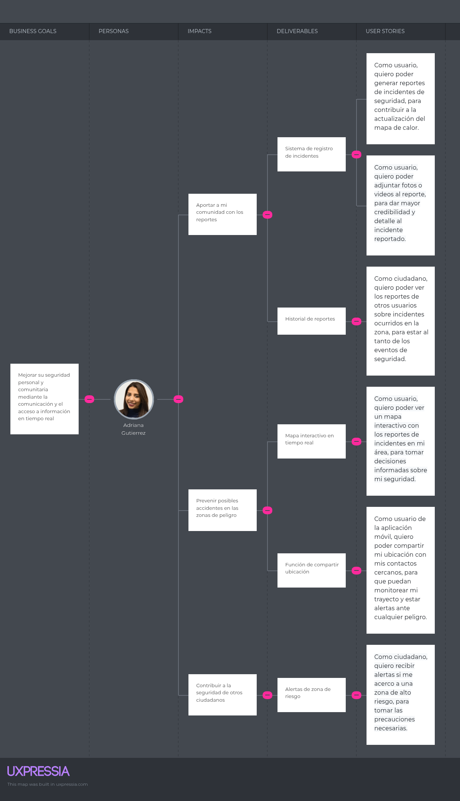

## 3.4. Product Backlog

Se implementa el siguiente producto backlog a partir de las historias de
usuario elaboradas, evaluándolas en un rango de 1,2,3,5,8 (serie
Fibonacci), significando el mayor número como el más importante y
relevante.
| **ID** | **User Story / Technical Story Id** | **Título**                                               | **Descripción**                                                                                                                                                                    | **Story Points (1/2/3/5/8)** |
|--------|-------------------------------------|----------------------------------------------------------|------------------------------------------------------------------------------------------------------------------------------------------------------------------------------------|------------------------------|
| 1      | **US02**                            | Navegar en la Landing Page                               | Como visitante de la Landing Page, quiero encontrar las secciones bien definidas para comprender fácilmente la información mostrada.                                               | 1                            |
| 2      | **US01**                            | Contactar con la Startup                                 | Como visitante de la Landing Page, quiero encontrar un formulario de contacto funcional y accesible, para poder comunicarme con el startup.                                        | 1                            |
| 3      | **US06**                            | Generar Reporte de Incidentes                            | Como usuario, quiero poder generar reportes de incidentes de seguridad, para contribuir a la actualización del mapa de calor.                                                       | 3                            |
| 4      | **US07**                            | Adjuntar Evidencia al Reporte                            | Como usuario, quiero poder adjuntar fotos o videos al reporte, para dar mayor credibilidad y detalle al incidente reportado.                                                        | 5                            |
| 5      | **US08**                            | Visualización de Reportes                                | Como ciudadano, quiero poder ver los reportes de otros usuarios sobre incidentes ocurridos en la zona, para estar al tanto de los eventos.                                          | 3                            |
| 6      | **US13**                            | Acceder a Mapa con Reportes                              | Como usuario, quiero poder ver un mapa interactivo con los reportes de incidentes en mi área, para tomar decisiones informadas sobre seguridad.                                     | 8                            |
| 7      | **US16**                            | Buscar Ubicación en el Mapa                              | Como usuario, quiero poder explorar reportes de seguridad en diferentes zonas del mapa, para tomar decisiones informadas sobre mis desplazamientos.                                | 3                            |
| 8      | **US15**                            | Filtrar Reportes                                         | Como usuario, quiero poder filtrar los reportes para ver todos los reportes o solo los que yo he creado, para gestionar mejor la información.                                       | 2                            |
| 9      | **US09**                            | Recibir Alertas de Zonas de Riesgo                       | Como ciudadano, quiero recibir alertas si me acerco a una zona de alto riesgo, para tomar las precauciones necesarias.                                                              | 5                            |
| 10     | **US10**                            | Compartir Ubicación con Contactos en la Aplicación Móvil | Como usuario de la aplicación móvil, quiero poder compartir mi ubicación con mis contactos cercanos, para que puedan monitorear mi trayecto ante cualquier peligro.                 | 5                            |
| 11     | **US11**                            | Editar Información de Perfil                             | Como usuario, quiero poder editar mi información de perfil, para corregir o actualizar mis datos personales.                                                                        | 2                            |
| 12     | **US14**                            | Acceder al Perfil de Usuario                             | Como usuario, quiero acceder a mi perfil desde el menú principal, para visualizar mi información personal y configuraciones.                                                        | 2                            |
| 13     | **US05**                            | Iniciar Sesión                                           | Como usuario registrado, quiero poder iniciar sesión con mi correo y contraseña, para acceder a mi cuenta.                                                                         | 8                            |
| 14     | **US04**                            | Registro de Usuarios                                     | Como usuario, quiero poder registrarme en la aplicación, para acceder a las funcionalidades de PeaceApp.                                                                           | 8                            |
| 15     | **US12**                            | Recuperar Contraseña                                     | Como usuario, quiero poder recuperar mi contraseña si la olvido, para poder acceder nuevamente a mi cuenta.                                                                         | 2                            |
| 16     | **US03**                            | Diseño Responsivo                                        | Como usuario, quiero que la aplicación se adapte a diferentes pantallas, para usarla cómodamente en móvil, tablet o escritorio.                                                     | 2                            |
| 17     | **TS04**                            | Crear reporte de incidente mediante RESTful API          | Como desarrollador, quiero que los usuarios puedan crear reportes de incidentes para compartir información sobre zonas peligrosas.                                                  | 5                            |
| 18     | **TS07**                            | Crear coordenadas de ubicación al generar un reporte     | Como desarrollador, quiero registrar las coordenadas de una ubicación mediante un POST, para asociarlas al reporte de un incidente.                                                 | 5                            |
| 19     | **TS08**                            | Obtener ubicaciones para renderizar reportes en el mapa  | Como desarrollador, quiero obtener las coordenadas mediante un GET, para mostrar los íconos de los reportes en el mapa.                                                             | 3                            |
| 20     | **TS05**                            | Obtener lista de reportes mediante RESTful API           | Como desarrollador, quiero que los usuarios puedan obtener una lista de reportes para ver incidentes recientes en su área.                                                          | 3                            |
| 21     | **TS06**                            | Obtener reporte por ID mediante RESTful API              | Como desarrollador, quiero que los usuarios puedan obtener los detalles de un solo reporte para consultar información específica sobre un incidente.                                | 3                            |
| 22     | **TS09**                            | Crear alerta al acercarse a una zona de peligro          | Como desarrollador, quiero crear una alerta mediante POST para notificar que un usuario está dentro del rango de un incidente.                                                      | 5                            |
| 23     | **TS10**                            | Obtener alertas por usuario                              | Como desarrollador, quiero obtener las alertas específicas de un usuario mediante GET.                                                                                             | 3                            |
| 24     | **TS11**                            | Eliminar alertas al recargar el mapa                     | Como desarrollador, quiero eliminar todas las alertas del usuario al recargar el mapa para evitar duplicaciones.                                                                    | 2                            |
| 25     | **TS12**                            | Obtener detalles de una alerta por ID                    | Como desarrollador, quiero consultar una alerta específica por su ID.                                                                                                              | 2                            |
| 26     | **TS03**                            | Editar perfil de usuario mediante RESTful API            | Como desarrollador, quiero que los usuarios puedan actualizar su información personal para mantener sus perfiles al día.                                                            | 3                            |
| 27     | **TS13**                            | Obtener datos de usuario por email                       | Como desarrollador, quiero obtener un usuario mediante su email para fines de autenticación.                                                                                        | 2                            |
| 28     | **TS01**                            | Autenticación JWT mediante RESTful API                   | Como desarrollador, quiero autenticar a los usuarios a través de un token JWT para que puedan acceder a la plataforma de manera segura.                                             | 8                            |
| 29     | **TS02**                            | Crear nuevo usuario mediante RESTful API                 | Como desarrollador, quiero permitir la creación de nuevos usuarios para que puedan acceder al sistema.                                                                              | 8                            |

# Capítulo IV: Product Architecture Design

## 4.1. Design Concepts, ViewPoints & ER Diagrams

### 4.1.1. Principles Statements

Con el fin de garantizar que nuestra solución evolucione de forma ordenada y sostenible, resulta fundamental definir principios y lineamientos que orienten el diseño y desarrollo del software. Estos principios proporcionan una base sólida para asegurar que el sistema sea seguro, flexible y de fácil mantenimiento, además de favorecer la escalabilidad y la calidad del código a lo largo del tiempo.

#### Principio de Privacidad y Seguridad de la Información:

Todas las funcionalidades deben incorporar mecanismos de protección de datos personales. Esto incluye una autenticación segura, control de acceso basado en roles y encriptación de información sensible, garantizando la confianza de los ciudadanos.

#### Principio de Usabilidad y Experiencia de Usuario:

El sistema debe ofrecer una interfaz clara, intuitiva y accesible. Los flujos de interacción deben estar centrados en el usuario, con validación constante mediante pruebas de usabilidad, para fomentar la adopción y el uso continuo de la aplicación.

#### Principio de Escalabilidad y Rendimiento:

La arquitectura de PeaceApp debe soportar el crecimiento en volumen de reportes y usuarios sin degradar la experiencia. Se privilegiarán patrones y tecnologías que permitan balancear cargas y mantener un tiempo de respuesta óptimo.

#### Modularidad y Desacoplamiento:

El diseño del sistema debe estructurarse en componentes independientes y reutilizables. Esto reduce el impacto de los cambios, facilita la evolución del sistema y permite escalar de forma diferenciada los módulos críticos como notificaciones, mapas o geolocalización.

#### Preferencia por asincronía:

Cuando sea posible, se priorizarán las llamadas asincrónicas frente a las sincrónicas, para mejorar el rendimiento, la tolerancia a fallos y la capacidad de respuesta en escenarios de alta concurrencia.

#### Uso de librerías con soporte comercial:

Se favorecerá la adopción de bibliotecas y frameworks que cuenten con respaldo empresarial o comunidades activas, garantizando soporte técnico, estabilidad y actualizaciones constantes.

#### Alineamiento con principios SOLID:

Se aplicarán los principios de Responsabilidad Única, Abierto-Cerrado, Segregación de Interfaces e Inversión de Dependencias para asegurar un diseño orientado a objetos claro, extensible y de bajo acoplamiento.

### 4.1.2. Approaches Statements Architectural Styles & Patterns

En esta sección describimos los enfoques fundamentales que tendremos en cuenta durante el desarrollo de PeaceApp. Estos enfoques nos brindan una base conceptual que guía nuestras decisiones frente a los retos de arquitectura y diseño que enfrentamos. Con ellos aseguramos que la aplicación evolucione de forma coherente con nuestra visión de seguridad, usabilidad y escalabilidad.

#### Approaches Statements:

##### Domain-Driven Design (DDD):

La complejidad del dominio de seguridad ciudadana se abordará mediante la separación clara de contextos (reportes de incidentes, geolocalización, autenticación, alertas), lo que facilitará mantener un modelo de negocio alineado con las reglas y procesos reales.

##### Enfoque Centrado en el Usuario (UCD):

Dado que PeaceApp busca generar confianza en situaciones de seguridad ciudadana, se prioriza la investigación con usuarios, pruebas de usabilidad y diseño de interfaces accesibles para diferentes perfiles de ciudadanos.

##### Agile Software Development:

Se adoptará un marco ágil con iteraciones cortas que permitan lanzar versiones funcionales tempranas, validar hipótesis con usuarios y ajustar funcionalidades en base a feedback real.

##### Continuous Integration & Continuous Deployment (CI/CD):

Se automatizará la construcción, pruebas y despliegue de cada iteración para asegurar calidad, confiabilidad y tiempo de respuesta rápido frente a nuevas necesidades.

##### Unit Testing & Refactoring:

Realizaremos validación continua de componentes, junto con prácticas de refactorización, lo que reforzará la mantenibilidad del sistema y reducirá riesgos de regresión.

#### Architectural Styles & Patterns:

##### Arquitectura basada en Microservicios:

Cada módulo crítico (autenticación, geolocalización, gestión de reportes, notificaciones) se implementa como un servicio independiente. Esto facilita el escalamiento selectivo, mejora la resiliencia y permite desplegar nuevas funcionalidades sin afectar todo el sistema.

##### Patrón Cliente-Servidor:

Tanto la aplicación móvil como web actúan como cliente que interactúa con servicios backend mediante APIs RESTful seguras, asegurando separación de responsabilidades.

##### Patrón Repositorio:

El acceso a datos se implementará mediante este patrón para separar la lógica de negocio de la persistencia, facilitando cambios futuros en la base de datos sin afectar otros componentes del sistema.

### 4.1.3. Context Diagram

El diagrama de contexto representa a PeaceApp, una aplicación móvil y web orientada a la seguridad ciudadana que permite a los usuarios reportar incidentes, visualizar zonas de riesgo y compartir su ubicación en tiempo real. Los actores que interactúan con el sistema son el Citizen, quien utiliza la aplicación para mantenerse informado y enviar reportes, y el Admin, encargado de gestionar cuentas, reportes y alertas dentro de la plataforma. A su vez, PeaceApp consume los servicios externos del Map System, para obtener datos de geolocalización y mapas, así como del SMS Gateway y la WhatsApp API, utilizados para enviar alertas y compartir ubicaciones con contactos de confianza fuera de la aplicación.

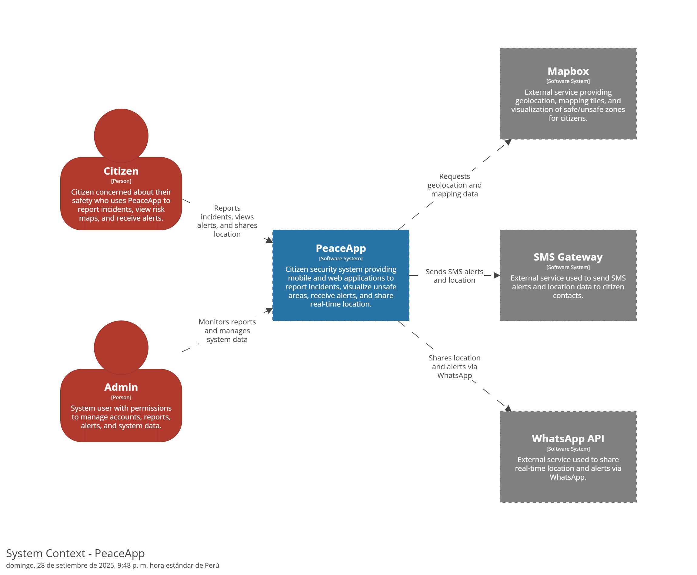

### 4.1.4. Approach driven ViewPoints Diagrams

#### 4.1.4.1. Diagrama de Actividad:

El diagrama de actividades de PeaceApp describe el flujo de acciones del usuario desde el inicio de sesión o registro hasta la interacción con las funcionalidades principales de la aplicación, comenzando con el acceso al mapa que muestra los reportes realizados por la comunidad o vacío si no existen, y que además envía notificaciones cuando el usuario se encuentra cerca de una zona de riesgo; desde allí, el usuario puede acceder a la pestaña de reportes para visualizar todos los incidentes o solo los propios, crear nuevos reportes seleccionando tipo, título, descripción, ubicación y evidencia, con opción de eliminarlos en caso de error; también puede gestionar su información personal en la pestaña de perfil con la posibilidad de modificar datos o cerrar sesión, y finalmente compartir su ubicación en tiempo real con contactos de confianza mediante SMS o WhatsApp para reforzar su seguridad.

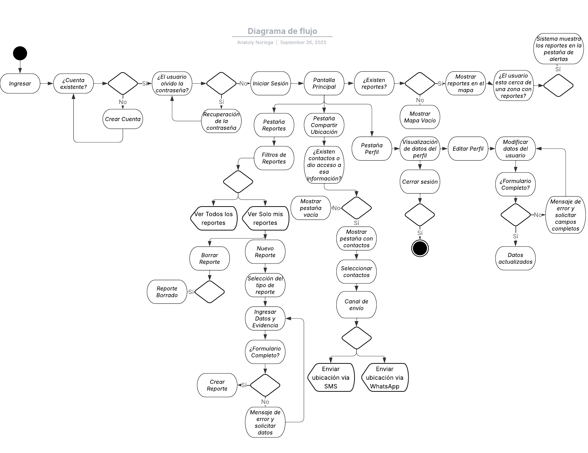

Figura 1: Diagrama de Actividad con LucidChart

#### 4.1.4.2. Diagrama de Estado:

Para el diagrama de estado, diagramamos los procesos más importantes de PeaceApp

**Proceso del ciclo de vida de un reporte:** El diagrama de estados del reporte en PeaceApp representa las etapas que atraviesa un incidente desde su creación hasta su eliminación. El proceso inicia en un estado de “Sin reporte registrado”, desde donde el usuario puede crear un nuevo reporte seleccionando el tipo de incidente (robo, falta de iluminación, acoso, accidente u otro). Posteriormente, debe ingresar datos y evidencia, completando un formulario que valida la información. Si los campos no están completos, el sistema solicita correcciones; en caso contrario, el reporte pasa al estado de “Reporte creado”. Una vez creado, el reporte se vuelve “Reporte visible”, mostrándose en el mapa interactivo y en la pestaña de reportes. Si un usuario se encuentra cerca de la ubicación del reporte, este genera una “Alerta creada” que refuerza la seguridad preventiva. Finalmente, el reporte puede ser eliminado por el usuario, alcanzando el estado de “Reporte eliminado” y concluyendo su ciclo de vida dentro de la aplicación.

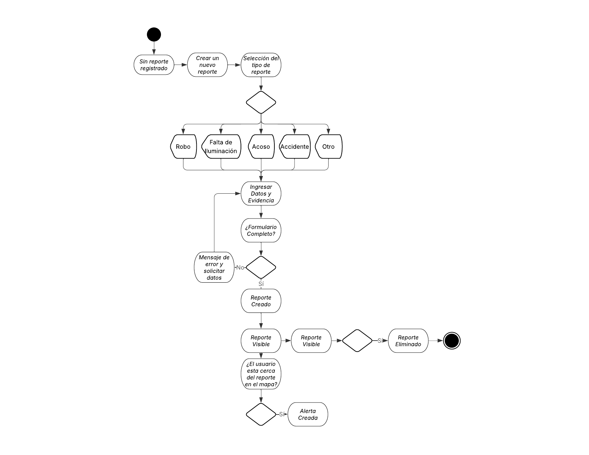

Figura 2: Ciclo de vida de un Reporte con LucidChart

**Proceso del ciclo de compartir ubicación en PeaceApp:** El diagrama de estados de la funcionalidad de compartir ubicación en PeaceApp muestra el proceso que sigue un usuario desde el estado inicial de “Sin ubicación compartida”. El flujo comienza al acceder a la pestaña de ubicación, donde se verifica si el usuario otorgó permisos para acceder a su lista de contactos. En caso de no hacerlo, el sistema se mantiene en “Ubicación no compartida”; de lo contrario, el usuario puede seleccionar un contacto y elegir el canal de envío (SMS o WhatsApp). Posteriormente, se valida el acceso al servicio de mensajería: si no se autoriza, el estado vuelve a “Ubicación no compartida”; en caso afirmativo, la aplicación pasa al estado de “Ubicación enviada”, donde la información en tiempo real es compartida con el contacto seleccionado. El ciclo finaliza cuando el usuario detiene la acción o cierra sesión, retornando nuevamente al estado de “Ubicación no compartida”.

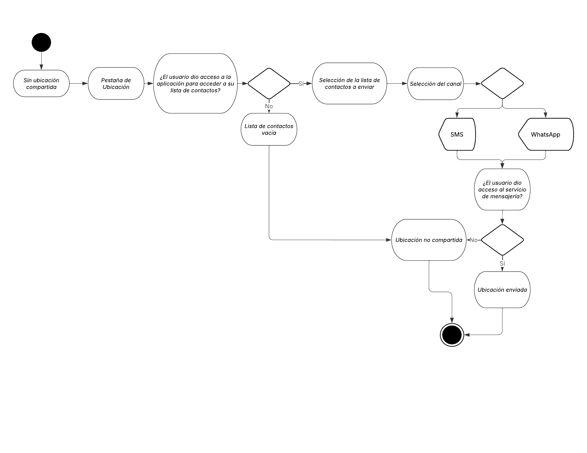

Figura 3: Ciclo de compartir ubicación en tiempo real con LucidChart

#### 4.1.4.3. Diagrama de Clase:

El diagrama de clases de PeaceApp modela la estructura principal del sistema, organizando los componentes en controladores, servicios y repositorios para mantener un diseño modular y desacoplado. Se representan clases clave como User, que gestiona la información de autenticación y las relaciones con los reportes y alertas; Report, que encapsula los datos de los incidentes creados por los usuarios; Alert, que administra las notificaciones generadas cuando un usuario se encuentra cerca de una zona de riesgo; y Location, que permite registrar y obtener coordenadas geográficas. Además, se incluyen los controladores y servicios de autenticación, notificaciones, reportes, pagos y localización, cada uno conectado a su respectivo repositorio para la persistencia de datos. Este diseño refleja la aplicación de principios SOLID y la arquitectura en capas, asegurando escalabilidad, seguridad y mantenibilidad en el sistema.

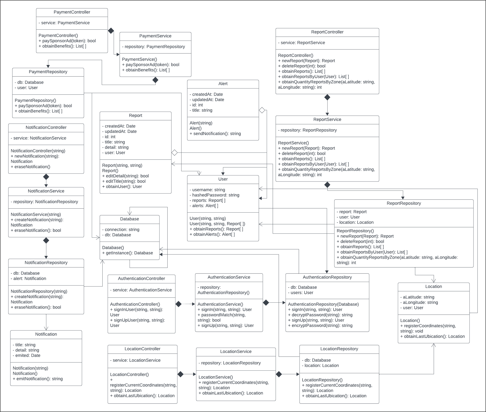

#### 4.1.4.4. Diagrama de Contenedores:

El diagrama de contenedores de PeaceApp ilustra cómo los usuarios del sistema, representados por los roles de Ciudadano y Administrador, interactúan con las diferentes interfaces y componentes de la solución. Los ciudadanos acceden a la Landing Page para obtener información general sobre la aplicación y utilizan tanto la Aplicación Web como la Aplicación Móvil y la Single Page Application (SPA) para gestionar reportes, recibir alertas y compartir su ubicación. Estas interfaces se comunican con un API Gateway RESTful, que centraliza las solicitudes y distribuye el tráfico hacia los distintos microservicios. En el backend se encuentran servicios especializados para la gestión de reportes, perfiles de usuario, autenticación, alertas y localización. La información se almacena en una Base de Datos Relacional, mientras que para funciones críticas como la mensajería y la geolocalización se integran servicios externos como el SMS Gateway, la API de WhatsApp y un Map System que provee datos cartográficos y de zonas de riesgo.
- API Gateway RESTful: Es el componente encargado de recibir todas las solicitudes provenientes de las aplicaciones cliente (Web, Móvil y SPA) y redirigirlas a los distintos microservicios. Implementado sobre JSON/HTTPS, el gateway administra rutas, seguridad y balance de peticiones, garantizando una capa de control centralizado.

##### Bounded Contexts (Microservicios):

- Authentication Service: Gestiona el inicio de sesión, registro de usuarios y autenticación mediante validación de credenciales.
- Profiles Service: Maneja los datos personales y las preferencias de los usuarios, permitiendo consultar y actualizar información de perfil.
- Reports Service: Administra la creación, edición, visualización y eliminación de reportes de incidentes, además de exponerlos en el mapa.
- Alerts Service: Genera y distribuye notificaciones a los usuarios cuando se encuentran en zonas cercanas a reportes activos.
- Location Service: Gestiona el registro y consulta de coordenadas de ubicación, permitiendo el envío de la ubicación en tiempo real y la integración con mapas.

Cada uno de estos microservicios expone su propia API y se comunica directamente con la base de datos relacional para almacenar y consultar información.

##### Servicios Externos:

- SMS Gateway: Servicio externo para enviar mensajes de texto con alertas y notificaciones a los contactos registrados.
- WhatsApp API: Servicio externo utilizado para compartir la ubicación en tiempo real mediante la plataforma de mensajería WhatsApp.
- Map System: Proveedor externo de información geográfica que permite mostrar mapas, ubicar incidentes y destacar zonas críticas en la aplicación.

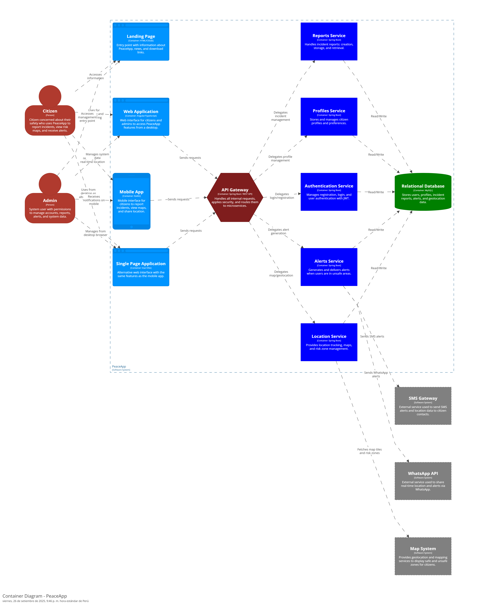

### 4.1.5. Relational/Non Relational Database Diagram

El sistema de base de datos de PeaceApp está diseñado para dar soporte a la gestión integral de reportes de seguridad, alertas, usuarios, ubicaciones y pagos dentro de la aplicación. El modelo refleja una estructura relacional clara y modular, en la que los usuarios pueden registrar incidentes, recibir alertas de zonas de riesgo, compartir su ubicación en tiempo real, gestionar rutas seguras, así como realizar pagos y almacenar sus ubicaciones favoritas. Esta organización permite garantizar trazabilidad, consistencia y seguridad en los datos, facilitando el control de toda la información crítica del sistema.

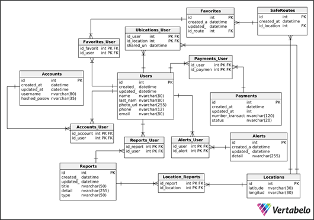

- users: Almacena la información principal de los usuarios del sistema, incluyendo nombres, apellidos, teléfono, correo electrónico, credenciales y fechas de creación y actualización. Es la tabla central del modelo y se conecta con reportes, alertas, ubicaciones, favoritos y pagos.

- accounts: Contiene datos de las cuentas de usuario y sus credenciales de autenticación (nombre de usuario, contraseña cifrada, fechas de creación/actualización). Se vincula a la tabla users para habilitar el inicio de sesión y la gestión de credenciales.

- accounts_user: Representa la relación entre accounts y users, enlazando a cada usuario con su cuenta correspondiente mediante claves foráneas.

- reports: Registra los incidentes reportados por los usuarios, con atributos como fecha, título, descripción, tipo de reporte y estado. Se asocia con usuarios y ubicaciones para su trazabilidad.

- reports_user: Gestiona la relación entre reports y users, permitiendo identificar qué usuario creó cada reporte.

- alerts: Almacena las notificaciones generadas por los reportes, incluyendo fecha, detalle y estado. Se utilizan para avisar a los usuarios cercanos a zonas de riesgo.

- alerts_user: Define la relación entre alerts y users, permitiendo vincular qué usuarios reciben cada alerta generada.

- locations: Contiene las coordenadas geográficas (latitud, longitud) utilizadas para mapear reportes, rutas seguras y ubicaciones compartidas.

- location_reports: Tabla de relación entre reports y locations, que permite registrar la ubicación de cada reporte en el mapa.

- ubications_user: Permite gestionar las ubicaciones compartidas en tiempo real entre usuarios, incluyendo la fecha de inicio de la compartición y el usuario relacionado.

- favorites: Registra las ubicaciones o rutas marcadas como favoritas por los usuarios, vinculando a users y a locations para facilitar accesos rápidos.

- favorites_user: Relaciona a los usuarios con sus ubicaciones o rutas favoritas mediante claves foráneas.

- safe_routes: Contiene la información de rutas seguras definidas por los usuarios, asociadas a una ubicación registrada.

- payments: Almacena las transacciones realizadas en la aplicación, registrando el monto, método de pago, estado de la transacción y fechas de creación/actualización.

- payments_user: Relaciona las transacciones de la tabla payments con los usuarios que las realizaron, garantizando la trazabilidad de cada operación.

### 4.1.6. Design Patterns

El uso de patrones de diseño en PeaceApp permitirá desarrollar una solución extensible y confiable, donde cada módulo se mantenga desacoplado y fácilmente evolucionable. Estos patrones garantizan la reutilización de código, la reducción de complejidad y la alineación de la arquitectura con los principios de seguridad, escalabilidad y usabilidad definidos previamente.

#### Domain Driven Design (DDD)

- **Propósito:** Modelar el dominio de seguridad ciudadana (alertas, reportes, usuarios, ubicaciones) con un lenguaje cercano al negocio, usando tácticas como **Entidades, Objetos de Valor, Agregados y Repositorios**.
- **Beneficio:** Permite que las entidades clave como *Usuario, Alerta, Ubicación* estén alineadas con la realidad del problema, facilitando la comunicación con stakeholders y la evolución del sistema frente a nuevos requerimientos (p. ej., integración con autoridades locales).

#### Strategy

- **Propósito:** Definir un conjunto de algoritmos o comportamientos intercambiables sin modificar el cliente.
- **Beneficio:** Facilita implementar distintos **tipos de alertas** (robo, accidente, emergencia médica) con lógicas personalizadas sin alterar el flujo central de la aplicación.

#### Observer

- **Propósito:** Notificar automáticamente a múltiples suscriptores cuando ocurre un evento.
- **Beneficio:** Cuando un usuario reporta una alerta, el sistema notifica en tiempo real a otros usuarios cercanos y, opcionalmente, a las autoridades, garantizando rapidez en la difusión de información.

#### Factory Method

- **Propósito:** Delegar la creación de objetos a subclases o métodos especializados para reducir el acoplamiento.
- **Beneficio:** Permite crear objetos dinámicamente según el tipo de alerta o nivel de usuario (básico, premium, autoridad) sin modificar la lógica central.

#### Composite

- **Propósito:** Tratar de manera uniforme objetos individuales y composiciones.
- **Beneficio:** Posibilita representar un **mapa de alertas** como una composición jerárquica (ciudad → distrito → barrio → alerta individual), simplificando la visualización y gestión de la información en distintos niveles de detalle.

#### Role-Based Access Control (RBAC)

- **Propósito:** Asignar permisos a roles y roles a usuarios para controlar accesos.
- **Beneficio:** Diferencia los privilegios entre **usuarios comunes, moderadores y autoridades**, garantizando seguridad y personalización en las funcionalidades disponibles.

### 4.1.7. Tactics

En el marco del método ADD v3, los tactics representan las decisiones arquitectónicas específicas que permiten alcanzar los atributos de calidad definidos para el sistema. Mientras que los principles statements establecen lineamientos generales, los tactics se enfocan en acciones concretas que orientan el diseño técnico y la implementación de la solución. Para PeaceApp, se han definido tácticas orientadas a garantizar seguridad, disponibilidad, escalabilidad, mantenibilidad y usabilidad, respondiendo a las necesidades críticas del sistema y alineándose con la visión de negocio.

#### Seguridad

| Táctica | Descripción | Justificación |
|---------|-------------|---------------|
| Autenticación con JWT | Uso de tokens seguros para validar identidad de los usuarios. | Garantiza que solo usuarios autorizados accedan a la aplicación. |
| Cifrado de datos en tránsito (HTTPS/TLS) | Encriptación de la comunicación entre cliente y servidor. | Protege la información sensible como reportes y ubicaciones. |
| Control de accesos basado en roles | Definir permisos diferenciados para usuarios y autoridades. | Evita accesos indebidos y asegura un uso confiable de la plataforma. |

#### Disponibilidad

| Táctica | Descripción | Justificación |
|---------|-------------|---------------|
| Balanceo de carga | Distribuir peticiones entre múltiples servidores. | Asegura que la aplicación esté disponible incluso en picos de uso. |
| Replicación de base de datos | Mantener copias sincronizadas en diferentes nodos. | Minimiza el impacto de fallos y mejora la resiliencia. |
| Monitoreo proactivo | Uso de alertas y métricas en tiempo real. | Permite detectar y resolver problemas antes de que afecten a los usuarios. |

#### Escalabilidad

| Táctica | Descripción | Justificación |
|---------|-------------|---------------|
| Arquitectura basada en microservicios | Dividir el sistema en servicios independientes. | Facilita crecer por módulos sin afectar al resto de la aplicación. |
| Auto-escalado en la nube | Ajustar dinámicamente la capacidad de servidores según demanda. | Reduce costos y soporta incrementos en la carga de usuarios. |
| Cacheo de información | Uso de Redis u otra capa de caché. | Optimiza consultas frecuentes como reportes recientes o mapas de calor. |

#### Mantenibilidad

| Táctica | Descripción | Justificación |
|---------|-------------|---------------|
| Código modular y documentado | Separar componentes por responsabilidad. | Facilita la localización y corrección de errores. |
| Pruebas automatizadas | Integrar pruebas unitarias y de integración. | Reduce riesgos de fallos al introducir cambios. |
| Uso de patrones de diseño | Aplicar MVC o MVVM en la app móvil. | Mejora la organización y facilita la incorporación de nuevas funcionalidades. |

#### Usabilidad

| Táctica | Descripción | Justificación |
|---------|-------------|---------------|
| Diseño centrado en el usuario (UX) | Interfaces simples, consistentes y accesibles. | Incrementa la adopción de la aplicación y la confianza de los usuarios. |
| Retroalimentación inmediata | Confirmaciones y notificaciones visuales/sonoras al interactuar. | Genera confianza y sensación de control en el usuario. |
| Internacionalización y accesibilidad | Soporte multilenguaje y compatibilidad con accesibilidad móvil. | Permite llegar a un público más amplio, incluyendo personas con discapacidad. |

## 4.2. Architectural Drivers

### 4.2.1. Design Purpose

El propósito del diseño arquitectónico de PeaceApp es proporcionar una base estructurada, segura, escalable y mantenible que soporte de manera eficiente la gestión de reportes ciudadanos de incidentes en tiempo real. A través del uso de principios de diseño como la separación de responsabilidades, el uso de patrones arquitectónicos adecuados y la definición de capas claras, se busca facilitar la implementación coherente de funcionalidades esenciales orientadas a la seguridad ciudadana, garantizando un desarrollo modular y alineado con las necesidades reales del dominio urbano. Esta arquitectura permitirá al equipo de desarrollo incorporar nuevas características, escalar servicios críticos como notificaciones en tiempo real o geolocalización, integrar sistemas externos (por ejemplo, autoridades locales o servicios de emergencia), y mantener una alta calidad en la experiencia de usuario, incluso ante cambios en el entorno tecnológico o en los requerimientos sociales.

Para este proceso de diseño, nos basaremos en los siguientes objetivos y principios:

- Escalabilidad y Flexibilidad: La arquitectura debe adaptarse a cambios futuros, permitiendo la integración de nuevas funcionalidades y la expansión del sistema sin comprometer rendimiento o estabilidad.
- Modularidad y Reusabilidad: Fomentar un diseño modular que permita la reutilización de componentes y la incorporación de nuevas funcionalidades sin afectar el sistema existente.
- Desacoplamiento: Reducir dependencias entre componentes, facilitando actualizaciones, mantenimiento y resolución de problemas.
- Seguridad y Protección de Datos: Garantizar la protección de la información sensible de los usuarios mediante mecanismos de seguridad robustos y políticas de privacidad estrictas.
- Interoperabilidad: Asegurar que PeaceApp pueda interactuar con plataformas externas, dispositivos móviles y servicios de terceros, especialmente con autoridades y sistemas de emergencia.
- Mantenibilidad y Actualización Continua: Diseñar con visión a largo plazo para facilitar el mantenimiento y la evolución constante del sistema ante nuevas necesidades sociales o tecnológicas.
- Alta Disponibilidad y Confiabilidad: Garantizar que el sistema esté operativo de manera continua, incluso en contextos de alta demanda o emergencias.
- Experiencia de Usuario Óptima: Proporcionar una interacción fluida, intuitiva y confiable que incentive la participación ciudadana y eleve los niveles de confianza en la aplicación.

### 4.2.2. Primary Functionality (Primary User Stories)

A continuación, se detallan las funciones esenciales (user stories) que influyen de manera directa en la organización del sistema y orientan las decisiones del diseño arquitectónico de PeaceApp.

| User Story ID | Título                                             | Descripción                                                                                                                                                                                                              |
|---------------|----------------------------------------------------|--------------------------------------------------------------------------------------------------------------------------------------------------------------------------------------------------------------------------|
| US04          | Registro de Usuarios | Como usuario, quiero poder registrarme en la aplicación, para acceder a las funcionalidades de PeaceApp.                                                                                                                |
| US05          | Iniciar Sesión       | Como usuario registrado, quiero poder iniciar sesión con mi correo y contraseña, para acceder a mi cuenta.                                                                                                              |
| US06          | Generar Reporte de Incidentes  | Como usuario, quiero poder generar reportes de incidentes de seguridad, para contribuir a la actualización del mapa de calor.                                                                                 |
| US07          | Adjuntar Evidencia al Reporte  | Como usuario, quiero poder adjuntar fotos o videos al reporte, para dar mayor credibilidad y detalle al incidente reportado.                                                                                  |
| US08          | Visualización de Reportes        | Como ciudadano, quiero poder ver los reportes de otros usuarios sobre incidentes ocurridos en la zona, para estar al tanto de los eventos de seguridad.                                                     |
| US09          | Recibir Alertas de Zonas de Riesgo | Como ciudadano, quiero recibir alertas si me acerco a una zona de alto riesgo, para tomar las precauciones necesarias.                                                                                    |
| US10          | Compartir Ubicación con Contactos en la Aplicación Móvil | Como usuario de la aplicación móvil, quiero poder compartir mi ubicación con mis contactos cercanos, para que puedan monitorear mi trayecto y estar alertas ante cualquier peligro. |
| US13          | Acceder a Mapa con Reportes          | Como usuario, quiero poder ver un mapa interactivo con los reportes de incidentes en mi área, para tomar decisiones informadas sobre mi seguridad.                                                      |
| US15          | Filtrar Reportes         | Como usuario, quiero poder filtrar los reportes para ver todos los reportes o solo los que yo he creado, para gestionar mejor la información relevante según mis intereses.                                         |
| US16          | Buscar Ubicación en el Mapa         | Como usuario, quiero poder explorar reportes de seguridad en diferentes zonas del mapa, para tomar decisiones informadas sobre mis desplazamientos.                                                      |

### 4.2.3. Quality Attribute Scenarios

Los atributos de calidad determinados para PeaceApp son los que se detallan a continuación:

**a. Disponibilidad:**

Este atributo se trata de la capacidad del sistema para estar disponible y operativo cuando se necesita.
En nuestra solución, esto significa que los usuarios podrán acceder a la aplicación en cualquier momento para reportar incidentes de seguridad o recibir alertas en tiempo real.
La facilidad con la que se puede garantizar esta disponibilidad depende de una infraestructura confiable, redundante y con monitoreo constante.
Una alta disponibilidad transmite confianza al ciudadano, asegurando que la plataforma siempre esté lista para su uso sin interrupciones inesperadas, especialmente en situaciones críticas.

**b. Rendimiento:**

Este atributo se trata de la capacidad del sistema para responder con rapidez y eficiencia bajo distintas cargas de trabajo.
En nuestra solución, buscamos que los reportes de incidentes, el envío de alertas y las consultas de mapas se procesen en tiempo mínimo, evitando retrasos que puedan afectar la seguridad del usuario.
La facilidad con la que se mantiene un buen rendimiento se logra mediante una arquitectura optimizada, balanceo de carga y pruebas de estrés que validen la eficiencia del sistema.
Un alto rendimiento mejora la experiencia de los usuarios, reduciendo la frustración y asegurando que la información crítica llegue de forma oportuna.

**c. Escalabilidad:**

Este atributo se trata de la capacidad del sistema para crecer y adaptarse a un aumento de usuarios, datos o transacciones.
En nuestra solución, esto significa que la aplicación puede ampliarse fácilmente para atender a más distritos o ciudades, soportando un mayor volumen de alertas y usuarios sin perder eficiencia.
La facilidad con la que se logra esta escalabilidad proviene de una arquitectura modular y distribuida, diseñada desde el inicio para soportar crecimiento.
Un sistema escalable asegura la continuidad del servicio y la adopción masiva sin necesidad de rediseños costosos.

**d. Mantenibilidad:**

Este atributo se trata de la capacidad del sistema para ser modificado fácilmente cuando se necesitan cambios o mejoras.
En nuestra solución, el código será limpio, modular y bien documentado, lo cual facilita la detección y corrección de errores, así como la integración de nuevas funcionalidades (ejemplo: chat en tiempo real con autoridades).
La facilidad con la que se mantiene y mejora el sistema reduce los tiempos de desarrollo, evita errores nuevos y permite adaptarse a las necesidades cambiantes de la comunidad.
Una alta mantenibilidad asegura la evolución constante de PeaceApp con bajo riesgo y esfuerzo.

**e. Usabilidad:**

Este atributo se trata de la capacidad del sistema para ser entendido y utilizado con facilidad por los usuarios finales.
En nuestra solución, nos enfocamos en una interfaz clara, intuitiva y accesible, que permita a los ciudadanos reportar incidentes o consultar alertas de manera rápida incluso en momentos de emergencia.
La facilidad con la que un usuario interactúa con la aplicación depende de un diseño UX/UI bien estructurado, retroalimentación visual clara y soporte para accesibilidad.
Una alta usabilidad fomenta la adopción de la plataforma, reduce la curva de aprendizaje y genera confianza en los ciudadanos para seguir utilizándola.

**f. Seguridad:**

Este atributo se trata de la capacidad del sistema para proteger la confidencialidad, integridad y disponibilidad de la información.
En nuestra solución, esto implica implementar autenticación robusta, encriptación de datos y control de acceso según roles (usuario, autoridad, administrador).
La facilidad con la que se garantiza la seguridad depende de políticas claras de protección de datos y del uso de estándares internacionales (ejemplo: OWASP).
Una alta seguridad incrementa la confianza de los usuarios y asegura que la información sensible no sea vulnerada ni utilizada de forma indebida.

**a. Disponibilidad:**

| **Elemento**            | **Detalle**                                                                 |
|--------------------------|-----------------------------------------------------------------------------|
| **Escenario**           | Un ciudadano necesita reportar un incidente en la calle a través de la app. |
| **Fuente de Estímulo**  | Ciudadano que usa la app                                                    |
| **Estímulo**            | Intenta acceder a la app para reportar un incidente en la calle             |
| **Medioambiente**       | El sistema se encuentra bajo condiciones normales de operación              |
| **Artefacto**           | Servidor y frontend de PeaceApp                                             |
| **Respuesta**           | El sistema responde y permite el registro del incidente sin caída del servicio |
| **Medida de Respuesta** | Tiempo de disponibilidad ≥ 99.5% mensual                                    |

**b. Rendimiento:**

| **Elemento**            | **Detalle**                                                                 |
|--------------------------|-----------------------------------------------------------------------------|
| **Escenario**           | Un usuario envía un reporte con foto y geolocalización en horario concurrido. |
| **Fuente de Estímulo**  | Usuario enviando un reporte                                                 |
| **Estímulo**            | Envío de reporte de incidente con foto y geolocalización                    |
| **Medioambiente**       | Sistema con 1000 usuarios concurrentes                                      |
| **Artefacto**           | API de backend y base de datos                                              |
| **Respuesta**           | Procesa y guarda el reporte en la base de datos                             |
| **Medida de Respuesta** | Tiempo de respuesta ≤ 3 segundos                                            |

**c. Escalabilidad:**

| **Elemento**            | **Detalle**                                                                 |
|--------------------------|-----------------------------------------------------------------------------|
| **Escenario**           | El servicio se expande a nuevos distritos y la cantidad de usuarios se duplica. |
| **Fuente de Estímulo**  | Municipalidad que amplía la cobertura                                       |
| **Estímulo**            | Aumento de usuarios al extender el servicio a nuevos distritos              |
| **Medioambiente**       | Sistema en crecimiento exponencial de usuarios y transacciones              |
| **Artefacto**           | Arquitectura distribuida en la nube                                         |
| **Respuesta**           | Se despliegan nuevas instancias y balanceadores automáticamente             |
| **Medida de Respuesta** | El sistema soporta +10,000 usuarios sin degradación notable del rendimiento |

**d. Mantenibilidad:**

| **Elemento**            | **Detalle**                                                                 |
|--------------------------|-----------------------------------------------------------------------------|
| **Escenario**           | El equipo de desarrollo necesita agregar un módulo de comunicación con autoridades. |
| **Fuente de Estímulo**  | Equipo de desarrollo                                                        |
| **Estímulo**            | Necesidad de agregar un nuevo módulo de comunicación directa con autoridades |
| **Medioambiente**       | Sistema en operación con versiones previas estables                         |
| **Artefacto**           | Código fuente modular de PeaceApp                                           |
| **Respuesta**           | Se implementa el nuevo módulo sin afectar funcionalidades existentes        |
| **Medida de Respuesta** | Cambios implementados en ≤ 2 sprints sin errores críticos en producción     |

**e. Usabilidad:**

| **Elemento**            | **Detalle**                                                                 |
|--------------------------|-----------------------------------------------------------------------------|
| **Escenario**           | Un ciudadano bajo estrés necesita presionar el botón de emergencia.          |
| **Fuente de Estímulo**  | Ciudadano que reporta un incidente                                          |
| **Estímulo**            | Dificultad para ubicar el botón de “Emergencia”                             |
| **Medioambiente**       | App utilizada en situación de estrés (robo, accidente, etc.)                |
| **Artefacto**           | Interfaz gráfica del usuario (UI/UX)                                        |
| **Respuesta**           | Se muestra un botón visible y accesible en la pantalla principal            |
| **Medida de Respuesta** | 90% de usuarios logra reportar en ≤ 5 segundos durante pruebas de usabilidad |

**f. Seguridad:**

| **Elemento**            | **Detalle**                                                                 |
|--------------------------|-----------------------------------------------------------------------------|
| **Escenario**           | Un atacante intenta ingresar al sistema usando credenciales robadas.        |
| **Fuente de Estímulo**  | Atacante externo                                                            |
| **Estímulo**            | Intenta acceder a la base de datos con credenciales robadas                 |
| **Medioambiente**       | Bajo ataque de fuerza bruta en horario crítico                              |
| **Artefacto**           | Sistema de autenticación y base de datos                                    |
| **Respuesta**           | Bloquea el intento, activa alertas y mantiene la integridad de los datos    |
| **Medida de Respuesta** | 100% de accesos no autorizados bloqueados; logs generados y auditados en < 1min |

### 4.2.4. Constraints

La tabla a continuación muestra las limitaciones que deben considerarse dentro del desarrollo de PeaceApp.

| **ID**   | **Constraint** | **Restricción** | **Impacto** |
|----------|----------------|-----------------|-------------|
| **CON-01** | Conectividad Urbana Variable | En muchas zonas urbanas la conectividad móvil puede ser inestable o intermitente. | La aplicación debe permitir funcionamiento básico offline (ej. registro temporal de incidentes) y sincronización automática cuando haya conexión. |
| **CON-02** | Presupuesto y Recursos | El proyecto cuenta con recursos financieros y humanos limitados. | Se priorizará el uso de tecnologías open source y librerías con soporte comunitario/comercial, enfocándose en un MVP funcional antes de ampliar funcionalidades. |
| **CON-03** | Cumplimiento Normativo en Protección de Datos | PeaceApp debe cumplir con la Ley de Protección de Datos Personales en Perú (Ley N.° 29733) y normativas internacionales de privacidad. | Requiere incorporar cifrado de datos, autenticación segura, consentimiento explícito de usuarios y auditoría de accesos. |
| **CON-04** | Integración con Infraestructura Municipal y Policial | La aplicación busca colaborar con entidades municipales y policiales que tienen sus propios sistemas de información. | Es necesario desarrollar APIs estandarizadas y protocolos de intercambio de datos, garantizando compatibilidad e interoperabilidad. |
| **CON-05** | Diversidad de Dispositivos | Los usuarios utilizarán teléfonos móviles de diferentes gamas (alta, media, baja). | La aplicación debe ser ligera, optimizada en rendimiento y compatible con Android/iOS en versiones aún usadas en el mercado. |
| **CON-06** | Tiempo de Entrega | El proyecto debe contar con un prototipo funcional para ser validado en pruebas piloto en un plazo corto. | Se debe adoptar un enfoque ágil (Scrum/Lean UX), entregando un MVP con las funcionalidades críticas: alertas, geolocalización y mapa de incidentes. |
| **CON-07** | Sostenibilidad a Largo Plazo | La continuidad del sistema depende de su mantenimiento y financiamiento posterior. | Influirá en la elección de arquitecturas escalables y de bajo mantenimiento, así como en la búsqueda de convenios con municipalidades y ONGs. |

### 4.2.5. Architectural Concerns

Las consideraciones arquitectónicas importantes para nuestro proyecto que aseguran el cumplimiento de los requisitos del negocio y la satisfacción de las expectativas de los interesados son las siguientes:

| **ID**   | **Architectural Concern** | **Descripción** | **Impacto en la Arquitectura** |
|----------|----------------------------|-----------------|--------------------------------|
| **ARC-01** | Protección de Datos Personales | Los usuarios comparten información sensible (ubicación en tiempo real, reportes de incidentes). | Requiere aplicar cifrado en tránsito y en reposo, políticas de anonimización y control de accesos estrictos. |
| **ARC-02** | Escalabilidad en Altas Cargas | En situaciones de emergencia pueden generarse picos de tráfico por múltiples reportes simultáneos. | La arquitectura debe escalar horizontalmente (ej. balanceadores de carga, microservicios) para mantener tiempos de respuesta aceptables. |
| **ARC-03** | Disponibilidad y Resiliencia | La aplicación debe estar disponible 24/7, incluso frente a fallas en servidores o cortes de red. | Se deben diseñar mecanismos de redundancia, replicación de datos y recuperación ante desastres (DR). |
| **ARC-04** | Integración con Entidades Externas | PeaceApp debe interoperar con sistemas de municipalidades, serenazgo y policía. | Implica diseñar APIs seguras y estandarizadas, además de considerar latencia y confiabilidad en el intercambio de datos. |
| **ARC-05** | Experiencia de Usuario (UX) | La interfaz debe ser clara y rápida de usar, especialmente en contextos de estrés. | Obliga a un diseño minimalista, accesible y validado con pruebas de usabilidad. |
| **ARC-06** | Gestión de Incidentes Falsos o Maliciosos | Los usuarios podrían enviar reportes falsos que perjudiquen la confianza en la plataforma. | Se requieren mecanismos de validación (ej. reputación de usuario, moderación). |
| **ARC-07** | Sostenibilidad y Mantenibilidad | La aplicación debe evolucionar a largo plazo sin costos excesivos de mantenimiento. | Se deben usar arquitecturas modulares, componentes desacoplados y tecnologías ampliamente soportadas. |

## 4.3. ADD Iterations

### 4.3.1 Iteration 1: Optimización de Procesos Clave para la Seguridad Ciudadana
### 4.3.1.1 Architectural Design Backlog 1

Se definen los impulsores (drivers) que conforman la primera iteración del método ADD, centrada en la optimización del proceso de reporte, visualización y comunicación de incidentes en tiempo real.

| ID   | Título                          | Scenario                                                                                                    | Quality Attribute | Driver                                                                 |
|------|---------------------------------|------------------------------------------------------------------------------------------------------------|-------------------|------------------------------------------------------------------------|
| US04 | Registro de Usuarios            | Como usuario, quiero poder registrarme en la aplicación, para acceder a las funcionalidades de PeaceApp.   | Seguridad         | Garantizar registro seguro y almacenamiento cifrado de datos personales. |
| US06 | Generar Reporte de Incidentes   | Como usuario, quiero poder generar reportes de incidentes de seguridad, para contribuir al mapa de calor.  | Usabilidad        | Ofrecer una interfaz rápida e intuitiva para reportar incidentes en tiempo real. |
| US08 | Visualización de Reportes       | Como ciudadano, quiero poder ver los reportes de otros usuarios, para estar al tanto de los eventos.       | Rendimiento       | Asegurar tiempos de carga menores a 2 segundos para mostrar listados de reportes. |
| US09 | Recibir Alertas de Zonas de Riesgo | Como ciudadano, quiero recibir alertas si me acerco a una zona de alto riesgo.                            | Disponibilidad    | Implementar notificaciones push en tiempo real con alta tasa de entrega. |

### 4.3.1.2 Establish Iteration Goal by Selecting Drivers

Se establecen las metas de iteración para cada atributo de calidad elegido.

| ID   | Quality Attribute | Scenario                                                                                                                                     |
|------|------------------|---------------------------------------------------------------------------------------------------------------------------------------------|
| US06 | Usabilidad       | Proporcionar a los ciudadanos una experiencia intuitiva para registrar incidentes en tiempo real. Esto permitirá la adopción masiva de la plataforma y la actualización constante de datos de seguridad. |
| US08 | Rendimiento      | Garantizar que la visualización del mapa de calor interactivo sea rápida, con tiempos de respuesta inferiores a 2 segundos, asegurando la confiabilidad de la información al momento de desplazarse. |
| US09 | Disponibilidad   | Asegurar que las notificaciones push se entreguen de forma inmediata y confiable, reduciendo riesgos al mantener a los usuarios informados en situaciones críticas. |
| US04 | Seguridad        | Implementar mecanismos de autenticación y encriptación de datos para proteger la información sensible de los usuarios, fortaleciendo la confianza en la aplicación. |

### 4.3.1.3 Choose One or More Elements of the System to Refine

En esta iteración, el equipo se enfocará en refinar los siguientes elementos clave del sistema, alineados a los drivers identificados (usabilidad, rendimiento, disponibilidad y seguridad):

| Elemento                                           | Mejoras contempladas                                                                                                      |
|---------------------------------------------------|---------------------------------------------------------------------------------------------------------------------------|
| **Interfaz de Usuario – Módulo de Reportes y Mapas Interactivos** | - Inputs claros y validados para reportar incidentes (tipo, ubicación, hora). - Mapas interactivos con filtros de incidentes y rutas seguras. - Navegación simple y soporte de accesibilidad (colores contrastados y textos legibles). |
| **Backend – Procesamiento de Reportes y Generación del Mapa de Calor** | - Almacenamiento estructurado de incidentes con validación automática. - Algoritmos de agregación para mapas de calor dinámicos. - Optimización de consultas para tiempos de respuesta menores a 2 segundos. |
| **Módulo de Notificaciones y Alertas en Tiempo Real** | - Gestión automática de alertas en el backend. - Envío de notificaciones push inmediatas y confiables. - Configuración de alertas personalizadas por usuario. |
| **Módulo de Seguridad y Autenticación**           | - Implementación de autenticación robusta (OAuth 2.0, JWT). - Encriptación de datos sensibles en tránsito y en reposo. - Control de acceso basado en roles (usuario, autoridad, administrador). |

### 4.3.1.4 Choose One or More Design Concepts That Satisfy the Selected Drivers

Para satisfacer los atributos de calidad seleccionados en esta iteración (**usabilidad, rendimiento, disponibilidad y seguridad**), se han elegido los siguientes conceptos de diseño:

| Decisiones | Justificación y Supuestos |
|------------|---------------------------|
| **Diseño de Formularios Simples e Intuitivos para Reportar Incidentes** | Se usarán los formularios de registro de incidentes (tipo, ubicación, hora) con validaciones dinámicas y feedback visual inmediato. Esto facilita el uso para cualquier ciudadano, incluso con poca experiencia tecnológica, mejorando la **usabilidad**. |
| **Mapas Interactivos para Visualización de Calor** | Se utilizarán mapas dinámicos con filtros de incidentes y rutas seguras, optimizados para tiempos de respuesta menores a 2 segundos. Esto garantiza una experiencia fluida en la consulta de información crítica, mejorando el **rendimiento**. |
| **Sistema de Notificaciones Push en Tiempo Real** | Se empleará un módulo de notificaciones automáticas, con entrega inmediata y confiable de alertas sobre incidentes cercanos. Esto asegura que los ciudadanos reciban información en situaciones críticas, cumpliendo con la **disponibilidad**. |
| **Mecanismos de Autenticación y Encriptación de Datos** | Se implementará autenticación robusta (OAuth 2.0, JWT) y encriptación de datos sensibles en tránsito y en reposo. Además, se gestionará el acceso según roles (usuario, autoridad, administrador). Esto protege la información sensible y fortalece la **seguridad**. |

### 4.3.1.5 Instantiate Architectural Elements, Allocate Responsibilities, and Define Interfaces

En esta iteración, se definen e instancian los siguientes elementos arquitectónicos principales, asignando responsabilidades específicas y estableciendo sus interfaces de comunicación:

| Apartado                                      | Decisión                                                                 | Justificación                                                                 |
|-----------------------------------------------|--------------------------------------------------------------------------|-------------------------------------------------------------------------------|
| **Frontend Web/Móvil (PeaceApp UI)**          | Interfaz de usuario para ciudadanos y autoridades. Maneja el registro de incidentes, visualización de mapas de calor y gestión de notificaciones. | Brinda una experiencia amigable e inclusiva, conectando directamente a los usuarios con las funcionalidades principales. |
| **Backend API Gateway**                       | Orquesta las solicitudes de los módulos, maneja la autenticación, enrutamiento y validaciones básicas. | Permite centralizar la seguridad, simplificar la comunicación y escalar los microservicios.. |
| **Microservicio de Reportes de Incidentes**   | CRUD de reportes (crear, editar, eliminar, listar incidentes). Validación y almacenamiento de datos. | API REST expuesta al API Gateway. Procesa la información en tiempo real. |
| **Microservicio de Mapas Interactivos**       | Generación de mapas de calor dinámicos con filtros y rutas seguras. | API REST para consultas rápidas de incidentes. Algoritmos de agregación para visualización eficiente. |
| **Microservicio de Notificaciones y Alertas** | Gestión y envío de notificaciones push en tiempo real. Configuración de alertas personalizadas. | Mantiene a los usuarios informados y comprometidos con las actividades. |
| **Microservicio de Seguridad y Autenticación**| Manejo de autenticación de usuarios y cifrado de datos sensibles. Control de acceso basado en roles. | Garantiza almacenamiento seguro, integridad y disponibilidad de la información. | 

#### 4.3.1.6. Sketch Views (C4 & UML) and Record Design Decisions

En esta sección se representan visualmente los componentes del sistema a través de los diagramas C4 Model (Contexto, Contenedor y Componente) y diagramas UML. El objetivo es ofrecer una visión clara y estructurada de cómo se organiza PeaceApp de nivel de arquitectura, interfaces y relaciones entre los módulos. Asimismo, se mencionan las decisiones arquitectónicas más importantes tomadas durante la iteración, detallando sus justificaciones técnicas y los supuestos considerados.

##### Diagrama de Contexto

##### Diagrama de Contenedor

##### IAM Bounded Context

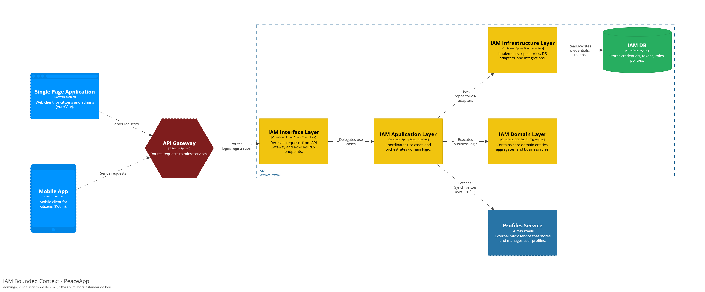

##### Profile Bounded Context

##### Report Bounded Context

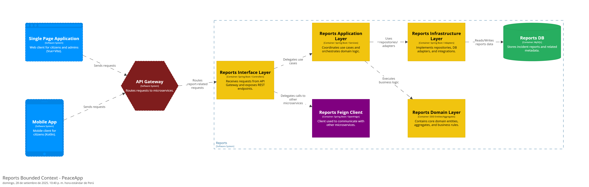

##### Alert Bounded Context

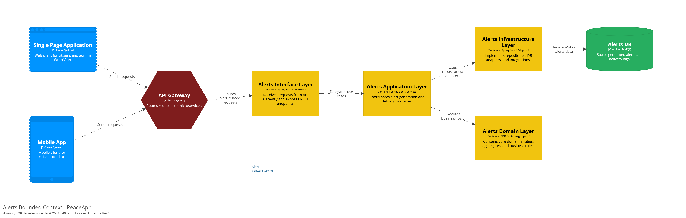

##### Location Bounded Context

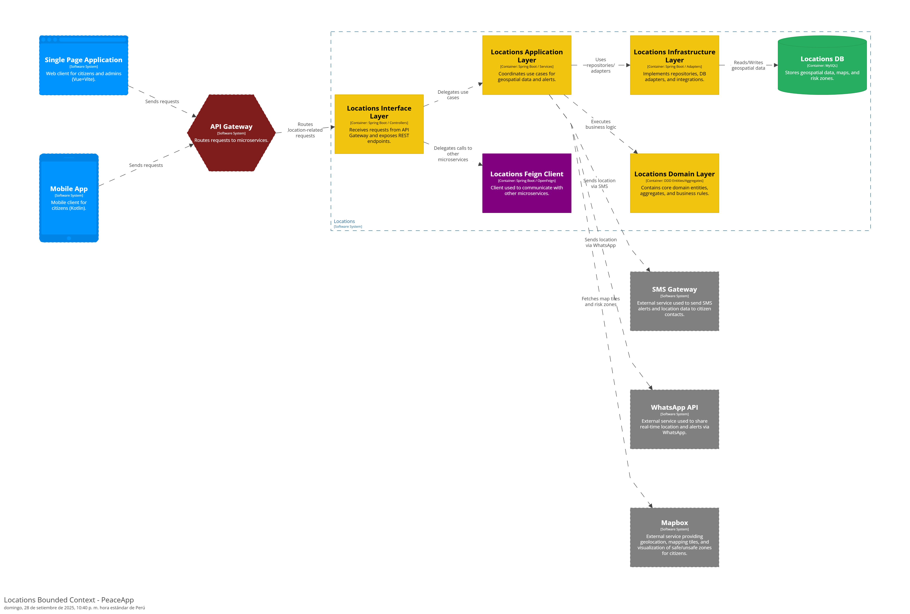

##### Diagrama de Clases

## Design Decisions – PeaceApp

| Decisión | Justificación |
|----------|---------------|
| **Arquitectura de Microservicios** | Permite escalar servicios críticos como IAM, Reports, Alerts, Profiles o Locations de manera independiente. Esto favorece la mantenibilidad, la resiliencia ante fallos y la evolución del sistema sin afectar a otros módulos. |
| **API Gateway centralizado** | Gestiona la autenticación, autorización y control de tráfico. Desacopla el frontend (SPA y Mobile App) de los distintos microservicios, aplicando seguridad IAM de forma uniforme. |
| **Uso de MySQL en todos los microservicios** | Base de datos robusta, relacional y ampliamente soportada. Garantiza consistencia transaccional para credenciales, perfiles, reportes, alertas y datos de ubicación, simplificando la administración al unificar la tecnología de persistencia. |
| **Integración con SMS Gateway y WhatsApp API** | Garantiza la entrega oportuna de notificaciones y localizaciones a los ciudadanos a través de canales de comunicación directos y confiables. |
| **Integración con Mapbox** | Permite enriquecer la experiencia de los usuarios mostrando mapas interactivos, geolocalización en tiempo real y visualización de zonas seguras/inseguras. |
| **Frontend con SPA (Vue+Vite) y Mobile App (Kotlin)** | Ofrece interfaces modernas, rápidas y adaptadas tanto para administradores como para ciudadanos, asegurando accesibilidad multiplataforma. |
| **DDD (Domain Driven Design)** | La separación en capas (Interface, Application, Domain, Infrastructure) clarifica responsabilidades y facilita la evolución del dominio en cada bounded context. |

#### 4.3.1.7. Analysis of Current Design and Review Iteration Goal (Kanban Board)

Esta sección analiza el diseño arquitectónico obtenido en relación a los drivers de calidad planteados para la iteración: usabilidad, confiabilidad, mantenibilidad y eficiencia.
Se evalúa el grado de cumplimiento de los objetivos definidos, identificando fortalezas y posibles áreas de mejora.
Finalmente, se presenta un Kanban Board que muestra el avance y estado de las actividades arquitectónicas priorizadas en esta fase, fomentando la transparencia y la gestión ágil del proyecto.

Análisis del Diseño Actual

- Usabilidad: Se garantiza mediante interfaces web y móviles intuitivas, navegación clara en el mapa de zonas de riesgo, y formularios simples para reportar incidentes.

- Confiabilidad: El uso de una base de datos transaccional en MySQL y la integración con servicios externos (SMS, WhatsApp, Mapbox) aseguran la entrega oportuna de alertas críticas.

- Mantenibilidad: La arquitectura basada en microservicios desacoplados (IAM, Profiles, Reports, Alerts, Location) facilita modificaciones y evolución independiente de cada módulo.

- Eficiencia: El API Gateway centralizado optimiza el ruteo de peticiones, mientras que la comunicación asincrónica entre microservicios reduce la latencia y mejora la respuesta en tiempo real.

El diseño actual cubre satisfactoriamente los drivers seleccionados en esta iteración, cumpliendo los objetivos propuestos.

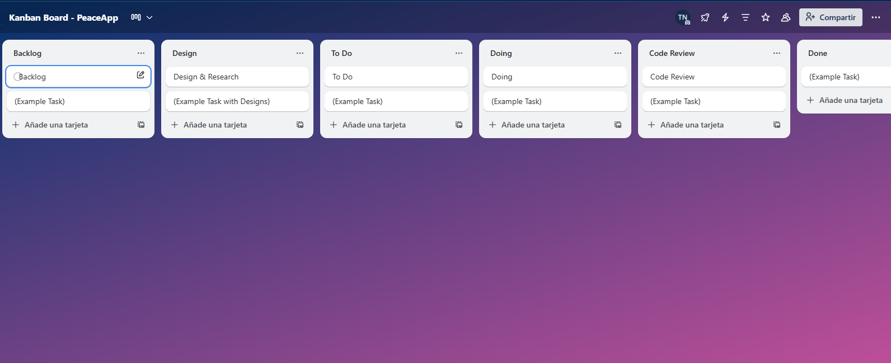

# Capítulo V: Product Implementation, Validation & Deployment

## 5.1. Testing Suites & General Patterns

### 5.1.1. Backend Application Core Testing Suite 

### 5.1.2 Pattern Based Backend Application(s)

### 5.1.3 Pattern Based Custom Software Library

### 5.1.4 Framework Pattern Driven Refactoring Report

---

## 5.2 Software Configuration Management

En esta sección se resume toda la información recopilada, analizando que pasos que se realizaran y como se siente.

---

# Conclusiones

# Recomendaciones

# Bibliografia

- Instituto Nacional de Estadística e Informática (INEI). (2024). *Perú: Encuesta Nacional de Seguridad Ciudadana 2024*. Instituto Nacional de Estadística e Informática. [https://www.inei.gob.pe](https://www.inei.gob.pe)

# Anexos

**Anexo N°1: Organización del proyecto**

URL de la organización del proyecto: <https://github.com/PeaceApp-6336-Fundamentos>

**Anexo N°2: Diagrama de actividades (Lucidchart)**

URL del diagrama en Lucidchart: <https://lucid.app/lucidchart/3814247c-9f4e-4f31-a0c1-fc8638089825/edit?viewport_loc=-254%2C0%2C2819%2C1316%2C0_0&invitationId=inv_daf23762-6aef-4d88-bc05-1bcf804170b6>

**Anexo N°3: Ciclo de vida de reporte (Lucidchart)**

URL del diagrama en Lucidchart: <https://lucid.app/lucidchart/64179528-6c6c-4596-b95b-f2f16f07d47d/edit?viewport_loc=-8%2C0%2C2730%2C1274%2C0_0&invitationId=inv_945b3387-0274-4d5d-b148-b5d52e66b345>

**Anexo N°4: Ciclo de vida de compartir ubicación (Lucidchart)**

URL del diagrama en Lucidchart: <https://lucid.app/lucidchart/aac7a3d3-51ac-45b6-aa28-67994ba8c084/edit?viewport_loc=-74%2C23%2C2416%2C1128%2C0_0&invitationId=inv_6cac7aad-e38e-4be9-b697-77e9b1904c47>
