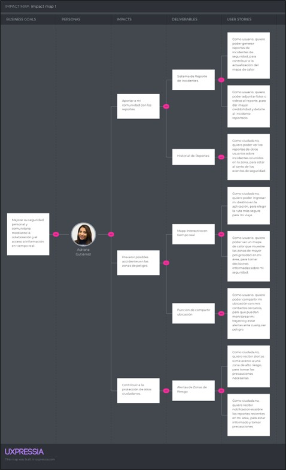

# 
 Universidad Peruana de Ciencias Aplicadas 

  

### 
 Informe de Trabajo Final 

 

  
 Carrera: Ingeniería de Software 

   
  
 Ciclo: 2025-20 

   
  
 Curso: Fundamentos de Arquitectura de Software 

   
  
 NRC: 6336 

   
  
 Profesor: Delgado Vite, Jorge Luis 

   
  
 Nombre del Startup: PeaceApp 

   
  
 Nombre del Producto: PeaceApp 

   
  
 Relación de Integrantes: 

  
  - Pilares Pocohuanca, Maria (u202215528) 

  
  - Ramirez Cabrera, Kenyi Efrain (u202220138) 

  
  - Noriega Suschenko, Anatoly Andrey (u202211813) 

  
  - Gordillo Ramos, Santiago Alonso (u202215160) 

  
  - Espejo Gamarra, Bryan Ronald (u202213278) 

   
  
 Mes y Año: Septiembre del 2025 

---

# Registro de Versiones del Informe

<table>
  <tr>
    <th style="text-align:center;">Versión</th>
    <th style="text-align:center;">Fecha</th>
    <th style="text-align:center;">Autor</th>
    <th style="text-align:center;">Descripción de la modificación</th>
  </tr>
  <tr>
    <td align="center">TB1</td>
    <td>12/09/2025</td>
    <td> Maria Pilares   Kenyi Ramirez   Anatoly Noriega   Santiago Gordillo   Bryan Espejo </td>
    <td> Realizamos los capítulos 1, 2 y 3 según la rúbrica de manera conjunta y eficiente.  </td>
  </tr>
</table>

---

# Tabla de contenidos

- [ Universidad Peruana de Ciencias Aplicadas ](#-universidad-peruana-de-ciencias-aplicadas-)
    - [ Informe de Trabajo Final ](#-informe-de-trabajo-final-)
- [Registro de Versiones del Informe](#registro-de-versiones-del-informe)
- [Tabla de contenidos](#tabla-de-contenidos)
- [Student Outcome](#student-outcome)
- [Capítulo I: Introducción](#capítulo-i-introducción)
    - [1.1 Startup Profile](#11-startup-profile)
        - [1.1.1 Descripción de la Startup](#111-descripción-de-la-startup)
        - [1.1.2. Perfiles de integrantes del equipo](#112-perfiles-de-integrantes-del-equipo)
    - [1.2. Solution Profile](#12-solution-profile)
        - [1.2.1. Nombre del Producto](#121-nombre-del-producto)
        - [1.2.2. Antecedentes y problemática](#122-antecedentes-y-problemática)
        - [1.2.3. Lean UX Process](#123-lean-ux-process)
            - [1.2.3.1. Lean UX Problem Statements](#1231-lean-ux-problem-statements)
            - [1.2.3.2. Lean UX Assumptions](#1232-lean-ux-assumptions)
            - [1.2.3.3. Lean UX Hypothesis Statements](#1233-lean-ux-hypothesis-statements)
            - [1.2.3.4. Lean UX Canvas](#1234-lean-ux-canvas)
    - [1.3. Segmentos Objetivo](#13-segmentos-objetivo)
- [Capítulo II: Requirements & Analysis](#capítulo-ii-requirements-elicitation--analysis)
    - [2.1. Competidores](#21-competidores)
        - [2.1.1. Análisis Competitivo](#211-análisis-competitivo)
        - [2.1.2. Estrategias y tácticas frente a competidores](#212-estrategias-y-tácticas-frente-a-competidores)
    - [2.2. Entrevistas](#22-entrevistas)
        - [2.2.1.  entrevistas](#221-diseño-de-entrevistas)
        - [2.2.2. Registro de entrevistas](#222-registro-de-entrevistas)
        - [2.2.3. Análisis de entrevistas](#223-análisis-de-entrevistas)
    - [2.3. Needfinding](#23-needfinding)
        - [2.3.1. User Personas](#231-user-personas)
        - [2.3.2. User Task Matrix](#232-user-task-matrix)
        - [2.3.3. Empathy Mapping](#234-empathy-mapping)
        - [2.3.4. As-is Scenario Mapping](#235-as-is-scenario-mapping)
- [Capítulo III: Requirements Specification](#capítulo-iii-requirements-specification)
    - [3.1. To-be Scenario Mapping](#31-to-be-scenario-mapping)
    - [3.2. User Stories](#32-user-stories)
    - [3.3. Impact Mapping](#33-impact-mapping)
    - [3.4. Product Backlog](#34-product-backlog)
- [Conclusiones](#conclusiones)
- [Bibliografia](#bibliografia)
- [Anexos](#anexos)

# Student Outcome

**Criterio:** La capacidad de adquirir y aplicar nuevos conocimientos según sea necesario, utilizando estrategias de
aprendizaje apropiadas.

ABET -- EAC - Student Outcome 7

<table>
<colgroup>
<col style="width: 30%" />
<col style="width: 40%" />
<col style="width: 30%" />
</colgroup>
<thead>
<tr class="header">
<th><strong>Criterio específico</strong></th>
<th><strong>Acciones Realizadas</strong></th>
<th><strong>Conclusiones</strong></th>
</tr>
</thead>
<tbody>
<tr class="odd">
<td>Actualiza conceptos y
conocimientos necesarios para su
desarrollo profesional y en especial
para su proyecto en soluciones de
software.</td>
<td>
            <strong>Pilares Pocohuanca, Maria</strong>  
            TB1   
            <strong>Ramirez Cabrera, Kenyi Efrain</strong>  
            TB1   
            <strong>Noriega Suschenko, Anatoly Andrey</strong>  
            TB1   
            <strong>Gordillo Ramos, Santiago Alonso</strong>  
            TB1   
            <strong>Espejo Gamarra, Bryan Ronald</strong>  
            TB1   
</td>
<td>
<em><strong>TB1</strong></em>
  
</td>
</tr>
<tr class="even">
<td>Reconoce la necesidad del
aprendizaje permanente para el
desempeño profesional y el
desarrollo de proyectos en
soluciones de software.</td>
<td>
            <strong>Pilares Pocohuanca, Maria</strong>  
            TB1   
            <strong>Ramirez Cabrera, Kenyi Efrain</strong>  
            TB1   
            <strong>Noriega Suschenko, Anatoly Andrey</strong>  
            TB1   
            <strong>Gordillo Ramos, Santiago Alonso</strong>  
            TB1   
            <strong>Espejo Gamarra, Bryan Ronald</strong>  
            TB1   
</td>
<td>
<em><strong>TB1</strong></em>
  
</td>
</tr>
</tbody>
</table>

# Capítulo I: Introducción

## 1.1 Startup Profile

### 1.1.1 Descripción de la Startup

En respuesta a la creciente inseguridad ciudadana en Perú, PeaceApp nace como una solución innovadora para mejorar la seguridad en las calles. En Lima Metropolitana, el 89,9% de la población percibe su entorno como inseguro (INEI, 2024), una cifra alarmante que no podemos ignorar.

**Misión:** Nuestra misión es garantizar la seguridad de nuestros usuarios, para que puedan transitar sin miedo alguno por las distintas calles del Perú.

**Visión:** Vemos el mundo en constante cambio y buscamos ser parte de ello. Creemos que todas las personas deben poder sentirse seguras de vivir y transitar en su propio país, y que los gobiernos deben encargarse de ello. Por eso, aspiramos a ser reconocidos como líderes en el mercado de seguridad, gracias a nuestra labor en beneficio de todos nuestros usuarios.

*¿Cómo lo logramos?* PeaceApp se presenta como una herramienta esencial para cualquier ciudadano preocupado por su seguridad. Con nuestra aplicación, los usuarios pueden acceder a un mapa interactivo que muestra los niveles de seguridad en diferentes zonas, permitiendo tomar decisiones más informadas. Además, ofrecemos la posibilidad de denunciar crímenes de forma rápida y sencilla, adjuntando fotos, audios o videos, ya sea de manera pública o anónima.

Sin embargo, PeaceApp va más allá: permite a los usuarios compartir su ubicación en tiempo real con sus contactos de confianza para que puedan monitorear su trayecto, brindando tranquilidad en sus desplazamientos.

Con PeaceApp, construimos un Perú más seguro, paso a paso.

### 1.1.2. Perfiles de integrantes del equipo

<table>
<colgroup>
<col style="width: 65%" />
<col style="width: 34%" />
</colgroup>
<thead>
<tr class="even">
<td>
<strong>Nombre:</strong> Maria Pilares Pocohuanca (U202215528)

<strong> </strong>
</td>
<td></td>
</tr>
<tr class="even">
<td>
<strong>Nombre:</strong> Kenyi Efrain Ramirez Cabrera (U202220138)

<strong> </strong>
</td>
<td></td>
</tr>
<tr class="even">
<td>
<strong>Nombre:</strong> Anatoly Andrey Noriega Suschenko
(U202211813)

<strong>Mi nombre es Anatoly Andrey Noriega Suschenko y soy muy apasionado a los videojuegos y a la programación en general. Actualmente tengo 21 años y estoy cursando el séptimo ciclo de mi carrera. Tengo cierto conocimiento y habilidad con los frameworks de Angular, Kotlin y Vue. Domino lenguajes como C++, Python, Java, C#, HTML, CSS, GML, Javascript, entre otros.
</td>
<td></td>
</tr>
<tr class="even">
<td>
<strong>Nombre:</strong> Santiago Alonso Gordillo Ramos (U202215160)

<strong> Mi nombre es Santiago Gordillo, me gusta la programación, en específico el lado frontend y me gustaría especializarme en ciberseguridad. tengo 21 años, domino frameworks como vue, angular,etc y lenguajes como C++ , Python, Javascript.</strong>
</td>
<td></td>
</tr>
<tr class="even">
  <td>
    
<strong>Nombre:</strong> Bryan Ronald Espejo Gamarra (U202213278)

    
Mi nombre es Bryan Espejo, tengo 22 años. Soy una persona que aprende rápido y me apasiona el desarrollo de software. Domino lenguajes como C++, Python, Java, C#, HTML, CSS y Javascript, además de frameworks como Vue y Angular. Lo último que aprendí fue Flutter y Kotlin, reforzando mis habilidades tanto en desarrollo móvil como en frontend.

  </td>
  <td></td>
</tr>

</table>

## 1.2. Solution Profile

### 1.2.1. Nombre del Producto

El producto desarrollado lleva por nombre PeaceApp, una aplicación móvil orientada a la seguridad ciudadana. Su propósito es brindar a los usuarios información en tiempo real sobre incidentes y zonas de riesgo en Lima Metropolitana, permitiendo tomar decisiones más seguras en sus desplazamientos y fomentando la colaboración entre ciudadanos y autoridades.

### 1.2.2. Antecedentes y problemática

**What (Qué):** PeaceApp es una aplicación diseñada para empoderar a los usuarios en su vida diaria, ayudándolos a navegar de manera más segura por las calles de Lima Metropolitana. Al crear una comunidad entre ciudadanos y autoridades, PeaceApp garantiza el acceso a información detallada y confiable sobre la seguridad en tiempo real, fomentando una red de colaboración que beneficia a todos.

**When (Cuándo):** PeaceApp estará disponible las 24 horas del día, los 7 días de la semana, ofreciendo asistencia continua y actualizada en cualquier momento que los usuarios lo necesiten.

**Where (Dónde):** PeaceApp puede ser utilizada en cualquier lugar y momento, siempre que el usuario cuente con una conexión a internet. La aplicación se adapta automáticamente a la ubicación del usuario, actualizando la información de seguridad local en tiempo real para brindar datos precisos y relevantes.

**Who (Quién):** PeaceApp está dirigida a los ciudadanos que transitan por las calles de Lima Metropolitana. Los usuarios no solo podrán beneficiarse de la información proporcionada, sino que también tendrán la capacidad de contribuir al bienestar de la comunidad al reportar incidentes y situaciones de riesgo, ayudando a mantener la plataforma actualizada y confiable para todos.

**Why (Por qué):** PeaceApp surge como respuesta al preocupante aumento de la delincuencia en Lima y en todo el país. Nuestro objetivo es proporcionar a los ciudadanos una herramienta que les permita estar informados sobre los sucesos más recientes en su entorno, incrementando su seguridad personal y ayudando a otros transeúntes a evitar situaciones peligrosas.

**How (Cómo):** PeaceApp se mantiene actualizada gracias al constante aporte de los usuarios, quienes reportan incidentes y colaboran con la comunidad. Además, la aplicación utiliza tecnología avanzada de geolocalización y análisis de datos para ofrecer información precisa en tiempo real.

**How Much (Cuánto):** PeaceApp estará disponible de forma gratuita para todos los usuarios. Sin embargo, para sostener el desarrollo y mantenimiento de la plataforma, la aplicación incluirá anuncios integrados.

### 1.2.3. Lean UX Process

#### 1.2.3.1. Lean UX Problem Statements

El propósito de nuestro servicio es empoderar a los ciudadanos ayudándolos a moverse de manera segura por su entorno. Con nuestra aplicación, los usuarios acceden a un mapa de calor que muestra la peligrosidad de las diferentes zonas de Lima Metropolitana, actualizado en tiempo real según los reportes enviados por otros usuarios. Hemos identificado una creciente insatisfacción en la población respecto a la seguridad en las calles, ya que los hurtos y delitos son una preocupación constante. Según el último resultado de la ENAPRES para el semestre móvil Ene-Jun 2024, publicado por el INEI, el 27.7% de la población mayor de 15 años en Perú ha sido víctima de algún hecho delictivo.

Ante ello, ¿cómo podemos transformar la percepción de inseguridad en Lima y ofrecer a los ciudadanos una herramienta que realmente impacte en su día a día?

#### 1.2.3.2. Lean UX Assumptions

hora que hemos analizado la problemática y contamos con una visión clara de cómo abordar la solución, es crucial identificar qué empresas comparten características similares a las nuestras y cómo han evolucionado con el tiempo. Esto nos permitirá aprender de su experiencia y adaptarnos mejor al mercado.

**Assumptions:**

1.  **Los ciudadanos de Lima necesitan una aplicación que les ofrezca rutas seguras para moverse por la ciudad.** Con el aumento de la delincuencia, es esencial que los usuarios puedan planificar sus trayectos de manera informada y evitar zonas peligrosas.

2.  **Los ciudadanos valoran sentirse parte de una comunidad que les permita reportar incidentes y ver esos reportes reflejados en un mapa interactivo.** La posibilidad de contribuir a la seguridad de su entorno genera un sentido de pertenencia y confianza en la plicación.

3.  **Actualmente, no existe una competencia relevante en el mercado que ofrezca una solución integral como la nuestra.** Esto nos posiciona como pioneros y líderes potenciales en el sector de la seguridad ciudadana en Lima.

4.  **Las entidades que utilicen nuestra aplicación obtendrán datos valiosos que les ayudarán a combatir la criminalidad de manera más efectiva.** Al tener acceso a información en tiempo real sobre las zonas más conflictivas, podrán tomar decisiones informadas.

5.  **Los ciudadanos comunes estarán interesados en nuestra aplicación, ya que les proporciona una herramienta práctica para mejorar su seguridad diaria.** La simplicidad y utilidad de la aplicación atraerán a un público amplio.

6.  **Las entidades públicas de Perú necesitan este tipo de soluciones tecnológicas para mejorar su capacidad de respuesta ante la criminalidad.** Nuestra aplicación les permitirá actuar de manera más proactiva y estratégica.

**Business Outcomes:**

- Generar ingresos sostenibles a través de la venta de la aplicación a entidades públicas y privadas.

- Mejorar la calidad de vida de los ciudadanos del Perú al reducir su exposición a riesgos en las calles.

- Contribuir a la disminución de la delincuencia en el país al facilitar la detección de zonas peligrosas y la respuesta oportuna.

**User Outcomes:**

1.  **¿Quién es el usuario?** Cualquier ciudadano que viva o trabaje en zonas donde las entidades están asociadas con nuestra plataforma.

2.  **¿Dónde encaja nuestro producto en su vida diaria?** Nuestra aplicación se convierte en una herramienta indispensable para planificar trayectos seguros y reportar incidentes, brindando tranquilidad en su rutina diaria.

3.  **¿Qué desafíos enfrenta nuestro producto?** Un desafío importante es que nuestra generación de ingresos depende de la capacidad de atraer y mantener asociaciones con entidades públicas y privadas.

4.  **¿Cuándo y cómo es usado nuestro producto?** Los usuarios utilizan la aplicación al desplazarse por áreas desconocidas o al desear reportar incidentes para proteger a otros. La aplicación se convierte en una herramienta diaria para asegurar trayectos más seguros.

5.  **¿Qué características son importantes?** La aplicación debe ser intuitiva y fácil de usar, con acceso rápido a la información relevante y una navegación clara. La actualización en tiempo real es fundamental para su efectividad.

6.  **¿Cómo debe verse y comportarse nuestro producto?** La aplicación debe ser visualmente atractiva, con una paleta de colores que sea agradable y fácil de leer. El proceso de registro debe ser simple y accesible para todos los usuarios, maximizando la usabilidad.

**User Benefits:**

1.  Evitar robos y otros incidentes peligrosos al moverse por la ciudad, gracias a la información proporcionada en tiempo real.

2.  Acceso a un mapa de calor que muestra zonas peligrosas y rutas seguras, ayudando a los usuarios a tomar decisiones informadas.

3.  Sentirse parte de una comunidad que contribuye a la seguridad colectiva, fortaleciendo el sentido de pertenencia y confianza.

#### 1.2.3.3. Lean UX Hypothesis Statements

- **Hypothesis Statement 01:**

**Creemos que** la aplicación logrará formar una comunidad activa y comprometida con la seguridad ciudadana.

**Sabremos que** hemos tenido éxito cuando se observe un aumento constante en la cantidad de usuarios registrados diariamente y estos participen en la aplicación realizando reportes.

- **Hypothesis Statement 02:**

**Creemos que** los ciudadanos valorarán la posibilidad de reportar incidentes y recibir información en tiempo real sobre la seguridad de su entorno.

**Sabremos que** hemos tenido éxito cuando veamos un alto porcentaje de usuarios activos que reporten incidentes con regularidad y utilicen la aplicación para consultar el mapa de calor antes de desplazarse.

- **Hypothesis Statement 03:**

**Creemos que** nuestra aplicación será capaz de reducir la percepción de inseguridad en las zonas donde se implemente.

**Sabremos que** hemos tenido éxito cuando encuestas de percepción de seguridad reflejen una disminución del miedo al crimen en las áreas donde los usuarios utilizan PeaceApp activamente.

- **Hypothesis Statement 04:**

**Creemos que** la implementación de anuncios en la versión gratuita de la aplicación no afectará negativamente la experiencia del usuario.

**Sabremos que** hemos tenido éxito cuando mantengamos un alto índice de retención de usuarios en la versión gratuita y obtengamos ingresos sostenibles a través de la publicidad.

- **Hypothesis Statement 05:**

**Creemos que** la aplicación será intuitiva y fácil de usar para personas de todas las edades y niveles de experiencia tecnológica.

**Sabremos que** hemos tenido éxito cuando las pruebas de usabilidad muestren que la mayoría de los usuarios completan tareas clave en la aplicación sin dificultad.

- **Hypothesis Statement 06:**

**Creemos que** el uso de geolocalización en tiempo real mejorará la precisión y relevancia de los datos de seguridad proporcionados a los usuarios.

**Sabremos que** hemos tenido éxito cuando los usuarios confíen en la información del mapa de calor y se apoyen en ella para tomar decisiones
sobre sus rutas diarias.

- **Hypothesis Statement 07:**

**Creemos que** la posibilidad de compartir la ubicación en tiempo real con contactos de confianza aumentará la sensación de seguridad entre los
usuarios.

**Sabremos que** hemos tenido éxito cuando una cantidad significativa de usuarios utilicen esta función regularmente.

#### 1.2.3.4. Lean UX Canvas

Enlace al esquema hecho en Miro: <https://tinyurl.com/ymmmjj7t>

## 1.3. Segmentos Objetivo

# Capítulo II: Requirements & Analysis

## 2.1. Competidores

<!--EDITANDO -->

| **¿Por qué llevar a cabo este análisis?** | Para conocer a nuestros competidores, sus estrategias y aprender de ellos. |
|------------------------------------------|-------------------------------------------------------------------------|
| **(En la cabecera colocar por cada competidor nombre y logo)** | **Su startup** | **Competidor 1** | **Competidor 2** | **Competidor 3** |
| **Perfil**                               | SafeCity | Nextdoor | Waze | PeaceApp |
| **Ventaja competitiva ¿Qué valor ofrece a los clientes?** | - **Seguridad y prevención**: Permite identificar y evitar zonas peligrosas a través de reportes en tiempo real.   - **Empoderamiento**: Facilita a las mujeres y otras víctimas la denuncia de incidentes de acoso.   - **Comunicación anónima**: Permite hacer reportes sin revelar la identidad, lo que fomenta mayor participación. | - **Conexión comunitaria**: Facilita la interacción entre vecinos, fortaleciendo el sentido de comunidad.   - **Seguridad y vigilancia vecinal**: Los usuarios pueden reportar y discutir incidentes, generando redes de vigilancia.   - **Recursos locales**: Permite a los usuarios compartir recomendaciones de servicios y negocios locales. | - **Eficiencia en desplazamientos**: Ofrece rutas optimizadas en tiempo real, evitando tráfico y obstáculos.   - **Seguridad en la conducción**: Informa sobre peligros en las rutas, como accidentes y obstáculos.   - **Comunidad activa**: Los usuarios contribuyen activamente con información sobre el tráfico, mejorando la precisión de los reportes. | - **Seguridad en tiempo real**: Los usuarios reciben alertas sobre situaciones riesgosas cerca de su entorno.   - **Colaboración ciudadana**: Permite a los usuarios y autoridades trabajar juntos para reportar incidentes.   - **Empoderamiento**: Da a los usuarios herramientas para contribuir a la seguridad pública.   - **Accesibilidad**: Interfaz fácil de usar para cualquier usuario.   - **Prevención de riesgos**: Ayuda a evitar áreas peligrosas y mejora la seguridad personal. |
| **Perfil de Marketing**                  | **Mercado objetivo** | **Estrategias de marketing** |
| **Mercado objetivo**                     | Mujeres de todas las edades, especialmente en zonas urbanas donde prevalecen el acoso y la violencia de género. | Adultos de todas las edades, propietarios de viviendas y residentes en vecindarios urbanos y suburbanos. | Conductores que viajan en áreas urbanas con tráfico, y aquellos interesados en optimizar su tiempo de viaje. | Ciudadanos preocupados por su seguridad, principalmente en Lima Metropolitana, que desean colaborar para mejorar su entorno. |
| **Estrategias de marketing**             | - **Campañas de concienciación**: Colaboraciones con ONGs y grupos feministas para promover la seguridad femenina.   - **Publicidad digital**: Anuncios en redes sociales dirigidos a mujeres en áreas urbanas.   - **Marketing comunitario**: Promoción en eventos relacionados con la seguridad.   - **Relaciones públicas**: Publicidad de historias de éxito para resaltar el impacto positivo de la app. | - **Publicidad en redes sociales**: Dirigido a residentes de vecindarios específicos.   - **Marketing de boca en boca**: Incentivar a los usuarios actuales a invitar a sus vecinos.   - **Colaboración con asociaciones vecinales**: Promover la plataforma como herramienta de comunicación.   - **Email marketing**: Enviar correos electrónicos con contenido relevante. | - **Marketing de alianzas**: Colaboraciones con empresas automotrices para integrar Waze.   - **Publicidad geolocalizada**: Anuncios dirigidos a conductores durante sus desplazamientos.   - **Eventos de seguridad vial**: Patrocinio de eventos relacionados con la conducción segura.   - **Programas de incentivos**: Ofrecer recompensas por contribuciones de información sobre el tráfico. | - **Campañas de concienciación**: Colaborar con entidades locales para sensibilizar sobre seguridad.   - **Publicidad digital**: Campañas dirigidas a los residentes de Lima Metropolitana.   - **Marketing comunitario**: Promoción en eventos locales relacionados con la seguridad.   - **Relaciones públicas**: Publicación de casos de éxito en medios locales. |
| **Perfil del Producto**                  | **Productos & Servicios** | **Precios & Costos** | **Canales de distribución (Web y/o Móvil)** |
| **Productos & Servicios**                | - Aplicación móvil para reportar incidentes de acoso y violencia.   - Mapa de puntos críticos de seguridad en tiempo real.   - Plataforma de datos para ONGs y gobiernos.   - Comunidad para el apoyo y concienciación. | - Red social vecinal para discutir temas de seguridad y compartir información local.   - Servicio de anuncios locales para negocios.   - Alertas sobre situaciones de seguridad en la comunidad. | - Navegación GPS en tiempo real, con información sobre tráfico y obstáculos.   - Funcionalidad para reportar incidentes en la vía.   - Integración con otros servicios como música y mapas. | - App móvil que ofrece reportes de seguridad en tiempo real.   - Mapa colaborativo de incidentes y alertas de riesgos.   - Plataforma de datos para analizar patrones de criminalidad.   - Comunidad para la colaboración entre ciudadanos y autoridades. |
| **Precios & Costos**                     | - **Modelo Freemium**: Gratuito para usuarios, con servicios premium para organizaciones. | - **Gratis para usuarios**: Genera ingresos a través de publicidad. | - **Gratis**: Ofrece publicidad geolocalizada como principal fuente de ingresos. | - **Modelo Freemium**: Gratuita para usuarios, con servicios premium para empresas y autoridades locales. |
| **Canales de distribución (Web y/o Móvil)** | - Móvil: Disponible en Android y iOS.   - Web: Plataforma complementaria para acceso a mapas y participación en foros. | - Móvil: Disponible en Android y iOS.   - Web: Plataforma web para una experiencia completa. | - Móvil: Disponible en Android y iOS.   - Web: Plataforma web para planificación de rutas. | - Móvil: Disponible en Android y iOS.   - Web: Plataforma web para mapas de seguridad y reportes. |
| **Análisis SWOT**                         | **Fortalezas** | **Debilidades** | **Oportunidades** | **Amenazas** |
| **Fortalezas**                            | - Enfoque en seguridad personal.   - Impacto social positivo.   - Colaboraciones con ONGs y gobiernos. | - Alcance limitado a zonas urbanas.   - Dependencia del número y calidad de los reportes.   - Opciones premium limitadas. | - Expansión geográfica.   - Integración con plataformas externas.   - Aumento en la demanda de soluciones de seguridad. | - Creciente competencia.   - Regulaciones sobre datos.   - Dependencia tecnológica. |
| **Debilidades**                           | - Alcance limitado en zonas rurales.   - Dependencia de usuarios para los reportes.   - Modelo freemium restringido. | - Preocupaciones sobre la privacidad de datos.   - Moderación de contenido difícil.   - Alta competencia. | - Dependencia de la participación activa de los usuarios.   - Consumo alto de datos y batería.   - Modelo de monetización limitado. | - Limitada penetración fuera de Lima.   - Dependencia de la participación de usuarios.   - Altos costos operativos. |
| **Oportunidades**                         | - Expansión a otras ciudades.   - Colaboraciones con otras plataformas.   - Mayor demanda por soluciones de seguridad. | - Integración de nuevos servicios.   - Alianzas con negocios locales.   - Creciente demanda de plataformas de comunidad. | - Expansión a nuevas funciones y servicios.   - Colaboración con gobiernos locales.   - Aumento del uso de vehículos. | - Expansión en otras ciudades peruanas y latinoamericanas.   - Alianzas estratégicas con gobiernos y empresas de tecnología.   - Aumento de la preocupación por la seguridad. |
| **Amenazas**                              | - Creciente competencia en el mercado.   - Cambios regulatorios.   - Dependencia de tecnología. | - Cambios en la privacidad de datos.   - Competencia de grandes plataformas.   - Saturación del mercado. | - Competencia de servicios de mapas.   - Preocupaciones sobre privacidad.   - Cambio en los hábitos de movilidad. | - Competencia en el mercado.   - Cambios regulatorios en privacidad.   - Riesgos tecnológicos. |

<!--EDITANDO -->

### 2.1.1. Análisis Competitivo

### 2.1.2. Estrategias y tácticas frente a competidores

## 2.2. Entrevistas

El objetivo realizar las entrevistas es para poder comprender las preocupaciones, necesidades y expectativas de nuestro segmento objetivo, en este caso los ciudadanos preocupados por su seguridad en espacios públicos, en relación con su seguridad en espacios públicos. La información recolectada guiará el desarrollo de funcionalidades clave en la aplicación móvil, buscando mejorar la seguridad y tranquilidad de los usuarios en su entorno.

### 2.2.1. Diseño de entrevistas

Para la primera parte necesitaremos algunos de sus datos personales:
Nombres y Apellidos, edad, pasatiempos y ocupación

**Segmento Objetivo: Ciudadanos preocupados por su seguridad en espacios
públicos**

1.  ¿Puede describir alguna situación reciente en un espacio público donde se haya sentido inseguro o preocupado por su seguridad?

Objetivo: Captar experiencias personales y contextos específicos que
generan inseguridad.

2.  ¿Qué medidas toma actualmente para sentirse más seguro cuando se encuentra en espacios públicos?

Objetivo: Conocer las prácticas o herramientas que ya utilizan para protegerse.

3.  ¿Qué aspectos de los espacios públicos (iluminación, vigilancia, presencia policial, etc.) le generan mayor preocupación en términos de seguridad?

Objetivo: Identificar factores específicos que afectan la percepción de seguridad.

4.  ¿Cómo reaccionaría si fuera testigo o víctima de una situación peligrosa en un espacio público?

Objetivo: Comprender las respuestas típicas de los ciudadanos ante situaciones de inseguridad.

5.  ¿Qué tipo de información o alertas le gustaría recibir a través de una aplicación móvil para mejorar su seguridad en espacios públicos?

Objetivo: Definir las funcionalidades más valiosas para los usuarios.

6.  ¿Qué tan cómodo se siente utilizando aplicaciones móviles para reportar incidentes de seguridad o recibir alertas?

Objetivo: Evaluar el nivel de comodidad y experiencia con tecnologías de seguridad.

7.  ¿Ha utilizado alguna vez una aplicación móvil enfocada en la seguridad ciudadana? Si es así, ¿qué le gustó o no le gustó de esa experiencia?

Objetivo: Identificar experiencias previas y posibles mejoras.

8.  ¿Considera útil la posibilidad de compartir su ubicación en tiempo real con familiares o amigos cuando se encuentra en un espacio público?

Objetivo: Evaluar el interés en funciones de seguridad basadas en la ubicación.

9.  ¿Qué otras características o herramientas le gustarían que una aplicación móvil incluyera para ayudarle a sentirse más seguro en espacios públicos?

Objetivo: Recopilar ideas adicionales para funcionalidades en la aplicación.

10. ¿Qué aspectos de una aplicación móvil de seguridad le harían sentir más confiado en su uso regular? (Ej.: facilidad de uso, protección de datos, confiabilidad, etc.)

Objetivo: Identificar los requisitos esenciales para que la aplicación sea adoptada ampliamente.

### 2.2.2. Registro de entrevistas

**URL de todas las entrevistas:** <>

**Entrevista N°1:**

**Timing:** 

**Nombre:** Mauricio Rojas

**Edad:** 22 años

**Pasatiempos:** Salir con amigos y con mascotas.

**Ocupación:** Estudiante Universitario (Ingeniería de Software)

Mauricio se siente inseguro en zonas congestionadas cerca de su universidad, especialmente después de presenciar un robo que generó tensión entre los transeúntes. Para protegerse, se mantiene cauteloso y evita zonas peligrosas cuando es posible, prestando atención a su
entorno. La falta de iluminación y vigilancia en las calles aumenta su sensación de inseguridad. Ante un incidente, su reacción sería grabarlo y difundirlo para garantizar que se realice una denuncia. Aunque no ha usado aplicaciones de seguridad ciudadana, le ustaría recibir alertas sobre zonas peligrosas y se siente cómodo usando tecnología para mantenerse informado. Considera útil compartir su ubicación en zonas desconocidas y valora la inclusión de foros en una app donde los usuarios puedan compartir experiencias. También le interesa que la aplicación sea confiable, especialmente en la protección de  datos y en la actualización de información basada en los reportes de los usuarios.

**Entrevista N° 2:**

**Timing:**

Nombre: Edson Sanchez

Edad: 20 años

Pasatiempos: Salir con amigos y jugar fútbol.

Ocupación: Estudiante Universitario (Psicología)

El entrevistado se siente inseguro en espacios públicos, especialmente cerca de su casa a altas horas de la noche, que a pesar de que no le haya ocurrido nada siente algo de miedo. Le preocupa la falta de vigilancia y la iluminación deficiente en estos lugares. Ante situaciones peligrosas, prefiere evitar problemas para salvaguardar su seguridad. Valora recibir alertas sobre robos o zonas peligrosas a través de una aplicación móvil, aunque no ha usado una app de seguridad antes, conoce su potencial y está interesado en funciones como alarmas y mapas de riesgo. Además, considera útil compartir su ubicación en tiempo real en caso de riesgo o llamar a las autoridades.

**Entrevista N°3:**

**Timing:**

**Nombre**: Marcia Mascco  

**Edad:** 21 años

**Pasatiempos:** Jugar videojuegos con su enamorado o amigos

**Ocupación:** Estudiante de la carrera de Administración y Marketing

La entrevistada no se siente segura en lugares donde no hay mucha iluminación ya que, como menciona, habia una zona por su residencia que estaba totalmente oscura y era zona donde robaban mucho. Afortunadamente, no ha sido victima de algún robo o alguna situación peligrosa, pero ante situaciones peligrosas ella indica que auxiliaria al afectado, dando su celular para llamar o bloquear dependiendo de lo que le hayan robado. Ella se siente cómoda y segura recibiendo alertas en su celuar, argumenta que revisa cada tanto algunas situaciones con alertas como, por ejemplo, google maps que manda alertas de tráfico o accidentes en alguna carretera. No ha usado apps de seguridad antes pero esta abierta a recibir una que le permita sentirse más segura en la vía pública y valora mucho las funcionalidades de alertas y de compartir ubicación en tiempo real.

**Entrevista N° 4:**

**Timing:**

**Nombre**:

**Edad:**

**Pasatiempos:**

**Ocupación:**

**Entrevista N° 5:**

**Timing:**

Nombre:

Edad:

Pasatiempos:

Ocupación:

### 2.2.3. Análisis de entrevistas

## 2.3. Needfinding

### 2.3.1. User Personas

En esta sección se presenta el User Persona que representa el segmento del proyecto. Este perfil permite comprender en profundidad las necesidades, motivaciones, frustraciones y comportamientos del usuario potencial del sistema, el cual busca mejorar la seguridad en la vía pública del país.

### 2.3.2. User Task Matrix

**Ciudadanos preocupados por su seguridad en espacios públicos**  

| **Tarea** | **Frecuencia / Importancia** |
|-----------|-------------------------------|
| Consultar a familiares o amigos sobre la seguridad de una zona antes de visitarla | Siempre / Alta |
| Buscar en Internet o en redes sociales noticias sobre incidentes en su área | A veces / Media |
| Evitar salir en horarios o lugares que son conocidos como peligrosos | Siempre / Alta |
| Llamar a la policía o a servicios de emergencia en caso de sentirse en peligro | Casi nunca / Alta |
| Organizarse con vecinos para mejorar la seguridad en la comunidad | Nunca / Media |
| Usar aplicaciones de mapas para evitar zonas peligrosas conocidas | Nunca / Media |
| Llevar consigo objetos de autodefensa personal | Nunca / Media |

---

## Análisis  

Adriana centra sus actividades en **mantenerse informada y protegida en espacios públicos**.  
La consulta constante con familiares, redes sociales e Internet, así como la decisión de evitar salir en horarios peligrosos, son sus **acciones prioritarias**, ya que le permiten anticipar riesgos y tomar decisiones seguras.  

Aunque **llamar a la policía o servicios de emergencia** es una acción poco frecuente, tiene una **alta importancia** por su carácter crítico en situaciones de peligro real.  
 
En resumen, la experiencia de Adriana está fuertemente orientada hacia la **prevención informada y la anticipación de riesgos**, lo que evidencia la necesidad de soluciones que le brinden **alertas confiables, comunicación ágil y herramientas tecnológicas de protección personal**.

### 2.3.3. Empathy Mapping

#### 2.3.4. As-is Scenario Mapping

Enlace del As-Is Scenario Mapping: https://lucid.app/lucidchart/c1cb9ad8-c701-42db-9a14-30617f7dbc29/edit?viewport_loc=-495%2C43%2C2351%2C1078%2C0_0&invitationId=inv_26bc4b6e-dc17-4979-8706-54483829b3f9

# Capítulo III: Requirements Specification
## 3.1. To-be Scenario Mapping

Enlace del To-Be Scenario Mapping: https://lucid.app/lucidchart/9c2329c4-fd90-4760-9ce3-d2e30cbe1b86/edit?viewport_loc=-433%2C56%2C1791%2C836%2C0_0&invitationId=inv_3a88d771-9c52-4f43-8aef-2c234eea78d6

## 3.2. User Stories

## 3.3. Impact Mapping

## 3.4. Product Backlog

# Conclusiones

# Recomendaciones

# Bibliografia

# Anexos

**Anexo N°1: Organización del proyecto**

URL de la organización del proyecto: <https://github.com/PeaceApp-6336-Fundamentos>
